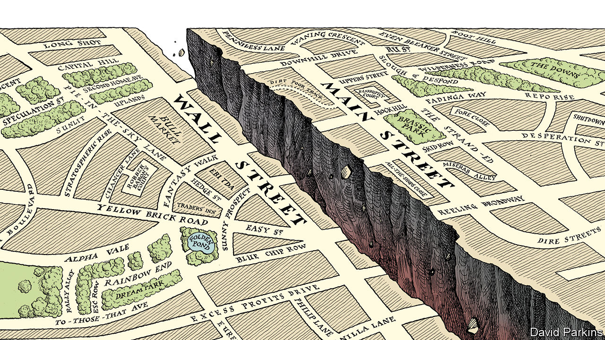

## A dangerous gap

# The market v the real economy

> Financial markets have got out of whack with the economy. Something has to give

> May 7th 2020

Editor’s note: The Economist is making some of its most important coverage of the covid-19 pandemic freely available to readers of The Economist Today, our daily newsletter. To receive it, register [here](https://www.economist.com//newslettersignup). For our coronavirus tracker and more coverage, see our [hub](https://www.economist.com//coronavirus)

STOCKMARKET HISTORY is packed with drama: the 1929 crash; Black Monday in 1987, when share prices lost 20% in a day; the dotcom mania in 1999. With such precedents, nothing should come as a surprise, but the past eight weeks have been remarkable, nonetheless. A gut-wrenching sell-off in shares has been followed by a delirious rally in America. Between February 19th and March 23rd, the S&P 500 index lost a third of its value. With barely a pause it has since rocketed, recovering more than half its loss. The catalyst was news that the Federal Reserve would buy corporate bonds, helping big firms finance their debts. Investors shifted from panic to optimism without missing a beat.

This rosy view from Wall Street should make you uneasy (see [article](https://www.economist.com//finance-and-economics/2020/05/07/a-perky-stockmarket-v-a-glum-economy)). It contrasts with markets elsewhere. Shares in Britain and continental Europe, for example, have recovered more sluggishly. And it is a world away from life on Main Street. Even as the lockdown eases in America, the blow to jobs has been savage, with unemployment rising from 4% to about 16%, the highest rate since records began in 1948. While big firms’ shares soar and they get help from the Fed, small businesses are struggling to get cash from Uncle Sam.

Wounds from the financial crisis of 2007-09 are being reopened. “This is the second time we’ve bailed their asses out,” grumbled Joe Biden, the Democratic presidential candidate, last month. The battle over who pays for the fiscal burdens of the pandemic is just beginning. On the present trajectory, a backlash against big business is likely.

Start with events in the markets. Much of the improved mood is because of the Fed, which has acted more dramatically than other central banks, buying up assets on an unimagined scale. It is committed to purchasing even more corporate debt, including high-yield “junk” bonds. The market for new issues of corporate bonds, which froze in February, has reopened in spectacular style. Companies have issued $560bn of bonds in the past six weeks, double the normal level. Even beached cruise-line firms have been able to raise cash, albeit at a high price. A cascade of bankruptcies at big firms has been forestalled. The central bank has, in effect, backstopped the cashflow of America Inc. The stockmarket has taken the hint and climbed.

The Fed has little choice—a run on the corporate-bond market would worsen a deep recession. Investors have cheered it on by piling into shares. They have nowhere else good to put their cash. Government-bond yields are barely positive in America. They are negative in Japan and much of Europe. You are guaranteed to lose money by holding them to maturity, and if inflation rises the losses would be painful. So stocks are appealing. By late March prices had fallen by enough to tempt the braver sort. They steeled themselves with the observation that much of the stockmarket’s value is tied to profits that will be made long after the covid-19 slump has given way to recovery.

Tellingly, though, the recent rise in share prices has been uneven. Even before the pandemic the market was lopsided, and it has become more so. Bourses in Britain and continental Europe, chock-full of troubled industries like carmaking, banking and energy, have lagged behind, and there are renewed jitters over the single currency (see [article](https://www.economist.com//europe/2020/05/07/germanys-highest-court-takes-issue-with-the-european-central-bank)). In America investors have put even more faith in a tiny group of tech darlings—Alphabet, Amazon, Apple, Facebook and Microsoft—which now make up a fifth of the S&P 500 index. There is little euphoria, just a despairing reach for the handful of businesses judged to be all-weather survivors.

At one level, this makes good sense. Asset managers have to put money to work as best they can. But there is something wrong with how fast stock prices have moved and where they have got back to. American shares are now higher than they were in August. This would seem to imply that commerce and the broader economy can get back to business as usual. There are countless threats to such a prospect, but three stand out.

The first is the risk of an aftershock. It is entirely possible that there will be a second wave of infections. And there are also the consequences of a steep recession to contend with—American GDP is expected to drop by about 10% in the second quarter compared with a year earlier. Many individual bosses hope that ruthless cost-cutting can help protect their margins and pay down the debts accumulated through the furlough. But in aggregate this corporate austerity will depress demand. The likely outcome is a 90% economy, running far below normal levels.

A second hazard to reckon with is fraud. Extended booms tend to encourage shifty behaviour, and the expansion before the covid crash was the longest on record. Years of cheap money and financial engineering mean that accounting shenanigans may now be laid bare. Already there have been two notable scandals in Asia in recent weeks, at Luckin Coffee, a Chinese Starbucks wannabe, and Hin Leong, a Singaporean energy trader that has been hiding giant losses (see [article](https://www.economist.com//business/2020/05/07/the-buoyant-oil-traders)). A big fraud or corporate collapse in America could rock the markets’ confidence, much as the demise of Enron shredded investors’ nerves in 2001 and Lehman Brothers led the stockmarket down in 2008.

The most overlooked risk is of a political backlash. The slump will hurt smaller firms and leave the bigger corporate survivors in a stronger position, increasing the concentration of some industries that was already a problem before the pandemic. A crisis demands sacrifice and will leave behind a big bill. The clamour for payback will only grow louder if big business has hogged more than its share of the subsidies on offer. It is easy to imagine windfall taxes on bailed-out industries, or a sharp reversal of the steady drop in the statutory federal corporate-tax rate, which fell to 21% in 2017 after President Donald Trump’s tax reforms, from a long-term average of well over 30%. Some Democrats want to limit mergers and stop firms returning cash to their owners.

For now, equity investors judge that the Fed has their back. But the mood of the markets can shift suddenly, as an extraordinary couple of months has proved. A one-month bear market scarcely seems enough time to absorb all the possible bad news from the pandemic and the huge uncertainty it has created. This stockmarket drama has a few more acts yet.■

Dig deeper:For our latest coverage of the covid-19 pandemic, register for The Economist Today, our daily [newsletter](https://www.economist.com//newslettersignup), or visit our [coronavirus tracker and story hub](https://www.economist.com//coronavirus)