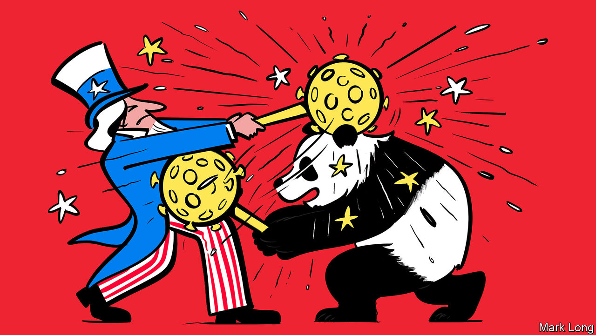

## The new scold war

# The pandemic is driving America and China further apart

> A relationship long burdened by rivalry and suspicion has fallen into outright hostility

> May 9th 2020

Editor’s note: The Economist is making some of its most important coverage of the covid-19 pandemic freely available to readers of The Economist Today, our daily newsletter. To receive it, register [here](https://www.economist.com//newslettersignup). For our coronavirus tracker and more coverage, see our [hub](https://www.economist.com//coronavirus)

YOU MIGHT have hoped that a pandemic would bring the world together. Instead covid-19 is tearing it apart. As the disease has spread, relations between America and China have plunged into an abyss from which they will struggle to escape.

Mike Pompeo, the secretary of state, says he has “enormous evidence” that the virus behind covid-19 came from a laboratory in Wuhan—though America’s intelligence agencies as well as its closest intelligence partners say proof is still lacking. To punish China for letting the disease spread, the Trump administration has reportedly considered demanding reparations or cancelling some Treasury bonds held by China—though nervous American officials later dismissed this crackpot idea. China has branded Mr Pompeo “insane” and a “political virus” (see [article](https://www.economist.com//united-states/2020/05/09/there-is-less-trust-between-washington-and-beijing-than-at-any-point-since-1979)). State-run media are calling for an international investigation into America’s “incredible failure” to deal with the outbreak.

This sniping deepens a bitter rivalry. The dominant view in the United States is that China is fundamentally hostile, a strategic rival that steals American intellectual property and destroys American jobs in the race to get ahead. China, meanwhile, sees America as a decadent and declining power that has resorted to bullying to keep China down because it can no longer compete fairly.

Domestic politics in both countries is likely to intensify the animosity. Now that covid-19 has undone the economic gains that occurred on his watch, President Donald Trump is making confrontation with China central to his re-election strategy including, he hopes, as a way to browbeat his opponent, Joe Biden.

China denies any blame for the pandemic, instead hailing the party’s disease management. At home, propaganda outlets hint that the virus came from America—and are widely believed. Yet America’s complaint that China’s first instinct was to cover up covid-19 is true. Other countries, including Australia, have called for an investigation into the origins of the pandemic. Reuters news agency this week reported on an internal paper prepared for China’s leaders, warning that feelings around the world against their country, led by America, are more intense than at any time since the killings around Tiananmen Square in 1989. China will slap down foreign critics more vigorously than ever.

Tension between two such splenetic powers has consequences. One is the risk of military action. China has occupied and fortified disputed shoals and reefs in the South China Sea in defiance of international law. It has recently sunk a Vietnamese vessel there. America, meanwhile, has been vigorously asserting the principle of freedom of navigation. When tensions are high, so are the risks of an accident. The most dangerous flashpoint is Taiwan. China claims the island as its own territory; America has an implicit commitment to protect it. During the pandemic, China has been testing Taiwan’s defences with aerial sorties and, in March, its first night-time exercise. America may be thinking of sending a high-ranking official to visit.

Neither China nor America seeks war, surely. But they are deliberately hurtling towards an economic separation. The world is thick with talk that more industries should count as strategic. As our special report on banking this week spells out, China is building a parallel financial system that will avoid the dollar-based payment mechanisms—and hence American sanctions. A trade deal between America and China, a minor, pre-covid thawing in their commercial rivalry, may yet fall apart.

Animosity also makes global threats, such as climate change and international crime, harder to deal with. Consider the pandemic itself. This week the European Union held a conference that raised $8bn to finance the search for a vaccine which might save lives and let people go back to work without fear. But America stayed away and China sent an empty-handed ambassador. For those decisions to make sense in Washington and Beijing, something must have gone very wrong.■

Dig deeper:For our latest coverage of the covid-19 pandemic, register for The Economist Today, our daily [newsletter](https://www.economist.com//newslettersignup), or visit our [coronavirus tracker and story hub](https://www.economist.com//coronavirus)

## URL

https://www.economist.com/leaders/2020/05/09/the-pandemic-is-driving-america-and-china-further-apart
