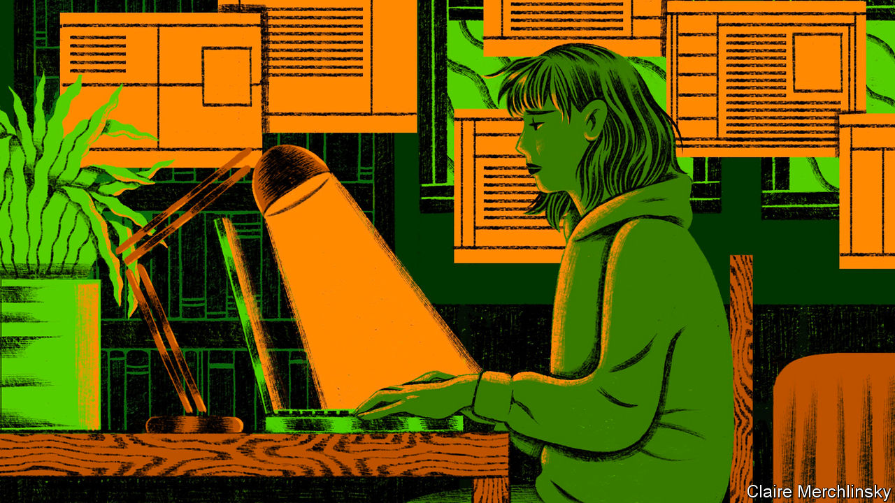
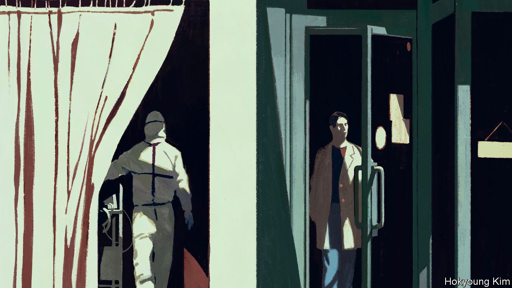
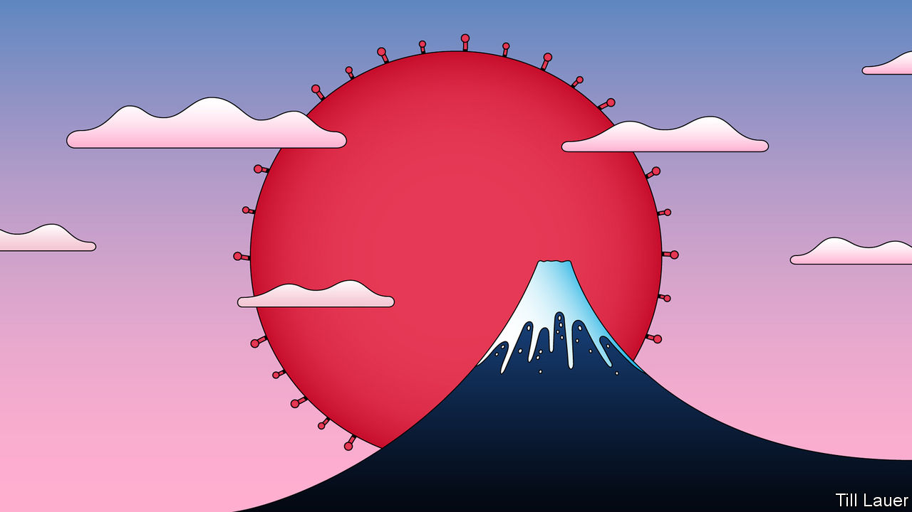
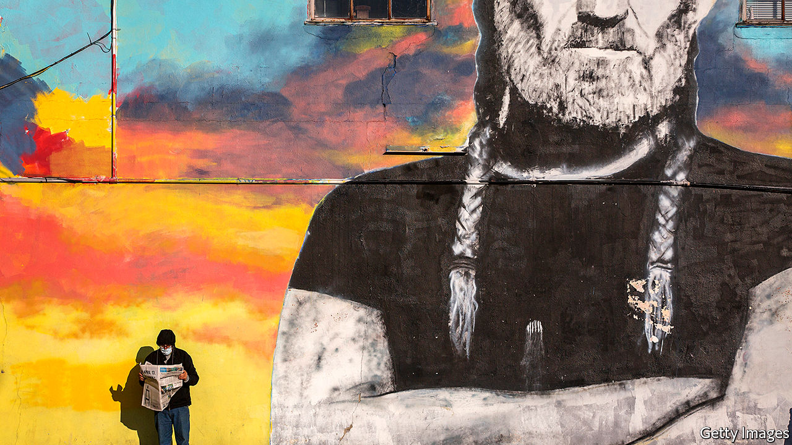

## On children, Mozambique, lockdowns, tracking covid, Japan, Labour, liberty

# Letters to the editor

> A selection of correspondence

> May 9th 2020

You looked at how covid-19 will affect the mental health and psychosocial well-being of vast swathes of society (“[Only connect](https://www.economist.com//international/2020/04/04/how-will-humans-by-nature-social-animals-fare-when-isolated)”, April 4th). However, you barely mentioned children and their caregivers. For most children there is no school, no meet-ups, no sports activities. Many also have to live through the severe distress of parents losing jobs, getting sick and feeling helpless. Even without a pandemic, 10-20% of children and adolescents worldwide experience mental disorders, with half beginning by the age of 14.

We know that covid-19 will have a lasting, though dangerously invisible, impact on children and their families. The longer this outbreak lasts, and the more restrictive response measures are, the deeper the effect will be on children’s learning, behaviour and emotional and social development. Now, more than ever, UNICEF is calling for collective action among governments, donors, and practitioners to address the complex and varying mental-health and psychosocial needs of children and families. This starts with listening to children’s concerns and prioritising their needs both in the short and long term.

HENRIETTA FOREExecutive directorUNICEFNew York

Your leader on Mozambique in part caricatured the nasty, intensifying conflict in Cabo Delgado province (“[Gas, guns and guerrillas](https://www.economist.com//leaders/2020/04/02/jihadists-threaten-mozambiques-new-gasfields)”, April 4th). The Mozambican armed forces were never designed or equipped to combat this type of insurgency; they are having to be restructured and reorientated. In common with other crisis hot-spots in Africa, the nexus of insecurity is in weakly governed terrain along a porous international border, in this case with Tanzania. It is local but with regional and international links that will require private and government security assistance from other countries, particularly to foster development in conflict-prone areas.

Also, energy firms are used to operating in hostile environments. Currently their immediate risks are access to global funding given the collapse in commodity prices and the spread of covid-19 among their workers. They, too, are focused on seeking improvements, including global business and human-rights best practice, by all who partner with them.

ALEX VINESDirectorAfrica ProgrammeChatham HouseLondon

“[Booby on the beat](https://www.economist.com//britain/2020/04/04/policing-in-a-lockdown)” (April 4th, 2020) highlighted the problems of policing Britain’s national lockdown. As a fan of “Dad’s Army”, I have not only worked with characters in the police like Hodges, but also Mainwaring, Wilson, Walker and the rest of the platoon.

The principle of policing by consent requires clarity of purpose. It is not the job of police to enforce its own morality, or that of a particular section of society; so said Sir Richard Mayne, one of two joint commissioners of the new Metropolitan Police in 1829. To stop officers imposing their own morality he provided them with a General Instruction book outlining the objectives of policing. Failure to adhere to these could result in an officer being disciplined.

Ahead of the London Olympics in 2012 it was felt that with so many police forces involved there was a risk that different policing styles across a range of tasks might confuse visitors to the games. Potential differences in how forces policed crowds lining the Olympic torch route, how sports stadiums were made secure and how potential evacuations were handled, were avoided by appointing a senior police officer to act as the National Olympic Security Co-ordinator. As someone who liaised between the army and the police, I saw the advantages of this homogenous policing approach, which provides a lesson in enforcing lockdowns.

PAUL MALYONLondon

Social values are another important factor in any calculus of the pandemic (“[Hard choices](https://www.economist.com//briefing/2020/04/04/the-hard-choices-covid-policymakers-face)”, April 4th). Europeans, for instance, may not like the surveillance methods used in Asia to confirm lockdown and confinement. However, some methods allow contact-tracing to be supported by proximity-tracing using mobile technology.

Sophisticated protocols based on offline and anonymised Bluetooth connections, not satellite data, guarantee privacy and are compatible with EU data-privacy laws. One such project, called Decentralised Privacy-Preserving Proximity Tracing (DP3T), has been developed by researchers from various European countries and will probably be tested by health authorities in seven of them soon. If successful, it will allow us to balance the health benefits with the costs while preserving fundamental democratic values, such as privacy.

MARTIN VETTERLIProfessor and presidentEcole Polytechnique Fédérale de Lausanne ( EPFL)

It is not that “the stigma of Japan’s wartime militarism has rendered state power weak” ([Banyan](https://www.economist.com//asia/2020/04/04/abe-shinzo-draws-closer-to-declaring-a-state-of-emergency), April 4th). Rather, the stain of wartime militarism in Japan shifted the locus of state power from flamboyant strongmen to discreet repression of the opposition. On paper, Japan has a multiparty parliament. In practice, parties other than Abe Shinzo’s Liberal Democratic Party have held a majority only twice. Amid large-scale civil protests in 1960, 1968 and the 2010s, the Japanese state never fully acquiesced to popular demands. Under Mr Abe’s leadership, the LDP president’s tenure (in effect, that of the prime minister) was extended to three terms. The list goes on.

Those who consider the Japanese state domestically “weak” may do well to study Yuugen, a principle of Zen aestheticism: subtle yet profound.

VICTORIA EDWARDSLewes, Delaware

I don’t want to be pedantic, but George Lansbury did not lead Labour into the general election of 1935 ([Bagehot](https://www.economist.com//britain/2020/04/04/labours-new-leader-should-beware-of-war-socialism), April 4th). As a pacifist, he resigned as leader a month before, when the party adopted a policy of “collective military opposition” to Italian aggression against Abyssinia. It was the former deputy leader, Clem Attlee, who led the party into the election. Nor can the result be fairly characterised as a “disaster”. Disappointing, perhaps, but the party gained more than 100 seats, taking back much of the ground it had lost in the truly disastrous election of 1931.

DICK LEONARDLondon

It might be worth pointing out to those marching for liberation from covid-19 restrictions (“[Stir craziness](https://www.economist.com//united-states/2020/04/23/america-begins-easing-restrictions)”, April 25th) that one concept of freedom is the ability to play Russian roulette, if that is your thing. The other concept of freedom does not confer the right to point the loaded gun at others.

ROBERT DRAPERRhode St Genese, Belgium

The WHO’s marker of “people who have recovered from covid-19” seems awkward and long. How about “covidian”?

CHARLES HITSCHFELDEdmonton, Canada