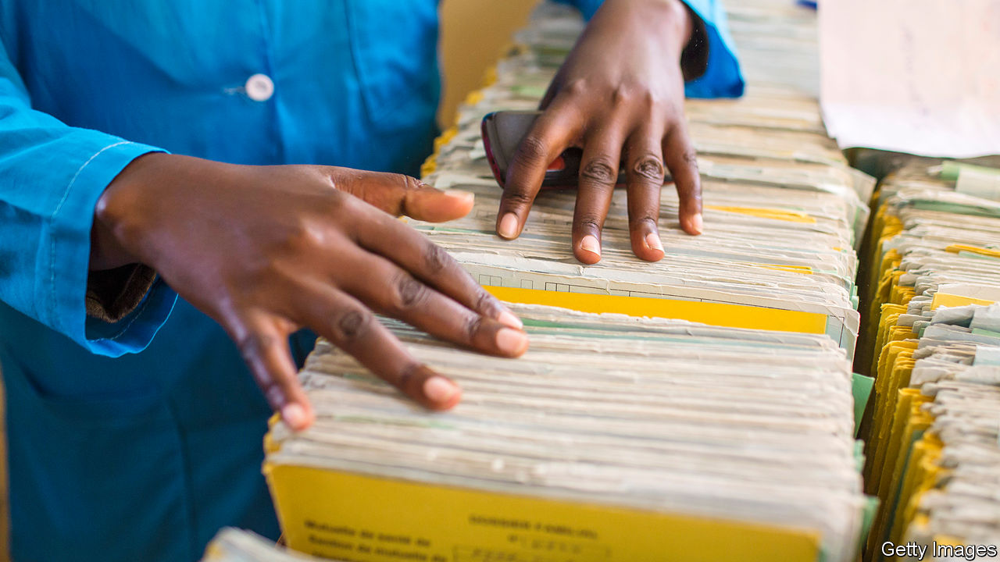

## Desperate times call for accurate measures

# Lacking data, many African governments make policy in the dark

> It is hard to help the poor if you don’t count them

> May 7th 2020

THE GRAVEDIGGERS of Kano know something is up. Death has not come as rapidly to this town in northern Nigeria since a great cholera outbreak 60 years ago, one told the BBC. Local newspapers are running long lists of names of people who have died after showing symptoms of covid-19. Among them were two professors, a newspaper columnist, the former editor of a paper and the mother of a film star. “They all died on Saturday,” read one report. Nobody knows whether they died of the virus, because nobody has checked.

According to official data Nigeria, Africa’s most populous country, has one of the continent’s lowest burdens of covid-19. As of May 7th it had reported 103 deaths and 3,145 confirmed infections from the novel coronavirus. That is almost certainly a vast undercount given that Nigeria has tested fewer than 22,000 people. The government has nonetheless begun easing lockdowns in Lagos, the commercial hub, and Abuja, the capital.

Making policy without reliable facts is hardly unique to Nigeria. In Somalia doctors worry about a surge in deaths, despite official figures showing only a small number of confirmed cases. Nor is it a new problem. A paucity of data across swathes of Africa has left governments guessing about where to build schools and roads. Businesses must take shots in the dark when investing in new markets. “Where do we build clinics, where do we build roads?” asks Gyude Moore, a former minister of public works in Liberia. Without basic data, he laments, we don’t know.

Even the simplest information about life and death is often unavailable. In Tanzania only about one in eight births is registered; in Niger only about 3% of deaths are. Even in relatively prosperous Ghana, just 25% of deaths are officially noted. It is not just the flow of people in and out of the world that is not counted, but also how many are here. Almost half of Africans live in a country where there has been no census since 2009. In the Democratic Republic of Congo the last one was in 1984.

Politics is often to blame. In Nigeria, for instance, money and power are divvied up between states according to their populations, so every region has an incentive to inflate its own count. An accurate tally would also expose gerrymandering of voting districts; urban votes typically count for less than rural ones.

Poverty statistics are little better. The World Bank’s latest count of the world’s poor excluded the region that has most of them—sub-Saharan Africa—because not enough countries had released credible data. The UN’s Sustainable Development Goals cover a broad sweep of objectives, from education and health to the environment. But in Africa there are too few statistics to track progress on 60% of the indicators. Even where data are provided, about half are estimates, not solid counts.

It is often difficult to assess the information that is collected. Patient records in health clinics, for example, are almost always written by hand, and then often gather dust in a corner. Moreover, when governments do publish data online they frequently use formats that make the numbers hard to collate and analyse. Even if one ministry has useful data, other parts of the government often cannot get hold of them. This can lead to big differences in basic numbers within the same government. A few years ago Malawi’s ministry of agriculture estimated there were 3.4m farm households, whereas the National Statistical Office reckoned there were 2.5m.

The problems do not stop at core statistics. Academic research shapes policy in many countries, but Africa generates just 1% of global research. Over a period of 20 years about 15 times more economic papers were published about America than about all of sub-Saharan Africa, according to a review of 20 years of research by Jishnu Das of Georgetown University and Quy-Toan Do of the World Bank. The world’s top five economic journals published just 34 papers in 20 years about sub-Saharan Africa, which, by the by, hosted a tiny 1.5% of the world’s medicine trials.

This is not to say that Africa cannot learn from research on other countries. But “local realities might make things that work elsewhere not work here,” says Charles Wiysonge of Cochrane South Africa, a medical research centre.

Still, there are reasons for hope. Across Africa, governments have become marginally better at collecting statistics since 2008, according to the World Bank. And others are stepping up. The Africa Evidence Network, a group of researchers and professionals, is promoting the use of evidence in policymaking. In Nigeria BudgIT, a tech-savvy NGO, turns dry budget numbers into understandable graphics for public perusal. It also tracks whether hundreds of budgeted projects for such things as schools and roads actually result in the promised bricks, books and tarmac. Momentum is growing in academia, too. Published studies from African institutions rose by almost 40% between 2012 and 2016.

Outsiders have pitched in as well, most notably with randomised controlled trials. Some have had a big impact. A study which found that a cheap deworming pill could greatly improve school attendance led to 270m children in Africa and Asia being treated in 2019. But other studies by outsiders do not help as much, partly because they focus on narrow interventions or particular aid projects. The influence of many randomised trials on government policy is “very limited”, says Ken Opalo of Georgetown University.

Only 0.33% of all official overseas aid is allocated to statistics, and even that is rarely co-ordinated. “The way to not solve the crisis is to get lots of donors to fund individual surveys,” says Dean Jolliffe of the World Bank. In Malawi five different donors recently funded five separate mobile health applications, with little thought of how they might operate together.

Better data allow governments to make better decisions. James Hollyer of the University of Minnesota and others have found that democracy is more likely to thrive when voters have good information. This boosts foreign direct investment, too.

The fight against covid-19 further highlights the importance of having good data everywhere. In Africa, the word of gravediggers too often seems more reliable than that of governments. ■

## URL

https://www.economist.com/middle-east-and-africa/2020/05/07/lacking-data-many-african-governments-make-policy-in-the-dark
