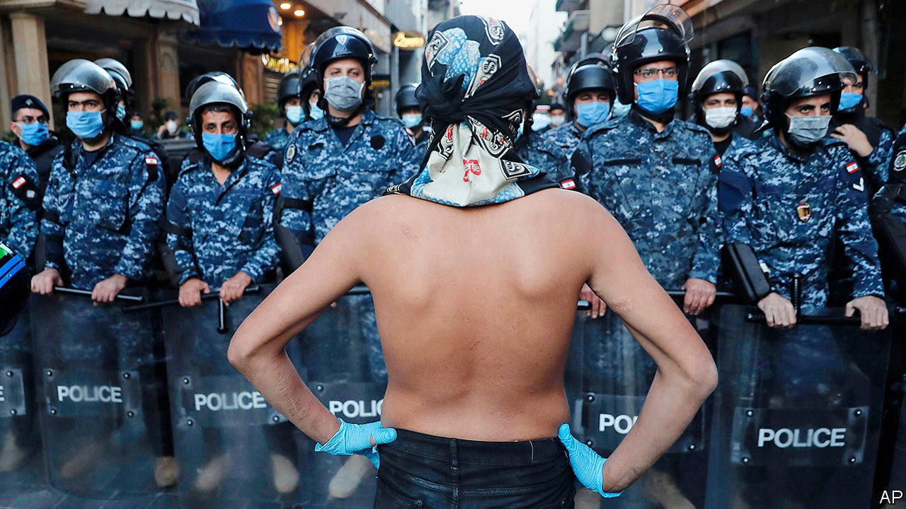

## From crisis to crisis

# Why protesters firebomb banks in Lebanon

> The pandemic turned the Arab street quiet. It will not last

> May 9th 2020BEIRUT

Editor’s note: The Economist is making some of its most important coverage of the covid-19 pandemic freely available to readers of The Economist Today, our daily newsletter. To receive it, register [here](https://www.economist.com//newslettersignup). For our coronavirus tracker and more coverage, see our [hub](https://www.economist.com//coronavirus)

COVID-19, JOKES Chadi Khoury, might have been good for his mental health. For six weeks a nationwide lockdown meant he could not fix a busted refrigerator in his Beirut snack shop. Now he can—but he has spent all morning arguing over prices. Repairmen want to be paid in dollars, which he lacks: gone are the days when customers might buy their falafel with greenbacks. “We’re in Lebanon, not America,” he yells into the phone. “Give me the price in Lebanese.” Down the street, the owner of a salon crunches the numbers for $400-worth of new shavers. Last year that was equal to about 25 haircuts. Today, even after raising prices, he will need to coif 60 customers to cover the bill.

Lebanon is lurching back to life. Most businesses closed in mid-March to halt the spread of the coronavirus. Even Barbar, a much-loved west Beirut takeaway that served shawarma behind sandbags during the civil war, pulled down its shutters. But the government is cautiously declaring victory. It counts fewer than 800 confirmed cases; daily new infections have been in single digits since April 15th. Firass Abiad, the head of Lebanon’s main covid-19 hospital, says the outbreak looks under control.

Little else is, though. Lebanon was in economic crisis before the pandemic, with an illiquid banking sector and a collapsing currency. On March 7th the government decided to default on its debts. The lockdown has pushed the economy into free fall. Thousands of businesses may never reopen. Stories of hardship circulate daily on social media: a pregnant woman and her husband salvaging food from a refuse skip; penniless migrant workers trying to cross the militarised border into Israel. With no other options, Lebanon has asked the IMF for help. But that will require difficult reforms many Lebanese can ill afford.

Since the end of the civil war in 1990, Lebanon has built a service economy based on finance, property and tourism. It ran large fiscal and current-account deficits—11% and 26% of GDP in 2018—and financed them with foreign capital, much of it from a sprawling diaspora. The central bank (Banque du Liban, or BDL) in effect ran a Ponzi scheme to defend its currency peg, borrowing dollars from commercial banks at generous interest rates.

The scheme collapsed last year as bank deposits began to shrink after a decade of growth. The peg, 1,500 pounds to the dollar, is all but meaningless: last month a dollar fetched 4,000 pounds on the black market. Banks have imposed informal capital controls. The state predicts a 53% jump in consumer prices this year. A business federation estimates that one-third of registered companies have gone under.

The middle class has become poor, and the poor destitute: three in four Lebanese may need aid by the end of the year. Despite the lockdown, thousands have taken to the streets in protest. Banks have been firebombed. In Tripoli, one of Lebanon’s poorest cities, a young man was shot dead by soldiers during a protest last month.

On April 30th ministers approved a “recovery plan” meant to win IMF support. It would drop the peg and devalue the pound to 3,500 to the dollar this year. The government would trim its wage bill, phase out electricity subsidies and broaden the tax base. Formal capital controls would keep scarce dollars in the country.

The plan is not perfect. It makes unrealistic assumptions such as strong tourism receipts—wishful thinking in a pandemic. It proposes lifting capital controls after one year. The government itself thinks this would cause an outflow of $9bn in 2021, all but negating any foreign aid. The plan is also too optimistic about the prospect of clawing back billions in stolen assets.

Perhaps most contentious will be how to clean up the balance-sheets of Lebanese banks, which have an estimated 100trn pounds in losses. The plan proposes a bail-in: shareholders would take a bath, and wealthy clients would see their deposits become long-dated, low-interest obligations. Bankers are predictably furious, arguing this would shatter confidence. But their anger is partly a way of ducking responsibility for their role in the crisis. Far from being contrite, banks are still pursuing outlandish schemes to raise capital. One recently offered to double the amount of any fresh dollar deposits. Either the bank has discovered a money tree, or this is a last, desperate stage in Lebanon’s state-sanctioned Ponzi scheme.

If bankers are unapologetic, politicians are oblivious. A quartet of former prime ministers, the men who led Lebanon into the abyss, are fighting against the recovery plan. Appointments at the BDL, which are divvied up by sect, were postponed last month because of partisan squabbling.

Protests that began in October united many Lebanese in disgust at the entire political class. But the country’s crises are giving its factions a new lease on life, as the state struggles to provide help. Hizbullah, the Shia militia and political party, has its own fleet of ambulances and more than a dozen covid-19 clinics. Every party is vaunting its efforts to treat patients and distribute food and cash. Some even hand out surgical masks emblazoned with their logos. The state, meanwhile, has still not distributed a meagre 400,000-pound stipend to needy families.

Other countries should take heed. Before the pandemic protests roiled the region. Iraqis rallied against a useless government. Algerians overthrew their longtime dictator, Abdelaziz Bouteflika, and kept protesting against his army-backed successor. The pandemic cleared the streets, but governments have squandered that respite. Low oil prices will push some states to insolvency. Iraq made just $1.4bn from selling crude in April, down from $7bn in April 2019. Analysts say it may need to borrow $40bn to get through the year. Lebanon will not be the only country where lockdowns give way to protests. ■

Dig deeper:For our latest coverage of the covid-19 pandemic, register for The Economist Today, our daily [newsletter](https://www.economist.com//newslettersignup), or visit our [coronavirus tracker and story hub](https://www.economist.com//coronavirus)

## URL

https://www.economist.com/middle-east-and-africa/2020/05/09/why-protesters-firebomb-banks-in-lebanon
