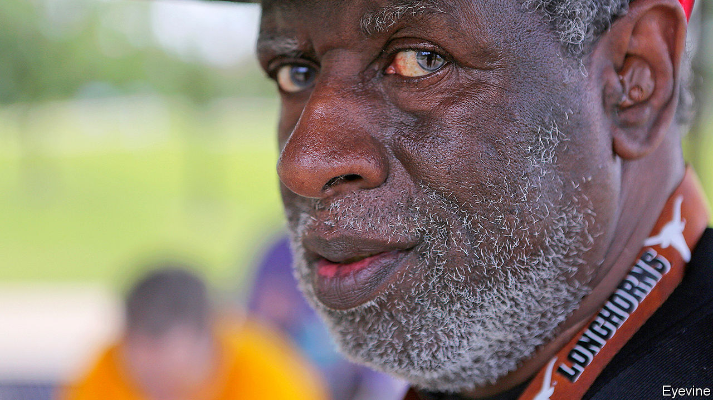

## A midwestern parable

# Willie Levi died on April 23rd

> The man whose case shone a sharp light on the treatment of mentally disabled workers was 73

> May 9th 2020

SINGING WAS something Willie Levi loved to do. When he was at the state school in Mexia, Texas, he belonged to a choir called the Sunshine Singers. They would tour round with a repertoire of hymns: “The Old Rugged Cross”, “What a Friend We Have in Jesus”. He sang more in church on Sundays: “Surely Goodness”, “Amazing Grace”. Along with the hymns he liked to shake his tambourine, to keep the beat. He could get music out of almost anything. If you gave him a comb, he could play it. And somewhere, in a pocket or a sock, he would keep a pair of spoons, the regular white plastic ones you might pick up in a coffee place. He could play those, too.

He also sang to the turkeys, or talked to them in their language, which was a cross between gobbling, whooping and singing. Turkeys were his work day in, day out, ever since he had been recruited by Henry’s Turkey Service in 1974 in Goldthwaite, Texas. It was the sort of job people like him, with a mental disability, seemed to end up with. He had tried portering and packing doughnuts, but nothing had quite worked out. In Goldthwaite his job was turkey insemination: catching the toms, all 40 thrashing pounds of them, milking their semen and running fast to impregnate the hens. When he and the others he worked with—mostly white, some black, all with a mental disability, all his brothers—were trucked 1,000 miles up to Iowa to handle turkeys there, things got harder. So hard, indeed, that their case marked a milestone for workers with mental disabilities across the United States.

The new job seemed okay at first. At the meatpacking plant in West Liberty he worked 12-hour days, but he was used to that. They would get there by 4.30am, lab coats and rubber boots on by 4.45, first bird out of the coop and flipped onto the shackle by 5. This was the section he worked in. The birds were usually angry, but once he’d hung them up he would give them a pat and croon a word or two. That went on for turkey after turkey, hundreds in a day. It was a tough, risky grapple, but he was skilled at it, and other brothers had it much worse: yanking out the guts or cutting out the heart and liver, which covered them in blood. At least he didn’t have to contort his fingers so constantly that his hands became hooks, as others’ did. It would have been tricky to play the spoons then.

The accommodation, too, seemed fine at the beginning. It was in an old schoolhouse on a rise outside the tiny town of Atalissa. The building was painted turquoise on the outside and red, blue and yellow inside. There was even a swing in the front yard. They had a gym and a pool table. The people in town, after a little while of wariness, became warm and kind to the “boys”, and returned his broad smile as he walked down the street. In the summer parade he rode on a float with other brothers, dressed as a clown in a pointy yellow hat. At socials he loved to dance with anyone.

Money, though, was a problem. He hardly had any. Granted, there was not a lot to spend it on in Atalissa, besides Mountain Dews and Honey Buns at the Mini Mart. But it was impossible to put aside any savings. His pay was meant to be $750 a month; he received $65. The rest was taken by Henry’s for bed, board, clothes, medical care (though they hardly had any) and rare outings. And it stayed the same for more than 30 years. The Fair Labour Standards Act of 1938 allowed workers with disabilities to be paid less if they were less productive, even if, like him, they were doing as good a job as they could. (“Hang ’em! Hang ’em!” the supervisor would shout.) Henry’s was exploiting them to the very limit of the law.

As the years passed, too, conditions got worse. He, like all the brothers, was getting older, not so fast or so alert at wrestling with big birds. Increasingly he was yelled at, called lazy, and told that he should get off his black butt and lift weights. Punishments came thick and fast: stand in the corner, go to your room, no TV, walk round the gym till supper time. The schoolhouse fell into disrepair and was overrun with mice and roaches, which fell from the ceiling as he ate. Mould grew on his clothes. He broke his kneecap, but had to work on. Two men ran away, and one of them was found frozen dead in a ditch; for a time the building was padlocked. Eleven men had already been retired and returned to Texas, but he was not sent, so he stayed and went on with the work. It was a long way back home, and possibly no one would know him any more.

When he walked into town he still smiled, as uncomplaining as ever. No one could tell the horrors from his face. But some had had suspicions for a while. In 1979 a reporter from the Des Moines Register had made inquiries. Nothing changed. The federal Labour Department noted in 1998 that Henry’s was underpaying its workers, but did not impose a fine. The Iowa Department of Human Services was alerted, but concluded that the men were Texans and therefore not theirs. It was not until 2009 that a state social worker went into the schoolhouse, found them all in the stinking rubbish, and rescued them. In 2011 a lawyer for the federal Equal Employment Opportunity Commission took up their case and won a jury verdict of $240m, the largest ever for the EEOC, for lost pay, abuse and discrimination. Legal caps reduced it to $1.6m, and by 2017 only about half had been extracted. But the point had been underlined. Workers with disabilities had to be properly paid and properly treated.

For Willie Levi, rescue was like a holiday. They went to the Super 8 Motel, slept in clean beds and had waffles for breakfast. From now on, he would be protected. He wouldn’t have to work with turkeys any more. He certainly wouldn’t eat them, ever again. And he could tell the true story to other people, especially to Dan Barry of the New York Times, who turned his notes from “the boys in the bunkhouse” into an unsparing documentary and a book. Mr Barry picked his portrait, in his red St Louis Cardinals cap, to be the first picture in it, as he had so often taken the lead in talking.

Back in Atalissa, the townsfolk felt lonely without them. The place seemed empty. In 2014 they tore the schoolhouse down, but memories were harder to lose. Many felt they should have noticed more, done something. The former pastor remarked that almost no one was in church now. He wondered what had happened to the guy with the tambourine, the one who always kept the beat.■

## URL

https://www.economist.com/obituary/2020/05/09/willie-levi-died-on-april-23rd
