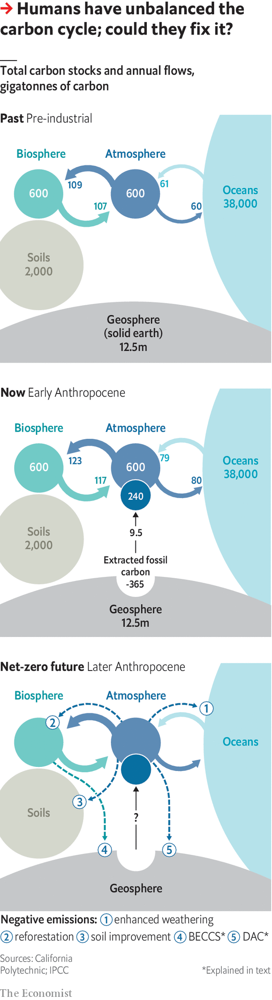

## Where nature ends

# Humanity’s immense impact on Earth’s climate and carbon cycle

> Much needs to be done for the damage to be reversed

> May 9th 2020

Editor’s note: This is the third in a series of climate briefs. To read the others, and more of our climate coverage, visit our hub at [economist.com/climatechange](https://www.economist.com//news/2020/04/24/the-economists-coverage-of-climate-change)

IT IS ALL, in the end, a matter of chemistry. Carbon dioxide is a form of what chemists call inorganic carbon—a simple molecule that is pretty inert. Fossil fuels are made of carbon in its organic form—often complex molecules that are far from inert. Combustion turns these organic complexities into inorganic simplicities: carbon dioxide, water vapour and heat.

Of the energy that people pay for (as opposed to the energy that comes from burning firewood) 34% comes from burning oil, 27% from coal and 24% from gas. Nuclear power, hydroelectric power and all other renewables combined provide just 15%. The result of all this fossil fuel use is a modern industrial economy and an annual flow of 9.5bn tonnes of carbon out of the ground and into the atmosphere.

Through its effects on the plants, animals and microbes which make up the biosphere, on the climate and on the oceans, this industrial flow of carbon links the Earth’s distant geological past to its future over millennia to come. It is the single clearest piece of evidence for the idea that humans now have a power over the Earth as great as the forces of nature, and that their use of this power has opened up a new geological epoch that some scientists call the Anthropocene.

To appreciate the importance of this industrial carbon flow, you have to understand the carbon cycle in which it sits. At first, this context seems reassuring. Almost all microbes, and all animals, get the energy that they need for life from breaking up food made of organic molecules. The flame-free, internalised form of combustion by which they do so, which biologists call respiration, produces much more carbon dioxide than industry does.

But respiration has a counterpart: photosynthesis, through which plants, algae and some bacteria use sunlight to turn inorganic carbon back into organic molecules. These new molecules are the raw material from which almost all living things on Earth are made; the sunlight stored within them is the source of all the energy that is released through respiration when those living things are eaten.

The other great flow of carbon dioxide into the atmosphere is similarly balanced. Carbon dioxide dissolved in seawater naturally diffuses into the air above. Carbon dioxide in the atmosphere dissolves into seawater. Left to themselves, the two flows balance (see diagram).

These flows create a system in what is called dynamic equilibrium; if you push it away from current conditions, it pulls itself back. If atmospheric carbon-dioxide levels go up, the rate at which carbon dioxide dissolves into the “sinks” provided by the oceans and plants will also, all things being equal, go up. This reduces the surplus, restoring the status quo. Until the 19th century this dynamic equilibrium had kept atmospheric carbon-dioxide levels pretty stable for most of the 10,000 years since the end of the most recent ice age.

The plants-and-food branch of the carbon cycle, though, is not quite perfect. Like the little bit left in the corner of the sardine can that you can’t get out, not all the organic matter made through photosynthesis gets used by creatures that respire. Some ends up buried in sediments instead.

The amount of carbon which leaks out of the biosphere this way is tiny compared with the flow returned to the atmosphere. But the leak has gone unstopped for a very long time, and that has allowed the Earth’s crust to build up a significant store of organic matter. Now human industry’s use of the most concentrated and readily available deposits of these fossil fuels has returned to the carbon cycle in a couple of centuries a fair fraction of what was stashed away over hundreds of millions of years. It is the addition of this new source with no new sink that has knocked the cycle out of whack.

The world’s seas and plants have tried their best to keep things in equilibrium, responding to rising levels of carbon dioxide by stashing more away in the biosphere and oceans. They suck up roughly half of all the extra carbon dioxide that industry puts into the atmosphere. But that is as much as they can do. And so the amount in the atmosphere grows.

This intensification of the carbon cycle has side-effects. Plants fed with extra carbon dioxide tend to grow more, if circumstances allow. Current estimates suggest the global rate of photosynthesis is 3-7% higher than it was 30 years ago; satellite images show the Earth is getting greener. Such “carbon-dioxide fertilisation” has improved the yields of some crops, and the growth of some forests and other ecosystems. This is not enough to compensate for the damage climate change does to agriculture by higher temperatures and altered rainfall. But, on balance, it is hard to see it as much of a problem.

The same cannot be said of the increased flow into the ocean sink. More dissolved carbon dioxide makes seawater more acidic. How bad this acidification will prove is open to debate. But the process will probably be very damaging to some ecosystems, including reefs already stressed by rising temperatures. Even if fossil-fuel use were not warming the climate, this acidification would in itself count as a frightening global change.

The growth of the two carbon sinks is also, left to itself, unsustainable. Warm water absorbs less carbon dioxide than cold water. So as the oceans warm their ability to offset emissions weakens. As to the land sink, higher temperatures speed up microbial respiration, especially in soils, more reliably than higher carbon-dioxide levels speed up photosynthesis.

The Paris agreement of 2015 calls for increases to the atmosphere’s carbon-dioxide level caused by fossil fuels to end by the second half of this century. Even if that deadline is not met, some mixture of policy, catastrophe and/or resource depletion will eventually bring the rise to an end. The flows of carbon between the atmosphere, oceans and biosphere will then come back into balance.

But the equilibrium thus restored will not be the pre-industrial one. The carbon-dioxide level will settle down not far short of whatever the 21st century’s peak level turns out to be. Which means that temperatures will stay high, too—with all that entails for crops, ice caps and the like.

This plateau will eventually subside. The erosion of the Earth’s crust exposes silicate minerals that react with carbon dioxide, eventually producing solid carbonate minerals from which the carbon cannot readily escape. But this “chemical weathering” works on a much longer timescale than the sinks. Geochemists think it would take 1,000 years for a post-fossil-fuel carbon-dioxide level of around 550 parts per million to be brought back below today’s 415ppm towards a mid-20th century level of 315ppm.

What, though, if the Anthropocene transitioned from a past dominated by anthropogenic carbon sources to a future characterised by anthropogenic sinks? There are two reasons why this might be appealing. One is that some fossil-fuel emissions may be very hard to eliminate from the economy. If they could be counterbalanced by “negative emissions” that take carbon dioxide out of the atmosphere at a similar rate, the Paris goal of stopping any further increase to the carbon-dioxide level would be far easier to meet.

The second attraction of the idea stems from the other Paris goal, that of keeping the global temperature increase, compared to pre-industrial times, well below 2°C. Doing this simply by reducing emissions would require much steeper cuts than any seen to date, and they would have to continue for decades. If the world developed negative-emission technologies, more gentle emissions cuts in the near future could be made up for by negative emissions later on, which would bring the carbon-dioxide level back down from its excessive peak.

Some forms of negative emission look fairly benign: farming in ways that make the soil richer in organic carbon; restoring degraded forests and planting new ones. More ambitious is the idea of harnessing photosynthesis to industry; growing plantation crops, burning them to generate electricity and sequestering the carbon dioxide given off underground, rather than letting it out into the atmosphere, an approach called bioenergy with carbon capture and storage, or BECCS.

Then there is the idea of stripping carbon dioxide out of the atmosphere with renewably powered open-air chemical engineering: “direct air capture”, or DAC. And there is also the possibility of helping along the chemical weathering process by grinding up silicate rocks into fine dusts, thus speeding up the reactions that store carbon dioxide away in stable minerals.

There are two big problems with these ideas. One is the scale at which they need to operate to make a difference. Imagine that in 2060 the world had, through a vast effort, renounced 90% of its fossil-fuel use. To offset the remaining recalcitrant 10% would still require a sink capable of soaking up about 1bn tonnes of carbon a year. The industrial systems for taking carbon dioxide from the air currently on the drawing board operate at barely a thousandth of that scale. Creating such a flow through photosynthesis would require a plantation about the size of Mexico.

This leads to the second problem. Imaginary backstops are dangerous. If countries build negative emissions into their thinking, they will cut emissions more slowly on the basis that any overshoot can be mopped up later. But they will not necessarily undertake the huge efforts required to make those negative emissions a reality. The Anthropocene fact that humans are now integral to the processes of the planet does not mean that they can change those processes without great effort—let alone just through wishful thinking. ■

Sign up to our fortnightly climate-change newsletter [here](https://www.economist.com//theclimateissue/)

Dig deeper:Climate brief 1: [Why tackling global warming is a challenge without precedent](https://www.economist.com//schools-brief/2020/04/23/why-tackling-global-warming-is-a-challenge-without-precedent)Climate brief 2: [How modelling articulates the science of climate change](https://www.economist.com//schools-brief/2020/05/02/how-modelling-articulates-the-science-of-climate-change)Climate brief 4: [Damage from climate change will be widespread and sometimes surprising](https://www.economist.com//schools-brief/2020/05/16/damage-from-climate-change-will-be-widespread-and-sometimes-surprising)[The Economist’s climate-change hub](https://www.economist.com//climatechange)