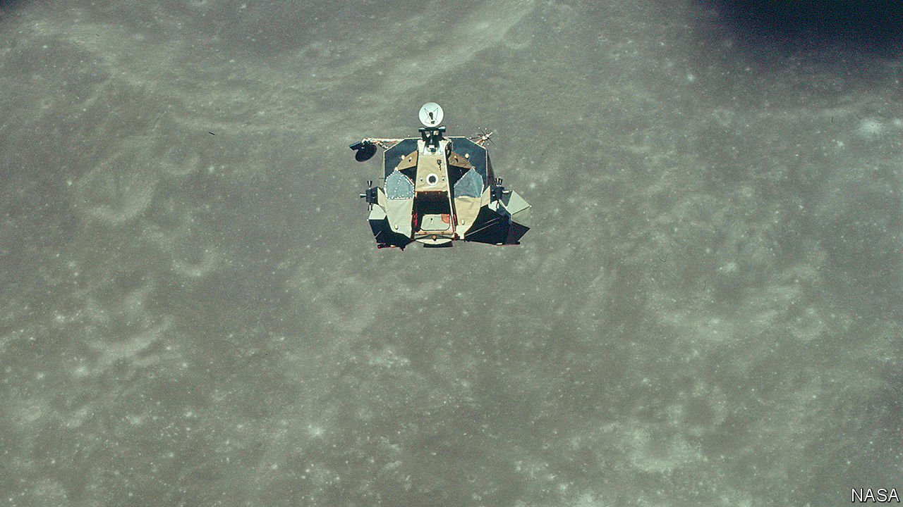

## Crewed space flight

# Another step towards returning people to Earth’s satellite

> A new Moon race has begun

> May 7th 2020

THE NEXT ten months will see a new race to the Moon played out on Earth, as three groups vie to construct a successor to the Lunar Excursion Module (LEM) which took the astronauts of the Apollo project there half a century ago.

The contestants, announced by NASA on April 30th, are SpaceX, run by Elon Musk, a high-profile billionaire, and two consortia. One is led by Blue Origin, run by Jeff Bezos, similarly profiled to Mr Musk and laden with even more billions, and the other by a not-at-all-high-profile outfit called Dynetics, a subsidiary of Leidos, an American technology firm.

The LEM’s landings were hit-and-run affairs. The longest spent three days on the lunar regolith. The LEM itself had a descent stage, with four spindly legs, that also acted as a platform for the ascent stage (pictured), which took its crew of two back to the mother ship.

This time around the plan is for larger crews and longer stays. The candidates are thus bigger than the LEM. The most LEM-like in concept, though, is Blue Origin’s. It has separate descent and ascent stages. But it has two of the latter—one to low lunar orbit, the other thence to a rendezvous with the craft that will take the astronauts home. It would be carried to the Moon either by Blue Origin’s proposed New Glenn launch rocket, or on Vulcan, a launcher planned by a consortium, the United Launch Alliance, of Lockheed Martin and Boeing.

SpaceX and Dynetics each have designs that land and take off intact. But they differ in how they will get to the Moon. Dynetics’ will launch on Vulcan. SpaceX’s lander is a version of its proposed Starship design that will do so on the firm’s planned Super Heavy rocket.

Conspicuous by its absence from the list is Boeing. Its offer of a LEM-like system of descent and ascent stages did not make the cut. The others have until next February to firm up their designs.

## URL

https://www.economist.com/science-and-technology/2020/05/07/another-step-towards-returning-people-to-earths-satellite
