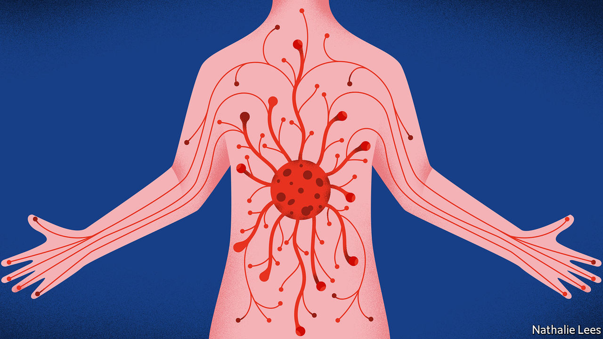

## Virology

# Covid-19 has many faces

> Why does the virus have such varied manifestations?

> May 9th 2020

Editor’s note: The Economist is making some of its most important coverage of the covid-19 pandemic freely available to readers of The Economist Today, our daily newsletter. To receive it, register [here](https://www.economist.com//newslettersignup). For our coronavirus tracker and more coverage, see our [hub](https://www.economist.com//coronavirus)

ACCORDING TO England’s National Health Service the signs that someone has contracted the novel coronavirus SARS-CoV-2 are a high temperature or a new, continuous cough. This is certainly true for a majority of patients, but it is not so for a sizeable minority. Papers published in recent weeks present the new virus as having many faces. This is in stark contrast to the way in which influenza, another primarily respiratory disease, behaves—and it makes SARS-CoV-2 all the more dangerous. It also raises the question of why this virus’s symptoms are so protean.

For decades, influenza has been referred to as “an unvarying disease caused by a varying virus” because of its tendency to mutate every year and yet still cause the same symptoms of rapid-onset fever, malaise, headaches and coughing. Indeed, a review of influenza papers published in 2018 by John Paget of the Netherlands Institute for Health Services Research, showed that even when all of the different influenza types (A or B) and subtypes (H1N1, H3N2, etc) were analysed, there were few differences in the ways they presented clinically. Literature on SARS-CoV-2 suggests, by contrast, that this virus is a master of disguise.

For example, Anthony DeBenedet, a doctor at St Joseph Mercy Health System in Michigan, reports in the American Journal of Gastroenterology that in early March, following a trip down the Nile, a 71-year-old woman arrived at his emergency department with bloody diarrhoea. She suffered with this condition for five days, while also experiencing abdominal pains and nausea. But her temperature was normal and her breathing good, so covid-19 was not suspected. Yet when he and his colleagues examined samples of her stools for signs of the sorts of bacterial infections that are likely to be picked up in Egypt, they found none. They also saw no beneficial effects from the antibiotics they were administering. They therefore started to wonder whether something else might be going on. It was only on the fourth day of the woman’s stay at the hospital, her ninth day of illness, when she developed a cough, that they tested her for SARS-CoV-2 and confirmed the virus’s presence in both her nasal tissues and her stools.

Dr DeBenedet’s findings are far from unique. Patients brought into hospital with all the symptoms of a heart attack have later been found to be suffering from cardiac inflammation caused by the virus. It has also demonstrated that it can begin as a kidney infection, or even as meningitis, before sometimes going on to cause its characteristic respiratory problems.

Precisely why SARS-CoV-2 manifests itself in so many ways while all of the various strands of influenza present the same symptoms is not clear. But there are several theories. One proposed by Stanley Perlman, an immunologist at the University of Iowa, is that in actual fact, nothing odd is really going on. The novel virus’s many faces are being noticed merely because it is a new disease and dangerous, and so is being studied intensely. He postulates that if influenza were looked at with equal intensity, it might also be shown to manifest in other ways—as a mild winter stomach infection, for example.

An idea suggested by William James, a virologist at the University of Oxford, is that the two-phase activity of SARS-CoV-2, whereby it starts in the upper respiratory tract and then migrates deep into the lungs, is the critical factor that allows it to travel around the body. “Influenza rarely gets deep into the lungs,” he says. “This new virus gets down there all the time.” Since the lungs are designed to move gases in and out of the bloodstream (their highly vascularised airs sacs have a collective surface area of about 50 square metres), viruses find it easy to make a similar journey.

Dr Perlman agrees that this notion may be correct, but points out that the only way to be sure is to take samples from places other than the respiratory tract, in people suffering from early stages of the infection, to see if virus migration depends on getting to the lungs first. As for why the disease sometimes makes its initial appearance in the digestive system, as it did in Dr DeBenedet’s patient, this is probably because ACE2, the cell-surface protein that SARS-CoV-2 binds to, is abundant in the gut as well as the lungs. How the virus gets through the highly acidic stomach unharmed is unknown. But clearly it can, and does.

ACE2 is also found in the kidneys and the heart, which may help explain why symptoms manifest there, as well. By contrast, the entry molecules preferred by influenza viruses are almost exclusive to the upper respiratory tract. Knowing all this may make identification of the early stages of covid-19 easier, and thus help to ease the plight of future cases like that of Dr DeBenedet’s patient.■

Dig deeper:For our latest coverage of the covid-19 pandemic, register for The Economist Today, our daily [newsletter](https://www.economist.com//newslettersignup), or visit our [coronavirus tracker and story hub](https://www.economist.com//coronavirus)