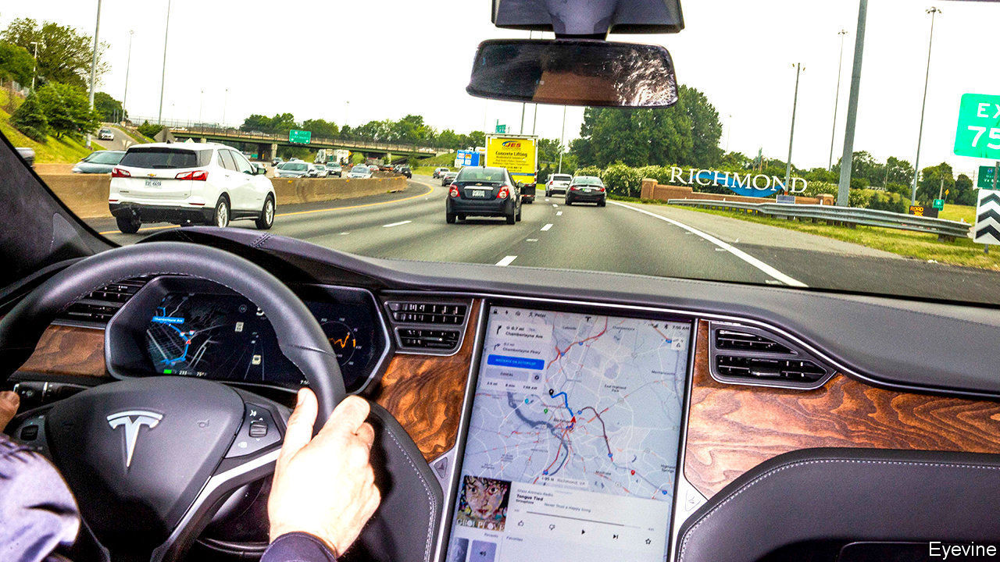

## Road safety

# Motorists using touchscreens in cars are being distracted

> Voice recognition is much safer

> May 7th 2020

STEP INSIDE most modern cars and instead of all the dials and switches that used to clutter the dashboard you are likely to find it dominated by a touchscreen. Often there is more than one screen, and some are bigger than those on a laptop. But, though touchscreens provide a convenient way to operate a multitude of controls and settings, the latest research shows they can also be dangerous distractions.

To discover how badly touchscreens distract drivers, Neale Kinnear and his colleagues at the Transport Research Laboratory, a former British-government agency now run as an independent test facility, arranged a series of experiments. They recruited two groups of 20 drivers. One consisted of regular users of Google’s Android Auto, a popular “infotainment” app which lets drivers interact with their phone through a car’s touchscreen. The others were partisans of Android Auto’s main rival, Apple CarPlay.

Each participant completed three 15 minute journeys along a set virtual route using the laboratory’s sophisticated driving simulator. On one of these trips they had to carry out tasks using only the touchscreen. These tasks included navigating to a restaurant, playing a particular song on Spotify (a music service), changing radio channels, getting the system to read out a text message, and making a “hands-free” telephone call. On the second trip they had to do the same, but using only the car’s voice-activated controls instead. The third journey was a control, with no assigned tasks.

Whenever a red bar flashed on the windscreen the researchers measured how long it took a driver to react by pulling the indicator stalk to flash the car’s lights. As they expected, drivers using touch controls on the screen took longer to respond to the flashing bar than did those using voice controls. Though the difference might be less than a second, at motorway speeds this would result in an increased stopping distance of up to 25 metres.

Dr Kinnear was, however, surprised by the amount of time drivers’ attention was diverted by the series of glances needed to operate the screen. Among the worst outcomes were a mean of 20 seconds of cumulative glances using Android Auto to play a song on Spotify, and of 16 seconds to set up the route to a restaurant with CarPlay. For voice commands those means fell to four and three seconds respectively.

The researchers calculated that reaction times to the red bar when the touchscreen was being employed were more than 50% longer than standard for some tasks. This was worse than the 46% impairment found in a previous simulator study looking at the effects of using a hand-held mobile phone while driving, which is banned in many countries.

Dr Kinnear and his colleagues have urged vehicle-safety bodies to impose standards that limit the use of overly distracting tasks on a car’s touchscreen. At present there are only voluntary guidelines. America’s National Highway Traffic Safety Administration, for instance, says touchscreen tasks should be completed in glances of two seconds or less, with a cumulative time of no more than 12 seconds.

The researchers believe voice-activation is a safer alternative that should be encouraged, though the software needs to be improved. Andy Peart of Artificial Solutions, a Swedish firm developing AI-assisted voice recognition, agrees. One problem is that spoken commands often have multiple intent. “Ask to turn the temperature up and play Ed Sheeran, and the system can’t cope,” he adds.

The migration of vehicle controls to touchscreens has also led to complaints about the machines’ rather than the drivers’ reaction times being too slow, and requiring a confusing number of steps, to boot. In April, after examining the touchscreens in new vehicles, What Car?, a British motoring magazine, reported that adjusting the heater fan can take twice as long when using a touchscreen rather than a physical button, and that selecting a new radio station takes eight times longer.

Carmakers are developing screens that are easier to operate and positioning them more in line with a driver’s view of the road. Haptic feedback, which adds physical, tactile responses, is also coming. This might, for example, detect a moving finger and produce a clicking sound and a slight vibration when a virtual button on the screen is felt and pressed. Old-school motorists may, however, still prefer their cars to come with real knobs on.■

## URL

https://www.economist.com/science-and-technology/2020/05/07/motorists-using-touchscreens-in-cars-are-being-distracted
