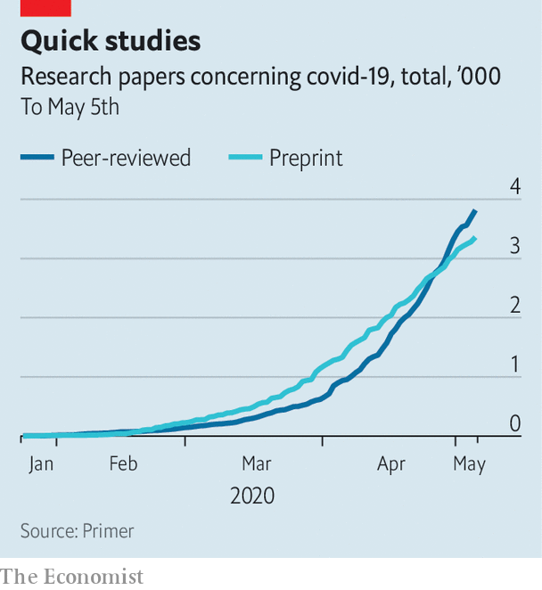

## Covid-19

# Scientific research on the coronavirus is being released in a torrent

> Will that change how science is published?

> May 7th 2020

Editor’s note: The Economist is making some of its most important coverage of the covid-19 pandemic freely available to readers of The Economist Today, our daily newsletter. To receive it, register [here](https://www.economist.com//newslettersignup). For our coronavirus tracker and more coverage, see our [hub](https://www.economist.com//coronavirus)

EXPONENTIAL INCREASES are a hallmark of pandemics. The spread of SARS-CoV-2 around the world has followed such a curve inexorably. But so, too, has the research effort to understand and control the virus. More than 7,000 papers on the pandemic—covering everything from virology to epidemiology—have appeared in the past three months (see chart). A fifth of them have come out in the past week alone.

This is astonishingly fast. Researchers usually take years to design experiments, collect data and check results. Scientific journals, the self-appointed keepers of the gate between those researchers and the rest of the world, can easily take six months, often a year, to grind through the various steps of their procedure, including editing and the process of checking by anonymous outside experts, known as peer review.

The current public-health emergency has, however, turbocharged all this. With physicians, policymakers and prime ministers all needing the latest science in order to make immediate life-and-death decisions, speed has become paramount. Journals have responded to sharp rises in submissions by working overtime. In so doing they have squeezed their normal processes down to days or weeks.

In the view of many, though, this is not enough. These people support a different way of disseminating scientific information—one that dethrones the journals by making journal publication an optional extra rather than a researcher’s primary goal. This model of scientific publishing relies on online repositories called preprint servers, on which papers can be posted swiftly and with only minimal formalities. Mathematicians and physicists already use them widely. Biologists increasingly do so too. Covid-19, however, has seen a step-change. Around half of the available scientific work on the pandemic has been released through preprint servers. The hope of preprinting’s supporters is that this will make the shift to using them irreversible.

Speed is good during a public-health emergency. The genome of SARS-CoV-2 was published by Chinese scientists on a public genome-data repository, a beast similar to a preprint server, just days after the virus was isolated. This permitted the rapid creation of tests to detect infections in people with suspicious symptoms. And the seriousness with which many parts of the world treated the new virus was aided by early reports which suggested that the fatality rates of the cases they looked at were much higher than those seen in influenza.

This increased speed shows that scientists have learned from their sluggish responses to previous outbreaks. In an analysis of research carried out during and after the Ebola outbreak of 2014-16 and the Zika outbreak of 2015-16, Marc Lipsitch, an epidemiologist at Harvard now working on covid-19, looked at just how sluggish those responses were. He found that, where preprints had been available, they appeared around 100 days before journal articles that had eventually been published on the same work. Unfortunately, less than 5% of all the journal articles published about the two outbreaks had been preprinted.

Dr Lipsitch recommended that preprints form a bigger part of a faster information “ecosystem” during future emergencies. And his wish, it appears, has been granted. The two biggest relevant preprint servers for covid-19 are bioRxiv, set up in 2013, and medRxiv, launched in 2019, both of which are run by Cold Spring Harbor Laboratory in New York state. (The “x” in the names represents the Greek letter “chi”, making them pronounceable as “bioarchive” and “medarchive”.)

BioRXiv is for general biological and related sciences. MedRxiv is focused on health and medicine. As The Economist went to press the two servers featured, between them, 2,853 articles about SARS-CoV-2 or covid-19. Another 789 had been posted on arXiv—at 29 years of age, the granddaddy of preprint servers—which belongs to Cornell University and specialises in maths and physical sciences.

Anyone can submit a manuscript to one of these servers and see it made available to the world within hours. Submissions are given a cursory check, to weed out opinion pieces and to ensure that they have the parts expected of a scientific paper—an abstract and sections describing methods and results. If the topic is controversial, the checkers may flag up outlandish claims. But beyond this they do not attempt to review the scientific contents of the paper. Once a preprint is online, anyone with access to the internet can read it and, if they so wish, leave detailed comments.

This process—essentially a free-for-all version of peer review—can be brutal. But it often works. Conspiracy theories about SARS-CoV-2 being an artificial, laboratory creation were fuelled by a preprint posted to bioRXiv in January, by Indian scientists. This claimed “uncanny” similarities between the genetic sequences of SARS-CoV-2 and HIV, the cause of AIDS. The study was torn apart as soon as it appeared, though, by other researchers who weighed in and pointed out serious methodological flaws. As a consequence, the manuscript has now been withdrawn.

This incident does, however, highlight a repeated criticism of preprint posting, which is that dodgy material may be misused, either accidentally or deliberately, by overzealous patients, politicians, journalists or just plain troublemakers. It is certainly a risk. But in the opinion of many, that risk does not outweigh the advantage of the free and fast flow of information between researchers that preprints provide.

For those who question the quality of science contained in preprints, there is reassurance in a recent study by researchers in Brazil (itself posted as a preprint), in which the authors used a questionnaire to score the quality of preprints on bioRxiv, and also the subsequent peer-reviewed-journal versions of these papers. They found that the journal papers were indeed of higher quality. But the difference was, on average, only 5%.

In any case, peer review as organised by journals is not perfect. It will neither pick up all errors nor weed out all bad research. The distracting focus on hydroxychloroquine as a potential covid-19 treatment was, for example, partly stimulated by a peer-reviewed paper in the International Journal of Antimicrobial Agents that was published on March 20th by French scientists. That paper now has question-marks over its rigour and reliability.

Moreover, even when a peer-reviewed paper is withdrawn, the damage may already have been done. On March 9th the South China Morning Post, an English-language newspaper in Hong Kong, published an article about research reported in Practical Preventive Medicine, a peer-reviewed journal, with a headline that read “coronavirus can travel twice as far as official safe distance”. This article has been shared more than 53,000 times on social media. Unfortunately, the study in question was retracted the day after the newspaper article was published. The Post reported the retraction immediately, but that report was shared less than 1,000 times.

The current pandemic highlights further limitations of the way peer review is typically organised. It works well when confined within a narrow group of specialists, but runs into problems when different fields rub up against each other. As Ivan Oransky, a founder of Retraction Watch, which catalogues bad practice in scientific research, observes, “if you were to do a study of the impact of social distancing, for example, and you only asked public health researchers to review that, there’s a reasonable chance that you would almost exclude or at least certainly not emphasise the economic disruption. Whereas if you only ask economists to look at it, you would almost certainly de-emphasise the health risks.”

Conventional journals might struggle to analyse the wide range of trade-offs from different angles in a situation like this. Preprints, says Dr Oransky, permit experts of different stripes to contribute, publicly and in parallel, to a wide-ranging criticism of a piece of research.

As Stuart Taylor, publishing director of the Royal Society, Britain’s top scientific academy, observes, moves towards more open science, preprints and faster dissemination of results were under way before the covid-19 pandemic. But these events will heighten those changes and probably make them permanent. Scholarly communication seems to be at an inflection point. Like many other things until recently taken for granted, it may never return to the way it was before SARS-CoV-2 came along.■

Dig deeper:For our latest coverage of the covid-19 pandemic, register for The Economist Today, our daily [newsletter](https://www.economist.com//newslettersignup), or visit our [coronavirus tracker and story hub](https://www.economist.com//coronavirus)