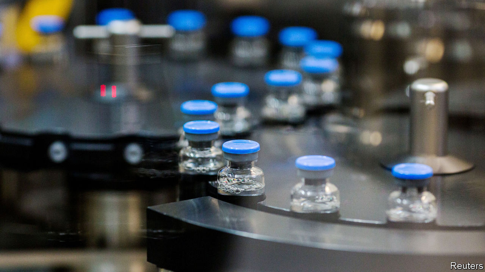

## Treating covid-19

# Two potential therapies for covid-19 have some effect

> Hope rears its head, but more information is needed

> May 9th 2020

Editor’s note: The Economist is making some of its most important coverage of the covid-19 pandemic freely available to readers of The Economist Today, our daily newsletter. To receive it, register [here](https://www.economist.com//newslettersignup). For our coronavirus tracker and more coverage, see our [hub](https://www.economist.com//coronavirus)

WHEN COVID-19 began its march across the world, so did a desperate hunt for a treatment. Not only would finding one save lives, knowing it was available would also allow countries to relax the lockdowns that are strangling economies everywhere. Attention has focused especially on whether existing drugs—the safety of which is already known from human trials—might be repurposed for the job.

Particular attention has been paid to remdesivir. This is an antiviral agent developed by Gilead, a Californian firm. It was originally intended to treat Ebola, but was sidelined when found to be less effective than alternatives. On April 29th America’s National Institute of Allergy and Infectious Diseases, which has been running trials of it, said preliminary data showed that it worked. On May 1st the country’s Food and Drug Administration permitted its emergency use.

Remdesivir is a nucleotide analogue. In other words, its structure mimics one of the chemical letters of the virus’s genetic code. The ill-fitting chemical letter gums up the virus’s replication mechanism. Remdesivir’s effect was not dramatic—it improved patients’ recovery time from 15 days to 11, and there was no statistically significant difference in death rates between treated and untreated patients—but it was real. A four-day reduction in stay-length will reduce the burden the disease imposes on hospitals.

Full data from the trial have not yet been published, something which makes those not involved in it nervous. Some doctors think that the drug will need to be given early, when a patient’s viral load is rising, to have the greatest effect. Also, outsiders cannot currently analyse the different groups of patients involved, to make sure that those who did not receive treatment were well matched with those that did. If, for example, those in the treatment group were healthier than those who were left untreated as a control, that would make the drug look more effective than it actually is.

Remdesivir is a beginning. Its eventual value, though, is likely to be as an arm of a combination therapy. Other drugs which might form part of such a therapy include further antivirals, and also anti-inflammatory medicines.

One possible anti-inflammatory treatment is tocilizumab, sold by Roche as Actemra and currently prescribed for arthritis. Many of those most seriously affected by covid-19 are killed by an overreaction of their immune system, called a cytokine storm, that leads to massive inflammation of the lungs and consequent respiratory failure. Cytokines are signalling molecules. Several varieties of them are secreted by the immune system in order to regulate itself. A storm occurs when uncontrolled levels of cytokines are released. Actemra blocks the cellular receptors for a cytokine called interleukin-6.

A recent trial of Actemra on 129 covid-19 patients who had developed pneumonia showed that it reduced deaths in the worst-affected. The big challenge with anti-inflammatory treatments is knowing when to give them. Applied too soon, they will reduce the immune response that is needed to tame the virus. For that, doctors will need to look carefully at the data from the Actemra trial. These, though, have not yet been published either. ■

Dig deeper:For our latest coverage of the covid-19 pandemic, register for The Economist Today, our daily [newsletter](https://www.economist.com//newslettersignup), or visit our [coronavirus tracker and story hub](https://www.economist.com//coronavirus)

## URL

https://www.economist.com/science-and-technology/2020/05/09/two-potential-therapies-for-covid-19-have-some-effect
