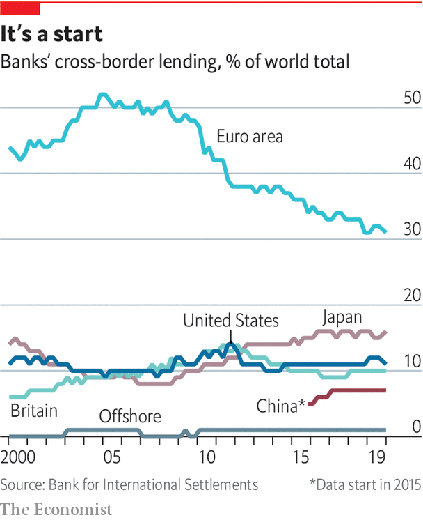
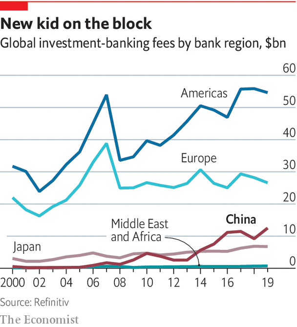

## Global banks

# As China goes global, its banks are coming out, too

> European banks are losing their influence

> May 7th 2020

AMERICAN BANKERS make for bold bosses. From his roomy office in Manhattan, in early February, the boss of one of the country’s biggest suggested he has few serious rivals—and all are just a few blocks away. “US banks continue to gain share from European banks.” Asia barely gets a mention. “Chinese institutions have generally proven incapable of expanding globally. When they buy sports cars and flashy hotels, it just doesn’t feel solid.” Days later Morgan Stanley, America’s sixth-largest bank, announced its $13bn acquisition of E-Trade, a broker—the biggest by a Wall Street bank since 2008.

Within weeks China had exported a different threat. As coronavirus-induced investor fever took hold, the Dow Jones index of top American lenders, which had soared by a third over 2019, crashed by 50%. The market rout did not wipe them out. But it is the sort of event that could lead incumbents to self-isolate—accelerating the discreet spread of Chinese banks in emerging markets. And the country is opening up its own market, hoping to learn tips from new entrants along the way.

Chinese banks are already huge. Their total assets now surpass those of American and European banks. They are also providing more cross-border credit, the bread and butter of international banks. The sum they lend overseas has grown by 11% a year since 2016. More surprising to outsiders, they are gaining clout in the sophisticated universe of capital markets, too. Last year Chinese banks earned three times more investment-banking fees than all Asian rivals combined (excluding Japan). Their share of the total has jumped from 1% in 2000 to 14%.

On the eve of the collapse of Lehman Brothers in 2008, European banks were the kings of cross-border lending. They accounted for 71% of total flows, which had grown from $10trn in 2000 to $35trn in 2008. But the subprime meltdown, followed by the eurozone crisis, forced them to retreat. As regulators required global banks to hold more rainy-day equity, other lenders chose to issue capital or to retain earnings. But conditions in Europe meant its banks had little choice but to trim their balance-sheets. Banks shed assets overseas. Far-flung subsidiaries were sold or shut. Today Europe (including Britain and Switzerland) provides 47% of the world’s $31trn in cross-border flows.

Cyclical events are likely to stymie them further. It is hard for banks to grow faster than their home economy. Europe has had anaemic growth throughout the 2010s. The virus crisis is turning 2020 into an even sicklier year. Interest rates, negative across the region for many quarters, are plumbing new depths. European banks’ return on tangible equity (ROTE) sank to 6.6% last year (investors reckon 10% is par). America’s top banks, buoyed by positive rates and a sprightly economy, posted double-digit ROTEs in 2019.

Europe will be hindered by structural factors, too. American lenders draw strength from their vast and unified home market. They can also reduce risk by repackaging loans and flogging them onto the country’s deep capital markets. The EU lacks both those things. Squabbles among members are hampering plans to complete a banking union. Cross-border mergers would give its top banks more scale, but are politically tricky, says Irene Finel-Honigman of Columbia University. And efforts to fuse capital markets remain unfinished (and diminished by Brexit, which separates the EU from its main financial centre).

The biggest issue lies with where European banks sit within the financial system. For all their cross-border heft, they are mostly middlemen, ferrying greenbacks from New York to other corners of the planet. Outside Europe much of their lending is done in dollars. Some is locked in long-term loans that cannot be called back. Yet they have no natural source of dollars, so many fund themselves by borrowing from short-term money-market funds. That makes them hostage to unsympathetic parties. Many reeled in 2012 when American funds, spooked that some European countries might default on their debt, struck European clients off their registers, says a top executive at a Swiss lender.

Asian rivals are filling part of the gap. With Japan stagnant, the country’s “megabanks” have been hunting for yield. They now extend 16% of global cross-border lending, twice their pre-2008 share. But their onslaught looks brash: they have piled into risky American securities. The rise of South-East Asia’s “super-regionals” seems more robust. They avoided follies during the 2000s, so suffered no hangover, says Edmund Lin of Bain, a consultancy. They have upgraded their tech. Perky economies give them oomph. Their total assets in the region have grown fivefold since 2002, when those of international banks doubled.

Many think China is missing out. A distant third in 2008, its banking system, at $40trn in assets, now surpasses both the euro area’s and America’s. A list of 30 “global systemically important banks” by the Financial Stability Board, a grouping of watchdogs, now includes all China’s “Big Four”—Bank of China, Industrial and Commercial Bank of China (ICBC), China Construction Bank and Agricultural Bank of China. Only one featured in 2012. But sceptics say they sit on dud loans at home and are being reined in by the state, which owns them. Their management is deemed “paternalistic”; their systems “unsophisticated”.

Chinese banks have indeed long been absorbed by their home market, where they have a 98% share. And their first attempts at internationalising did fail. Many hoped to garner tips on how to climb global leagues in the 2000s after luring American stars, like Goldman Sachs and Bank of America, as “strategic shareholders” through IPOs in Hong Kong. But those stakes were quickly liquidated after the subprime crisis. Chinese banks also realised they could earn higher profits at home. So plans were scaled back.

In recent years, however, they have been on a stealthy prowl. Banks have followed their corporate clients, themselves inclined to grow beyond their saturated home market. They finance trade, take local deposits from local subsidiaries and serve their mundane needs, like cash management or foreign exchange. They also fund Chinese-built infrastructure in emerging markets. Thanks to huge balance-sheets and inside knowledge of contractors’ history, they often outcompete foreign peers, says John Ott of Bain.

Their tentacles are spreading. The Big Four now have a total of 618 branches outside the mainland—a conservative proxy, since commercial banks need few shops. Since 2015 their share of global cross-border lending has risen from 5% to 7%. Foreign assets account for 9% of their book. Their footprint differs from that of Western peers: Chinese banks supply two-thirds of all cross-border lending within emerging markets. Hasnen Varawalla of Absa, a South African bank, says their presence in Africa keeps growing.

President Xi Jinping’s Belt and Road Initiative (BRI) is a big catalyst. Chinese banks have lent nearly $600bn to 820 official BRI projects since 2013, reckons RWR, a consultancy. Unofficial sums are probably bigger. Bank of China alone says it lent more than $140bn to 600 projects between 2013 and mid-2019 (others do not disclose figures). Chinese lenders are expanding along the trail: they now have 76 branches in BRI countries, many created since 2018. Commercial banks share the labour with “policy” banks, like China Development Bank or the Export-Import Bank. Those tend to fund low-yielding projects like ports and railways, while the Big Four often back the “bankable” amenities around them, such as shopping centres or property development. Significant lending also appears to be done by non-bank subsidiaries of Chinese banks (no one knows how much). Many state agencies also disburse “hidden” credit. A paper in 2019 by German economists argues international bodies miss as much as 50% of China’s “public” lending.

The medium-term fallout from covid-19 may draw China’s Big Four further out. China’s global firms—which make up 24% of the Fortune 500 ranking, second only to America’s—may focus on Asia, where they have a natural edge. The banks will also want to diversify away from their domestic market, where non-performing loans are increasing. And unlike Japanese banks in the 1980s, which bought expensive property, they “have a strategic reason to win,” says Jamie Dimon of JPMorgan Chase.

They may be fighting the wrong fight. Since the financial crisis a growing share of people and firms are financing themselves by issuing securities on capital markets, shunning traditional lenders for “shadow” banks like pension funds and insurance firms. These have been amassing assets twice as fast as banks since 2008. They now account for nearly half the world’s financial system—about $184trn. Issuers of securities still rely on banks, but the shift favours those earning a living through fees (advising on issuances or underwriting them) rather than interest on loans from their balance-sheets.

American banks have a huge advantage, says James Gorman, Morgan Stanley’s boss. They make 60% of their revenue at home, which hosts the world’s biggest and most profitable capital market (it now represents 45% of global investment-banking revenue, up from 36% in 2009). The world’s top-five earning banks are all American. Some European banks, notably BNP Paribas, have snapped up clients and businesses from ailing peers, says Jean Lemierre, its chairman. Yet even in their backyard the top slots belong to transatlantic rivals.

Gaining an edge in investment banking requires a global network of investors and companies Chinese banks do not yet have. Many also lack independence. In 2015 the state leaned on securities firms to rescue the stockmarket. Last year it told them to lend to struggling small firms. Attempts at tie-ups with foreigners have foundered, too. The rigid hierarchy of China’s state-owned firms does not mix well with Wall Street’s freewheeling ethos, bankers say. Many staff have left CSLA, a respected Hong Kong outfit, since CITIC, a Chinese broker, bought it in 2013.

But Chinese banks are making unnoticed leaps. Eager to diversify funding and amass firepower for acquisitions overseas, home-grown companies have been rapidly raising dollar debt. Issuance reached $310bn last year, from $71bn in 2016. Chinese banks are underwriting these as lead or even sole arrangers, allowing tighter links with domestic titans while building contacts with foreign investors. Some also outsource services they do not yet master, like sales or electronic trading, to Western banks, which they then resell under their own brand. That enables them to grab a growing slice of clients’ “banking wallet”.

They are also progressing in the prestigious equity business. In 2019 CITIC beat Goldman Sachs to become the first local bank to top league tables in Asia. Chinese firms are propelled by their home market: local companies raised half a trillion dollars through IPOs in the past decade, says Refinitiv, a data firm. They are climbing the ranks in Hong Kong, which became the world’s largest listing hub in 2019. Chinese venues may not replace New York peers soon, says Ivy Wong of Baker McKenzie, a law firm. But they do provide leverage. Chinese issuers facing resistance in America can court global investors from Hong Kong, with no political fracas. Stock Connect, a scheme launched in June 2019 allowing Shanghai-listed firms to raise equity in London, may help.

Elsewhere in Asia China’s progress has been muted. But that need not matter much. Last year protests in Hong Kong prompted talk of a drain to Singapore, the rival regional centre. Yet, loth to anger Chinese officials, few firms dared move staff, says an executive at an American bank in Hong Kong. The Middle Kingdom is cementing its status as the centre of gravity for the region: investment-banking revenue in China has grown to $12bn, up from $550m in 2000.

Those juicy prospects are attracting outsiders—and Beijing is opening the door. Last year regulators cleared the way for full foreign takeovers of local banks. They then allowed outsiders to control wealth-management firms, pension-fund managers and brokers. In April foreign-ownership caps were also removed on securities firms. The world’s A-team of money managers is teaming up with locals or seeding subsidiaries in the hope of grabbing a slice of China’s $45trn financial-services market. “Every week we get a knock on the door by one of these top 15 players,” says Greg Gibb of Lufax, a Chinese wealth manager.

Breaking ground will be hard. Incumbents have a 25-year head start at building networks of branches and contacts throughout China’s huge landmass. Often they use investment banking to cross-sell other services to local companies, so can undercut outsiders on fees. Past episodes of liberalisation are not encouraging: in 2007, when Beijing first allowed foreign banks in, it hindered competition by forcing them to operate in bizarre locations. Today they have a 1.5% market share.

New entrants say it would be mad not to try. But many fear they will be crushed before they get big enough to make money. “We do not have expectations of short-term commercial success,” says the man in charge at an American firm. Another money manager in a tie-up with a local company says the flow of information seems to be going only in one direction.

Incumbents can hope for more efficient markets and some knowledge transfers. Many have started joint ventures with several foreign firms to cover all bases. “China is opening up because it is confident,” says a former Bank of China executive. He compares the country’s financial industry to its automotive sector, on which China also lifted ownership caps last year. One such tie-up suggests possible dangers ahead for foreign companies. In 2007 Geely, an obscure Chinese firm, partnered with LTI, the maker of London’s black cabs. By 2013 it had bought the business. It is now filling Britain with e-taxis that can out-green Uber. ■

## URL

https://www.economist.com/special-report/2020/05/07/as-china-goes-global-its-banks-are-coming-out-too
