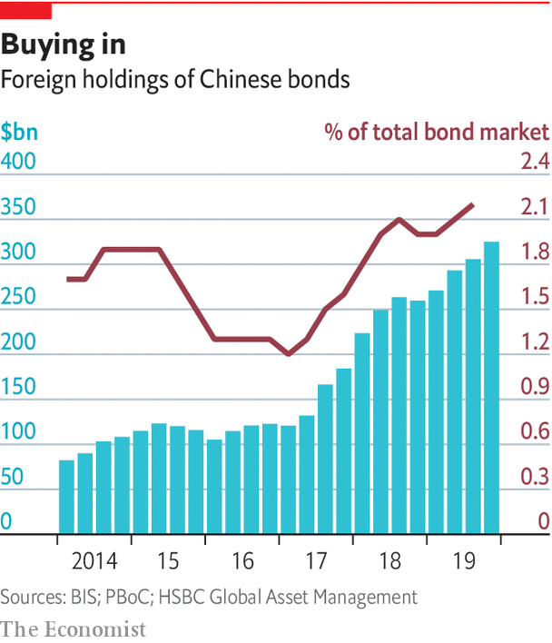

## International currencies

# China wants to make the yuan a central-bank favourite

> And it is playing a trump card in order to achieve it

> May 7th 2020

BETWEEN 2004 AND 2012 BNP Paribas helped funnel $30bn into Sudan, Cuba and Iran, all then under American sanctions. It hid its tracks using a network of “satellite” banks and by stripping payment messages of incriminating references. Whistleblowers tipped off American prosecutors. The bank pleaded guilty, expecting to pay €1.1bn ($1.2bn). It was fined $8.9bn by American authorities in 2014, and the case escalated to a diplomatic row.

BNP immediately fell into line. It moved the division overseeing the security of its dollar transactions from Europe to America, the first foreign bank to do so. A dozen staff lost their jobs and its compliance team was revamped. There was relief at the bank. It had avoided being permanently banned from clearing dollars, the closest thing to commercial death for international lenders. “Banks create money, and money is a sovereign good,” says Jean Lemierre, BNP’s chairman. “States decide what we can do with it.”

America wields more clout than other states because its money is so central to the system. On international currencies’ three roles—unit of account, medium of exchange and store of value—the greenback ranks high. Most commodity contracts are denominated in it. The dollar represents half of cross-border interbank claims, a proxy for international payments, and 62% of central-bank reserves. No amount of American goofing seems able to blunt its appeal. Everyone rushed to buy dollars during the subprime crash, even though Wall Street caused it. They did it again in March despite America’s bungled response to covid-19.

Yet the flattering snapshot masks an ominous process. Aware of the power that issuing an international currency confers, China is on a charm offensive. Cautious to avoid past mistakes, it is advancing methodically. And it is playing a big trump card: opening up its $13trn bond market, which accounts for 51% of all bonds issued by emerging economies. So far, all is going according to plan.

There are three types of benefits to the issuers of a reserve currency. One is reduced transaction costs. Banks can access central-bank liquidity at will. Firms can borrow cheaply overseas and suffer less foreign-exchange risk.

A second, bigger prize is macroeconomic flexibility. To outsiders, dollars are an attractive asset they use for cross-border purposes. Yet, for America, foreign ownership of its notes is like a loan from abroad. Hunger for dollars allows it to finance deficits with its own money instead of forcing its residents to spend less. That reduces the elemental need to balance the money that comes in with what goes out, freeing America to pursue the monetary and fiscal policy it wants. When the country suffered its first-ever credit-rating downgrade in 2011, investors rushed to buy dollar assets, making it even cheaper for it to borrow.

That autonomy, as well as the world’s dependence on greenbacks, gives it leverage—its third big advantage. America can extract concessions by rewarding allies with vital liquidity while denying it to foes. Last year three Chinese banks pledged swift compliance when suspected of flouting sanctions against North Korea. Monetary clout grants influence on international regulation: European bankers complain that global capital-adequacy ratios are harsher on them than on Americans.

Being the world’s money master incurs costs, too. Robust demand for the dollar boosts its value relative to others, hurting exporters. The Fed must contend with a growing overhang of liquid debt overseas, which leaves the domestic economy hostage to sudden movements of capital, says Benjamin Cohen of the University of California, Santa Barbara. And there is the duty to bail out the system when necessary.

Such trade-offs explain why rising economies, like Japan and Germany in the 1980s, shied away from turning their fiat into global favourites. Until recently Europe was in that camp. It saw the euro as a tool to build the union but did not care if others adopted it. Yet that calculus has changed. With America more isolationist, the EU attaches fresh value to monetary autonomy. In 2018 the European Commission started pushing for a stronger international role for the euro.

In that world minting a reserve currency is the ultimate aim. This is because the currency mix of central-bank holdings tends to be highly concentrated—more so than private investors’ portfolios. Becoming an investor darling, however, is a necessary first step. That requires having large, liquid capital markets and government bonds that are deemed safe assets (these make up the bulk of foreign-exchange reserves). Another requisite is to be widely used in trade, as central banks like to stock up on the cash their country needs to buy imports. There it helps to have a big economy that is integrated into global markets.

With four oil majors, a convertible currency and a vast cross-border banking system, the EU would seem to be “ready for prime time”, says Karthik Sankaran, a fund manager and currency strategist. Without fiscal union, however, it lacks a supranational, liquid eurobond. And bonds issued by single members display uneven safeness, because Europe’s weak banks and sovereigns are tightly connected (banks typically hold 15-30% of their home country’s debt). A banking union would help break that “doom loop”, but Brusselites admit the project is “a bit stuck”. The euro’s share of global reserves fell to 20% last year, from 28% in 2009.

So Europe tinkers around the edges. It sends questionnaires to G20 countries to understand why they do not use euros more often. In March it held a workshop with its eastern neighbours on how to issue euro bonds. The EU scolds its policy banks for not issuing more debt in euros. But top-down efforts are gaining little traction. “I look around me and everyone uses the dollar. It’s not me, it’s my clients,” says a European bank boss.

Russia has been brasher. Since 2013 its central bank has cut the dollar share of its reserves from 40% to 24%. Today Moscow mostly issues debt in roubles and euros. ING, a bank, reckons 62% of its exports were settled in dollars last year, down from 80% in 2013. But the push aims to insulate it from American wrath, not make it a currency power. Rosneft, a blacklisted firm that extracts 40% of Russia’s oil, now denominates its contracts in euros.

China makes no secret of its yearning for a global yuan. Eager to control how much money comes in and out of the country, however, it has long had capital controls in place, which limit how much of the currency outsiders can access. So its progress has been gradual. In the 2000s it started allowing Hong Kong residents to open deposit accounts in redbacks, creating pools of liquidity outside the Great Wall. It used the former British colony to test other policies, such as persuading foreign states and firms to issue “dim sum” bonds. Its efforts stalled in 2015, when a loosening of controls, and worries about China’s economy, forced the central bank to dump $1trn in reserves to combat outflows. Controls were tightened. Foreign trade settled in yuan collapsed. Offshore deposits cratered.

Sceptics say China is dreaming when it talks about internationalisation. But they have not woken up to fresh facts on the ground. Deposits did take a hit in 2015, but they are rising fast again and are now back to over 1trn yuan ($144bn), 20 times their total in 2009. Liquidity has spread: Taiwan has nearly half as much in deposits as Hong Kong. Singapore and London have grown.

A boom in foreign-exchange transactions also suggests growing usage. The daily turnover of FX instruments traded in Hong Kong has more than doubled since 2013, to $107bn. Other hubs have risen: Britain accounts for 37% of all trades; France and America are nearing double-digit shares. A growing list of offshore investment products are denominated in yuan, which helps raise its profile among investors. Hong Kong now lists exchange-traded funds, equities, gold futures and property investment trusts, says Craig Chan of Nomura, a bank.

But China’s mightiest advances are in the real world, where it uses its vast trade and investment network to fan out its fiat. The Belt and Road helps. Direct investment by Chinese firms into related projects was worth $15bn last year, a quarter of which was in yuan. China now settles 15% of its foreign trade in the currency, up from 11% in 2015. It has made it easier for its national champions to use the yuan in their transfers to foreign outposts, such as financing flows, capital injections or day-to-day cash management.

China wields particular clout in emerging markets. The number of banks processing yuan payments globally has grown by half since 2017, to 2,214. Most additions have come from Asia, the Middle East and Africa. Some European countries are also keen, notably France, the region’s dollar-basher in chief. A fifth of its trade with China is settled in yuan, as is 55% of payments between both countries. Paris actively encourages its banks and businesses to use the redback. A former IMF official says several multinationals have begun pricing deals in yuan to bypass American sanctions.

Beijing is mulling a wider offensive. It has appointed yuan-clearing banks in 25 countries to accompany exporters. It also wants to procure more of its vital imports in redbacks. In 2018 it launched yuan-denominated oil futures in Shanghai. This helps importers hedge risk while paying in domestic currency, says Stephen Innes of Axicorp, a foreign-exchange provider. They became the third-most widely traded such futures globally in just six months. Last year HSBC became the first foreign bank to hold margin deposits for foreign traders of iron-ore futures in Dalian, China’s commodities exchange. Vina Cheung, its yuan expert, says the country is “preparing the infrastructure to include overseas investors and traders”. Multinationals are starting to respond: Rio Tinto sold its first yuan iron-ore contract in October.

Crucially for China’s end goal, central banks are also warming up to the yuan. Since its inclusion in the IMF’s special drawing rights, a basket of elite currencies, in 2016, its share of global reserves has risen every quarter, to 2.1% in September. Natalie Dempster of the World Gold Council, an industry body, reckons some central banks are using gold as a halfway house to buy yuan once capital controls are lifted (they bought a record amount of gold in 2018). China has signed currency swap agreements with over 60 countries, amounting to half a trillion dollars. Some have pledged to allocate 10% of their stash to the yuan, which would bring its share of reserves to $800bn (from $220bn today).

Two factors could tip them into action. First, the yuan appears to be influencing exchange-rate fluctuations around the world. Recent research by IMF scholars finds the “yuan bloc” to account for 30% of global GDP—second only to the dollar, at 40%. Central banks pick reserve currencies closely tied with their own.

Second, China has opened a fresh breach in its capital controls, and money is streaming in (see chart). In 2017 the country launched Bond Connect, which allows foreigners to invest in onshore bonds through Hong Kong, and scrapped investment quotas. Last year it also authorised international credit-rating agencies. That, plus rising domestic demand for listed securities, has convinced the world’s most popular index providers to phase Chinese bonds into their benchmarks. This helped draw $60bn of foreign money into government bonds in 2019, a flow that covid-19 has not stopped. Some 1,900 overseas investors are registered to Bond Connect, up from 700 a year ago.

Foreigners now own 3% of China’s bond market, the world’s second-largest, and 8.8% of its government bonds (up from 2.8% in 2015). Their appetite will only rise. Chinese bonds offer good yields and diversification benefits. Yet they remain on the “very periphery of institutional investors’ portfolios”, says Mark Wiedman of BlackRock, the world’s largest money manager. It is creating a programme to guide clients on how to invest in China. ■