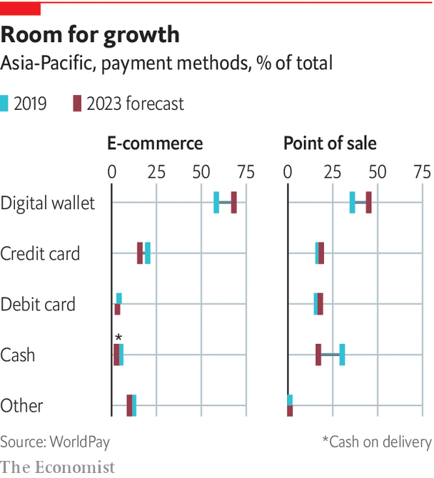

## Payment systems

# The financial world’s nervous system is being rewired

> And it is not America that is doing it

> May 7th 2020

TWO WEEKS before Christmas, executives from OneConnect, a Chinese technology firm, boarded a plane to New York. They landed in a chilly atmosphere: American legislators were about to bar Huawei, a telecoms giant suspected of spying for Beijing, from supplying American agencies. But OneConnect did the job. On December 13th it listed on the New York Stock Exchange, raising $312m, which valued it at $3.7bn. Analysts expect the loss-making firm’s share price to climb by more than 70% in the next 12 months.

OneConnect supplies the artificial brain and nervous system of financial firms that go digital, says Dai Ke, its strategy chief. It serves all China’s top lenders and 99% of the next tier down. It is expanding in Asia and recruits in America, where it runs a research lab, yet few people have ever heard of it. It belongs to a new breed of Chinese firms that are rewelding the pipes channelling money in the developing world. They are waging a “proxy battle” against American giants, says Huw van Steenis of UBS, a bank.

With America readier than ever to close the liquidity taps on rivals, China is investing time and money in building a private track. It has rolled out its own messaging system to complement SWIFT, which may one day supersede it. Meanwhile Alibaba and Tencent, two giant tech firms, have already built what Paco Ybarra of Citigroup, an American bank, calls “parallel banking systems”. Their digital wallets have over 1bn users each and account for half of in-store payments and nearly three-quarters of web sales in China.

Payment systems are more about moving information than money. The process usually involves banks at both ends, which exchange messages about such things as the sender’s identity or funds available. Within a single country banks talk the same language, and transfers can be settled by updating the central bank’s ledger. But cross-border payments cause headaches. Rules and standards differ. And the world lacks a common central bank, so there is no global ledger on which to record the transfer.

For large-value payments, finance’s usual fix is the “correspondent” banking system. Under often reciprocal arrangements, one bank in one country holds deposits owned by another bank in another. When a customer of the second wants to pay someone at the first, that bank instructs its correspondent to use the deposits. Many banks, however, do not have a direct link. To get to its final destination, the money must make stopovers. That requires an ID for each bank, a messaging system and a common language.

SWIFT provides all of these. Built over decades, its network is hard to replicate. But most of the world has two incentives to give it a go. The first is political. Although the organisation is not American, Uncle Sam leans on it to pressure friends and isolate foes. In 2018, when America threatened action if it did not exclude Iranian banks, SWIFT quickly complied.

The network’s complexity also makes cross-border transfers slow and costly. Many tasks, like checking customers are not known criminals, are duplicated. Banks must keep idle funds in foreign currency (some $10trn globally) to meet forecasted demand. And the system is not fully hack-proof. In 2016, North Korean hackers used stolen SWIFT identifiers to siphon off $81m from an account Bangladesh’s central bank held in New York.

Startups try to alleviate the pain by reducing the number of interactions banks and companies have with SWIFT. Some work with “hub” firms in recipient countries that break up big sums, like payroll, into tiny payments. Others aggregate transfers to absorb fixed costs. Lucy Liu of Airwallex, a fintech company, says it relocated from Australia to Hong Kong to serve rising demand from Chinese exporters. Some fintechs fully bypass SWIFT. Ripple, an American firm, has created a cryptocurrency it uses as an intermediary for payments between countries with different currencies.

Governments are also exploring crypto-money. China is leading a solo effort. It has already filed more than 120 patent applications for a sovereign digital currency, more than any other country. Hawks fear it may impose its use on BRI countries. “Our values are at stake,” says Tim Morrison, a former adviser to President Trump. But China seems to favour goals closer to home. With much of its economy now cashless, it sees a digital coin it controls as a crucial fail-safe for its domestic payment systems. It also wants to pre-empt Libra, a cryptocurrency Facebook intends to launch, from infiltrating people’s pockets.

Others have looked at international applications. Singapore and Canada, as well as Hong Kong and Thailand, have led joint experiments to test if digital coins minted by central banks could be used by commercial banks to transact across borders. Those proved successful, but engineers who took part doubt the system could ever deal with a large volume of transfers.

Pariah states already use digital monies to trade unnoticed. North Korea has hacked crypto-exchanges to fund weapons imports. Russia used bitcoins to pay for the infrastructure that hacked into the servers of America’s Democratic Party in 2016. But that underground economy is tiny. Jonathan Levin of Chainalysis, a data outfit, says transactions involving the petro, a currency Venezuela created, hit its peak in the last quarter of 2019—at just $8m.

Europe has instead tried to barter. Last year Britain, Germany and France launched Instex, a system meant to match the payments of firms buying oil or foodstuffs from Iran with the receipts of companies selling to the country. In principle, goods could flow with no need of moving money. Yet it took 14 months for Instex to do its first deal. European firms, many of whom do more business with America than Iran, fear being blacklisted.

China has gone furthest. In 2015 it launched CIPS, an interbank messaging system to ease international payments in yuan. It uses the same language as SWIFT, allowing it to talk to other countries’ payment systems. For now just 950 institutions use it—less than 10% of SWIFT’s membership. But “what matters is it’s there,” says Eswar Prasad of Cornell University.

The real revolution is happening in low-value transfers. Like SWIFT, the network of American card schemes is tricky to displace. Member banks and merchants trust each other because they adhere to tested rules. They also like the convenience of the schemes’ settlement platforms, which compute “net” positions between all banks that they square up at the end of the day. So rival schemes struggle to make a dent. In 2014, fearing sanctions could block it from using American schemes, Russia created its own, which now accounts for 17% of domestic cards. But its 70m tally is dwarfed by Visa and Mastercard’s 5bn. Size is not a problem for UnionPay, China’s own club. Just 130m of its 7.6bn cards were issued outside the mainland, however, where it is mostly used by Chinese tourists.

A mightier threat comes from a state-led revamp of domestic payment systems. Eager to reassert control over key infrastructure, some 70 countries have rebuilt their local plumbing to enable near-instant bank transfers at the tap of a screen. Europe is the most advanced, having fused local networks into a bloc of 35 countries and more than 500m people. South-East Asia is also trying to stitch its systems together. On March 5th India and Singapore connected theirs for the first time.

China lags behind its neighbours in beefing up its kit. But that need not matter. As the region’s trade hegemon, it can free ride on others. “Once Malaysia gets its system going, it will figure out a way to work with China,” says Phil Heasley, a former chairman of Visa USA. China is also hedging its bets by building a private track.

Just five years ago, shopping in second-tier cities was tedious. Few shops accepted cards. They did not like the fees and lacked a connection to plug in terminals. Settling anything other than daily supplies in cash required wads of it. The mass adoption of smartphones, however, meant most customers were starting to carry mini-terminals around. And the invention of QR codes suddenly allowed customers to pay even when the merchant was offline.

The combination of both has swept all before it. Last year Chinese customers paid 347trn yuan ($49trn) in purchases via mobile, 35 times the total in 2013. Two giants eat up 92% of the market. WeChat Pay, owned by Tencent, a tech group, dominates peer-to-peer transfers. Alipay, which belongs to Ant Financial, the finance arm of Alibaba, an e-commerce group, rules payments to firms. After loading digital “wallets” from their bank account, users can pay for almost anything, from cabs and bills to doctor appointments. Wallets charge no fee to users but tax them when they move money out, so everybody is incentivised to stay in their universe.

Their market now cornered, the “super-apps” are going global. Alipay is accepted by shops in 56 countries and regions, where it targets Chinese travellers. It has also bought minority stakes in wallets in nine Asian jurisdictions, allowing it to influence the industry without applying for local licences.

Douglas Feagin, Ant Financial’s internationalisation chief, says connecting the wallets in which it has invested is not a priority. But others suspect the firm is waiting for local wallets to reach critical mass. “It may not be branded Ant Financial,” says Zennon Kapron of Kapronasia, a consultancy, “but one of their goals is to eventually build an international cross-border wallet platform.” Its expertise is also luring firms from farther away. Six European mobile wallets have adopted Alipay’s QR format.

China’s fintechs will not always succeed. In some markets credit cards, or interbank systems, are too popular. But the battle over payment methods masks a bigger war over the hardware and software that power them all. It is one that China is winning.

Squeezed by low interest rates and the high fixed costs of going digital, banks across Asia are seeking to borrow scale by “moving to the cloud”. They store their data on large servers owned by specialist providers. Dave Bartoletti of Forrester, a research firm, sees the region as the “most important battleground” for cloud in finance (along with Europe). On hardware Alibaba is top dog. The firm provides a fifth of cloud infrastructure in Asia Pacific, more than its next two rivals (Amazon and Microsoft) combined.

China’s tech firms also rule the software bit. The need to execute huge amounts of transactions fast—last year Alibaba netted its first billion dollars in sales for Singles’ Day, China’s annual shopping festival, in 68 seconds—has endowed Ant Financial and Tencent with a knack at automation, machine-learning genius and troves of data. Both have used them to build nimble digital banks. These lead the race to define identification and security standards, crucial as banks and payments move online. Henry Ma of WeBank, Tencent’s offspring, says its facial-recognition tool has an error rate of less than one in a million (the human eye averages 1%).

Both banks are growing fast. MYbank (Ant Financial’s offering) already serves 20m of the country’s 100m SMEs. It also rents its kit to 200 other banks, and hopes to use Hong Kong and Singapore as a testing ground for those skills abroad. Investors think internationalisation has promise: Ant Financial, which is private, was valued at $150bn in its latest funding round. WeBank is taking a different tack. It is making the infrastructure it created available on an open-source basis, so foreign banks can build upon it.

Tencent and Alibaba’s greatest impact, however, may have been to awaken another giant. Ping An, a Chinese insurer with $1trn in assets, decided to become a cloud company after seeing their meteoric rise in finance, says Jonathan Larsen, its innovation chief. The company, which invests 1% of its revenue—worth $164bn last year—in research and development, has spawned 32 stand-alone businesses to help export the tech it hones at home.

The most strategic of its offspring is probably OneConnect, the startup that listed in New York in December. The firm offers cloud-based services that cover everything, from back-office to client-facing tasks. Its first foreign outpost, opened in 2018 in Singapore, has grown to 200 staff. It now serves 47 clients in 16 overseas markets. Those include Thailand, where it is poised to power the credit-card processing of a top-three bank, and Europe.

Covid-19 could help. With staff stuck at home, banks across the world are looking to move data-hungry processes like risk management online. OneConnect has launched a charm offensive to capture the business—this time without boarding a plane. ■