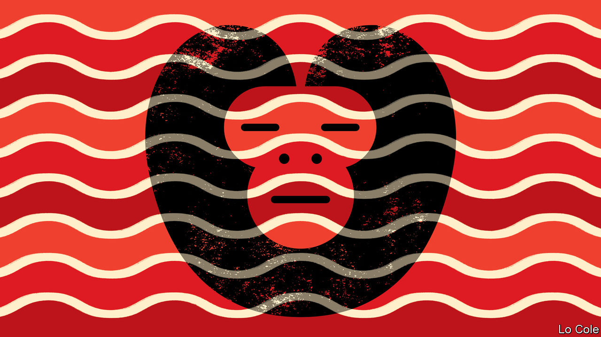

## Bello

# Antonio Di Benedetto and the Latin American condition

> Zama, a novel of solitude and self-destruction

> May 7th 2020

IT IS 1790 in Asunción. Today the capital of Paraguay, it was once an early colonial hub but by the end of the 18th century had become a backwater, the end of the line in a Spanish empire fast approaching the end of its time. Diego de Zama, the legal adviser to the governor, is a man with a brilliant past but, he confesses, now “subjugated by circumstances and without opportunities”. While he waits and waits for a half-promised posting, he is tortured by his desire for illicit love despite his inner promise of fidelity to his wife and children, distant by “half the length of two countries and the width of the second”.

So begins “Zama”, a short novel by Antonio Di Benedetto, published in 1956. Di Benedetto was born and lived for much of his life in Mendoza, an Argentine city in wine country at the foot of the Andes. He shunned the cosmopolitan cultural world of Buenos Aires. He preferred a life on the periphery. Though his work was appreciated in literary circles in Argentina and was translated into several European languages, only in 2016 was “Zama”, his masterwork, published in English (in a fluent translation by Esther Allen). Di Benedetto’s name is unmentioned in many histories of Latin American literature. In future ones it is likely to figure large.

In “Zama” he created a haunting novel about solitude and self-destruction that is both earthly and oneiric. Di Benedetto was influenced by Dostoyevsky and Kafka. But he also had much to say about the Latin American condition. “Zama” is dedicated to las víctimas de la espera, which Ms Allen translates as “the victims of expectation”, though the Spanish also means “the victims of waiting”. That could be said to sum up a region whose people are still waiting expectantly for progress and prosperity, or simply for a necessary piece of paperwork, a hospital appointment or for the bus.

The book starts with a graphic image. In the eddies of the great river “a dead monkey, still whole, still undecomposed, drifted back and forth with a certain precision…there he was, ready to go and not going. And there we were.” They were there in a world of exuberant nature, celebrated in many Latin American novels of the past but, in “Zama”, a looming Freudian threat. Spiders, snakes, bolting horses and savage dogs appear. There is a threat of sudden violence.

They were there, too, in a geographical vastness, but in a social world of cloying smallness, of daily encounters “repeated over many months and long years”. In this world, recognisable still in the provinces in Latin America, money and race count for much but status even more. Indians and mulattos are exploited and subordinate, but also valued for their knowledge (the shaman more so than the surgeon, for example). Zama is an americano, of Spanish parents but born in America and thus barred from the top posts in the Spanish administration. As Ms Allen notes in her preface, it will be the americanos who soon afterwards rise against the metropolis and lead the battle for independence. There is a glimmering of what is to come in the novel’s final section.

The Spanish empire looked stronger than it was. Zama’s salary goes unpaid for many months, as sometimes happens to contemporary civil servants in Latin America. The law had little relevance to local realities. Zama’s structured life gradually disintegrates. Like the borders of the empire, the boundaries of his self seem fluid.

An early admirer said of “Zama” that it is “a deliberate refutation of the very idea of the historical novel”. In place of baroque magic realism, Di Benedetto writes in sharp, modern, deceptively simple prose. Without proposing to be so, he was a bridge between Jorge Luis Borges, with his mental labyrinths, and Roberto Bolaño, a peripatetic Chilean whose work explored both the condition of the writer and chronic violence in Latin America. Bolaño recognised a debt, paying fictional homage to Di Benedetto in a short story. More recognition has come with a film of “Zama” in 2017 directed by Lucrecia Martel, an Argentine.

In an extraordinary twist, Di Benedetto’s own life came to resemble that of Zama’s final years. He was politically moderate. Yet hours after the coup in Argentina in 1976 he was arrested, jailed, tortured and subjected to four mock executions. Released after 18 months, he went into exile in Spain. “I’ll never be sure whether I was jailed for something I published,” he said later. “The uncertainty is the worst of the tortures.” That, too, is a statement that many Latin Americans might identify with.