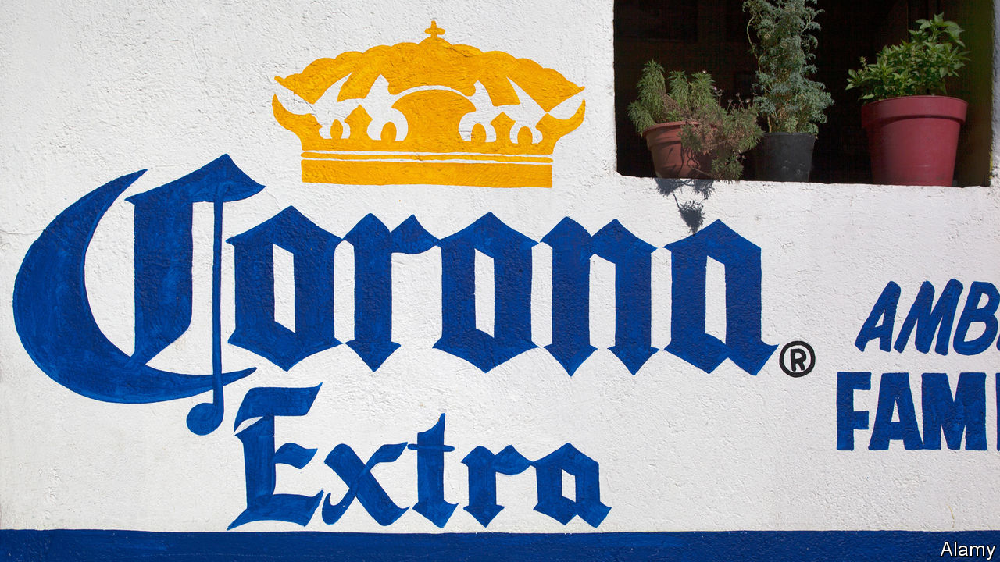

## The synonymous crown affair

# As cases of coronavirus grow, what about cases of Corona beer?

> Mexico’s beloved brand must now share its name with a pandemic

> May 4th 2020MEXICALI

Editor’s note: The Economist is making some of its most important coverage of the covid-19 pandemic freely available to readers of The Economist Today, our daily newsletter. To receive it, register [here](https://www.economist.com//newslettersignup). For our coronavirus tracker and more coverage, see our [hub](https://www.economist.com//coronavirus)

PICTURE THIS. You are lounging on a faraway beach and have nothing to do but listen to the sound of rolling waves. The confining walls, niggling tasks and dreary routines in your life are but distant memories. In their place, palm trees rustle and turquoise water stretches to the horizon. A beautiful somebody relaxes at your side, safe and free.

If this sounds like an upgrade on life in lockdown, you now know why the marketing for Corona beer has been so successful. In the 1980s Grupo Modelo, the Mexican brewer that created it, began exporting Corona to the United States, projecting an image of “fun, sun and beach”. Unlike branding for other beers, which merely invited drinkers to unwind, Corona offered escape. Save for Huawei, a Chinese telecoms mammoth, Corona is the most valuable global brand not from the rich world, according to Interbrand, a consultant. Or it was: 2020 has been riddled with rotten luck.

Start with a brutal clash of names a century in the making. Grupo Modelo began producing Corona in Mexico City in the 1920s. The crown that adorns the beer’s label and bottle-cap first appeared in 1963. Around that time, virologists crouched over microscopes in southern England identified a new kind of pathogen in humans. Its distinctive petal-like patterns on its edges “recall[ed] the solar corona”, wrote Nature in 1968. Soon afterwards, Corona beer began to conquer the world; by 2018, estimated Forbes, its sales reached $6.6bn. The coronavirus group bided its time.

In 2020, thanks to the pandemic, the word “corona” has ceased to be the plaything of marketeers at AB InBev, the giant brewer that bought Grupo Modelo in 2013. The term is now a battlefield on which glamour and calamity collide. Whether “corona”, a year or two from now, elicits thoughts of beaches and limes or of hospital beds and quarantines, is potentially a question worth billions.

The first shots fired in this battle were jokes. As the coronavirus spread, amateur comedians flocked to the images of far-flung exotica posted daily on Corona’s Instagram account. Some sardonically urged the brewer to “please stop killing innocent people”. Others suggested that Corona change its name to something with fewer negative connotations, “like Ebola”. Corona’s social-media team stopped posting on March 13th. It is safe to say that a lengthy furlough awaits them.

Could the bad vibes from the coronavirus prove more than a passing joke? Many experts in marketing psychology are sceptical. The term “coronavirus” will probably become less salient with time. “Corona” is not uniquely tied to the beer, which shares its name with a neighbourhood in New York and the sun’s aura; corona is also Spanish for “crown”. It may help that Corona is drunk mostly by the young, many of whom regard the pandemic as a nuisance rather than a trauma.

And yet Corona’s custodians must wonder if their beer will get through this unscathed. A brand’s power lies in its ability to trigger subconscious associations in consumers’ minds. But who can now hear the word “corona” without thinking of plague? At best, that may dilute Corona’s escape-to-the-beach message. At worst, it could drown it, getting consumers to think of suffering rather than pleasure, quarantine boredom rather than coastal escape, and of disease or bad hygiene. Many cite the unfortunate precedent of Ayds, a weight-loss candy whose sales plummeted in the 1980s. Its makers changed its name.

There are some ominous signs. This year Corona’s “buzz score”—a measure compiled by YouGov, a pollster, tracking whether people have heard positive and negative things about brands—has fallen by a third, to its lowest ever. But any evidence of lasting damage to the brand would be slow to emerge, points out Tom Meyvis, a professor of marketing at the Stern School of Business, at New York University. Market research amid a lockdown is unreliable, as is purchasing behaviour during a global recession. Sales at Constellation Brands, which makes and distributes Corona for drinkers in the United States, were “superb” in March, Bill Newlands, its chief executive, told CNBC, though “some of that’s obviously pantry loading” ahead of a lockdown.

Those who know Corona note that it has defied the odds to reach the top. Mexico had no beer-making pedigree with which to win foreign drinkers’ trust, but images of Mexican beaches soon became a novel, glamorous and world-beating selling-point. Corona’s transparent glass bottle causes the beer to spoil easily when exposed to sunlight, but a “nothing to hide” marketing slogan was a hit. On hearing that Californians were putting a slice of lime in the bottle before drinking it, Corona’s master brewers were horrified it would ruin the taste and wanted it stopped. It is now a cherished rite for drinkers across the world.

The beer’s success abroad has mattered deeply for its homeland. Its rise occurred in tandem with the opening of the Mexican economy. Corona took advantage of loosening trade barriers to enter new markets, and became a national ambassador for Mexico in faraway places. By the 1990s the secretary for commerce, Jaime Serra Puche, was boasting that “Mexico exports two fluids: crude oil and Corona”. It was perhaps the first product that asked Americans and others to pay more, rather than less, for something with a “Made in Mexico” label. That forged a path for other Mexican wares, from tequilas to tacos, to be branded as “high-end”.

It is a happy story curtailed by the unlucky events of 2020. But Corona’s woes this year go beyond its name. On March 21st and 22nd a controversial Corona brewery for Constellation Brands, already under construction in Mexicali, on Mexico’s border with California, was put to a public vote. Opponents said the brewery used too much water in a dry region. Constellation said its pledge to pay for fixing the region’s leaky pipes meant the water supply would be improved rather than imperilled. Mexicali’s mayor, Marina del Pilar Ávila Olmeda, said the debate around the brewery “has been politicised”, and that a decision to scrap it would affect the “legal certainty” that foreign investors seek in Mexico and cities like Mexicali. Turnout for the vote, at just 36,781 in a city of nearly 1m people, was itself depressed by the coronavirus. Of those, 76% voted to scupper the plant.

In the days before the referendum your correspondent visited the brewery site, 20 minutes’ drive south of Mexicali’s centre. The towering tanks were already built and painted creamy white, with a strip of Corona Gold on the top. Fields of dirt were soon to become car parks and offices for the plant’s 3,000 workers. Constellation had already spent $900m on the $1.4bn project, which now cannot be completed. Constellation, which has two other breweries in northern Mexico to serve thirsty Americans, is now unsure where—or whether—to build a replacement. For the first time, the Corona Americans drink might not be brewed only in Mexico.

Worse was to come for Corona in April, when the Mexican government belatedly ordered the closure of all non-essential activities. Unlike making wine in France or beer in the United States, brewing in Mexico was declared “non-essential”. Within weeks the national supply of Corona dried up. Your correspondent’s local supermarket in Mexico City has neither Corona nor any other domestic brew left on its shelves; there are only a few imported beers to choose from. Some of Corona’s moribund breweries have taken to filling up their iconic clear bottles with drinking water and delivering them to the poor.

But what is Corona to do about its biggest headache? For now both AB InBev and Constellation are staying silent. Any public recognition of the association between the virus and the beer is a no-no. “By acknowledging it you strengthen it,” says Mr Meyvis. To change the name of such a powerful brand would be dangerous, too. It would not only undo decades of hard work, but also destroy the beer’s sense of authenticity and history—which customers also prize. But if damage to the brand is unavoidable, its owners could do worse than pick Coronita, the beer’s name in Spain (the result of a trademark dispute). It preserves the brand’s identity, and it might just be enough of a change to get drinkers’ imaginations back on the beach, where they belong.■

Dig deeper:For our latest coverage of the covid-19 pandemic, register for The Economist Today, our daily [newsletter](https://www.economist.com//newslettersignup), or visit our [coronavirus tracker and story hub](https://www.economist.com//coronavirus)

## URL

https://www.economist.com/the-americas/2020/05/04/as-cases-of-coronavirus-grow-what-about-cases-of-corona-beer
