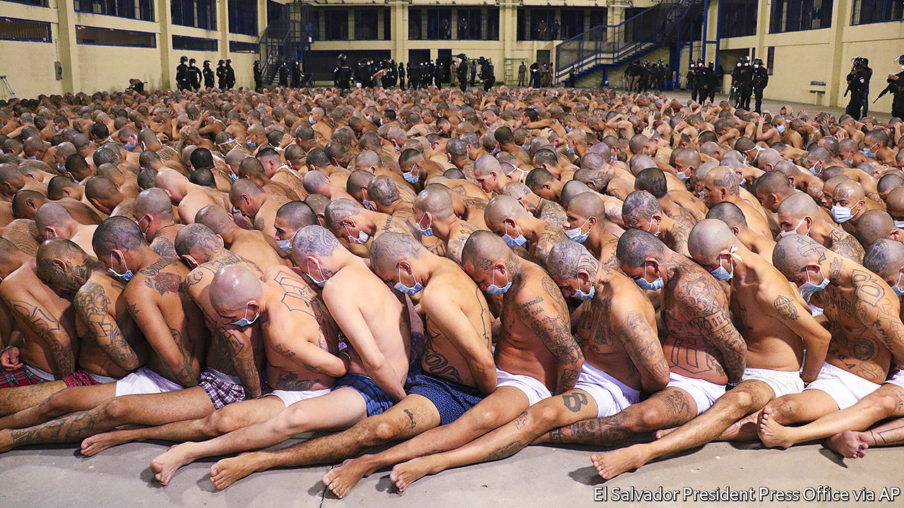

## Hungry house

# Nayib Bukele’s power grab in El Salvador

> A young president is weakening democratic institutions and empowering his family

> May 7th 2020

ON MARCH 13TH Carlos Henríquez Cortez returned to El Salvador from a two-day business trip in Guatemala. The 67-year-old engineer planned to quarantine at home. He knew that, to control the spread of covid-19, the government was holding returning travellers and visitors in “containment centres”. The elderly were exempt, or so Mr Henríquez thought. Airport guards detained him anyway. His containment centre had no toilet paper or space for social distancing, he told his wife. Mr Henríquez developed a fever. Authorities told him he could not have covid-19 because no cases had been reported in Guatemala. In hospital he tested positive for the disease. He died on April 22nd. 

Mr Henríquez was a casualty of El Salvador’s lockdown, which is among the strictest in the world. The 2,394 Salvadoreans detained since April 6th for violating quarantine have faced 30 days of confinement. Other countries, such as Peru, Panama and Russia, detain violators for up to 48 hours. The architect of El Salvador’s measures is Nayib Bukele, the country’s 38-year-old president. He claims that his draconian lockdown is the only way to protect Salvadoreans from the pandemic. His critics think he is using the crisis to destroy the institutions that upheld democracy since the end in 1992 of a ruinous civil war. 

Mr Bukele, a law-school dropout who spent much of his 20s managing nightclubs in which his family had invested, has a bond with El Salvador’s poor but aspirational youth. He seldom wears a suit and tweeted every 25 minutes on average during April. As mayor of San Salvador, the country’s capital, he rebuilt the city’s central squares. That wrested control from gangs, he claimed. In last year’s election campaign he fulminated against the corrupt rule of the two parties that have alternated in power since the war, the left-wing FMLN (to which he once belonged) and the right-wing Arena party.

Emigration from El Salvador has dropped since Mr Bukele became president. That may be in part because Salvadoreans expect him to reduce the crime and poverty that have driven many abroad. Four-fifths approve of his handling of the pandemic. His New Ideas party looks set to win big in legislative elections, which are due in February 2021.

But Mr Bukele does not seem content to govern through ordinary democratic means. The first warning was what Salvadoreans call “9F” (for February 9th). At loggerheads with the Legislative Assembly, which is still dominated by the FMLN and Arena, over financing for his security programme, Mr Bukele entered the chamber with gun-toting soldiers and sat in the speaker’s chair. Covid-19 emboldened the president further. When the Supreme Court issued rulings, starting in March, that he could not enact his quarantine without permission from the legislature, Mr Bukele pressed ahead. Salvadorean lives matter more than the opinions of “five people”, he tweeted. This week the legislature belatedly gave him the authorisation.

More brazen was his behaviour when the legislature met to override his veto of a bill that would repatriate citizens stuck abroad. A deputy coughed. Minutes later, Mr Bukele tweeted that his epidemiological team “had detected a significant suspicion of covid-19” in the chamber and that it should be shut down. So many frightened lawmakers left that the assembly lost its quorum. The president acted “like the kid who didn’t do his homework pulling the fire alarm at school”, says a businessman. 

Like many a caudillo, Mr Bukele entrusts power mainly to members of his family. His wife, Gabriela, picked much of the cabinet. Mr Bukele’s uncle is commerce secretary. The father of his godson runs the export-promotion agency. Childhood friends control the port authority and the agriculture ministry. In March Mr Bukele’s party elected a new president—his cousin. 

People who deal with his government say his most influential associates are his brothers: Karim, Ibrajim and Yusef. Some observers see Nayib as a budding dictator. But his presidency is more a “corporatist family project” to establish the Bukeles as one of the country’s most powerful clans, says an economist.

Salvadoreans’ tolerance for that project will depend on whether the president makes headway in solving problems that have driven much of the population to emigrate. The signs are not encouraging. The murder rate, which began falling in 2015, has continued to do so under Mr Bukele. But for four days in April the number of killings jumped. The reasons are unclear.

The president responded harshly. He tweeted that police could kill gangsters to defend themselves or others and ended the policy, in place since 2004, of keeping the two main gangs apart in prisons. In a theatrical twist on April 25th the government forced hundreds of gangsters, stripped to their underwear and with hands tied behind their backs, to huddle in rows. Their face masks reassured no one. When foreign observers objected, Mr Bukele tweeted that “it is incredible, the international support that the maras [gangs] have.” 

The covid crackdown has not made citizens safer than those in more relaxed countries nearby. El Salvador’s 695 confirmed infections and 15 deaths are comparable to the toll in Guatemala, a much bigger country. To soften the economic effect of the lockdown the government promised one-off payments of $300 to 1.5m poor households, triple what many workers earn in a month. But with public debt at 70% of GDP it cannot afford much largesse. The next round of aid will take the form of 2m food parcels.

Mr Bukele’s pre-pandemic ambitions are slipping away. A five-year plan drafted by consultants “fell apart”, says an insider. No progress has been made on pledges to raise the minimum income-tax threshold and to spruce up 50 town centres. A Commission Against Impunity, created in September, never looked like a serious effort to fight graft. It lacks the money and legal structure to do its job. The pandemic has helped to extend Mr Bukele’s honeymoon. It may not last much longer. ■