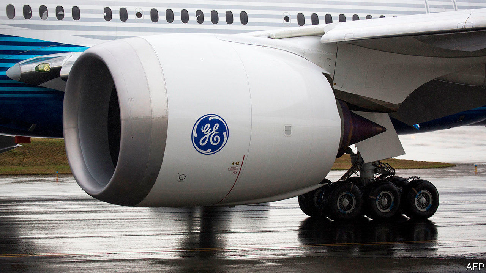
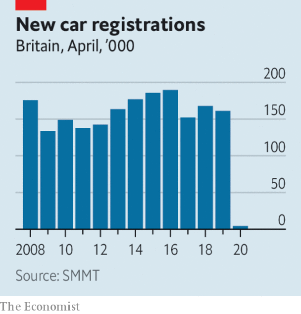

# Business this week

> May 9th 2020

More swingeing job cuts were announced in the aviation business, an industry that has been hammered by the restrictions on travel. General Electric said 13,000 jobs would go in its aviation division; Rolls-Royce, which makes engines for Boeing and Airbus, was reportedly considering 8,000 lay-offs; Virgin Atlantic announced plans to reduce its workforce by a third and close its operations at London Gatwick; and Ryanair said it would reduce its headcount by 15%. Michael O’Leary, Ryanair’s abrasive boss, criticised the recent government rescues of Air France-KLM and other carriers as “state-aid doping” for weak airlines.

Adding to the gloom, Warren Buffett’s investment company dumped the stock it held in America’s four biggest airlines. Berkshire Hathaway recorded an almost $50bn net loss in the first quarter, as its portfolio of shares took a pounding during the stockmarket rout.

Boeing, meanwhile, successfully closed a $25bn bond offering. Because of the “robust demand” in markets for its debt, the aerospace company does not anticipate having to turn to the government for aid. It is cutting 10% of its workforce and curbing production.

Alan Joyce, the chief executive of Qantas, said that it will take years for international travel to recover from the crisis. The Australian airline has shelved plans for non-stop flights from Australia to New York and London that were due to begin in 2022. 

Airbnb forecast a 50% slump in annual revenue and said it would cut its workforce by a quarter. The online home-rental firm thinks coronavirus will forever change its market because people will want to travel to places that are closer to home and relatively safe. Airbnb had been expected to float its shares on the stockmarket this year.

Just 4,321 new cars were registered in Britain last month, a drop of 97% compared with April 2019, according to the Society of Motor Manufacturers and Traders. The Italian and Spanish markets saw similar declines; in Germany registrations were down by 61% and in France sales fell by 89%. That stands in stark contrast to China, where, according to a Volkswagen official, the car market has rebounded. 

Hertz was granted a reprieve from bankruptcy when a group of creditors extended the deadline for a missed debt payment. The car-rental company has seen its business collapse as airports shut shop.

America’s Treasury Department said it would auction a new 20-year bond on May 20th. It expects to borrow almost $3trn of debt in the second quarter, a record that far exceeds its quarterly borrowing requirements during the financial crisis of 2007-09. 

China recorded a surprising increase in exports, which grew by 3.5% in April compared with the same month in 2019, the first rise this year.

Marathon, America’s biggest oil refiner, posted a $9.2bn quarterly loss, because of the pandemic and price “tensions”. Oil markets remained choppy. The price of Brent crude rose above $30 a barrel for the first time in weeks. See [article](https://www.economist.com//business/2020/05/07/the-buoyant-oil-traders).

In the most aggressive action it has taken so far to enforce regulations in the state that bolster the rights of workers in the gig economy, California filed a lawsuit against Uber and Lyft for misclassifying their drivers as independent contractors. Uber, which is helping its drivers find extra work at 7-Eleven and other companies during the crisis, said it would contest the suit in court. See [article](https://www.economist.com//finance-and-economics/2020/05/09/could-the-pandemic-give-americas-labour-movement-a-boost).

Lee Jae-yong, the de facto head of Samsung Group, apologised for the various corruption scandals that have beset his company. In a remarkable statement, Mr Lee, who was convicted of bribery in 2017, pledged that he would be the last person from his family to lead the conglomerate. He also overturned a decades-long policy at Samsung that stops workers joining a union.

Telefónica, Spain’s biggest telecoms company, announced the merger of its  o2 mobile brand in Britain with Virgin Media, a broadband and wireless provider that is owned by Liberty Global. The £31bn ($38bn) deal creates a behemoth in Britain’s telecommunications industry.

Peloton, which sells expensive internet-connected bikes, recorded a surge in sales in the latest quarter, as it doubled the number of subscribers to its workouts. With many people forced to exercise at home during lockdowns, the company is expanding its customer base beyond svelte hipsters to suburban mums and dads.

Tesla’s share price recovered from the drubbing it took after Elon Musk tweeted that it was too high, which wiped $15bn off the company’s market value. Soon after, Mr Musk, a critic of lockdowns, tweeted another abstract thought: “Rage, rage against the dying of the light of consciousness.”

## URL

https://www.economist.com/the-world-this-week/2020/05/09/business-this-week
