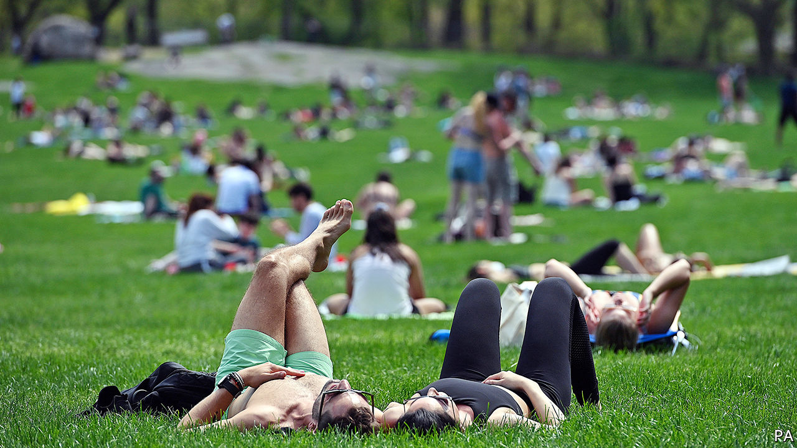
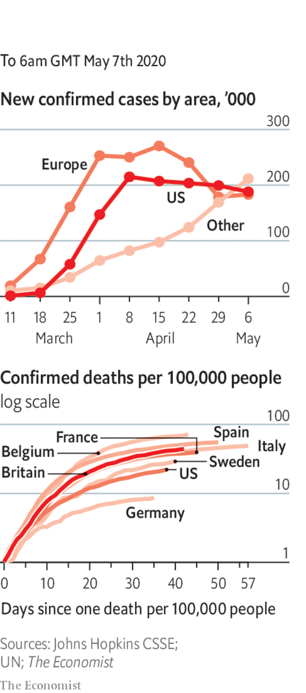

# Politics this week

> May 7th 2020

Reversing course, Donald Trump said that America’s coronavirus task-force would continue, but also focus on rebooting the economy. More states began easing their lockdowns. Florida allowed shops to trade if they limit customers, except in the heavily populated corridor between Miami and Palm Beach. In Michigan, the scene of rowdy anti-lockdown protests, the Republican legislature refused a request from the Democratic governor to extend her stay-at-home order. She extended it anyway.

America’s Supreme Court worked remotely for the first time, hearing arguments via teleconferences. The normally reticent Clarence Thomas, a justice on the court since 1991, asked questions, only his third comments during hearings in more than a decade. Ruth Bader Ginsburg, who is 87, was in hospital with an infection and took part from there.

America’s secretary of state, Mike Pompeo, said there was “enormous evidence” that covid-19 came from a laboratory in Wuhan, but did not provide any. China reacted angrily. State television called him “evil”. See [article](https://www.economist.com//leaders/2020/05/09/the-pandemic-is-driving-america-and-china-further-apart).

A Chinese journalist who had worked for state media was sentenced to 15 years in prison for “picking quarrels and provoking trouble…and bribery”. “Picking quarrels” is a term often used by the government to describe political dissent.

Kim Jong Un, North Korea’s dictator, resurfaced without explanation after a three-week absence. State media published images of him touring a fertiliser factory.

A regulator in the Philippines ordered ABS-CBN, a big television network, to stop broadcasting after its licence expired. Rodrigo Duterte, the president, had previously complained about bias and had threatened to take it off the air. But officials insist that Mr Duterte has no strong feelings about renewing the licence. See [article](https://www.economist.com//asia/2020/05/07/a-philippine-broadcaster-is-forced-off-the-air).

Dariga Nazarbayeva was removed as the head of Kazakhstan’s Senate and thus as the first in line to the presidency. Her father, Nursultan Nazarbayev, resigned as president in 2019, but remains head of a powerful committee in charge of national security. The personal lives and financial affairs of Ms Nazarbayeva and her sons have been the subject of legal proceedings in London in recent months. See [article](https://www.economist.com//asia/2020/05/07/a-kazakh-politician-with-a-pedigree-unexpectedly-loses-her-job).

Israel’s Supreme Court refused to block a power-sharing deal between Binyamin Netanyahu, the prime minister, and Benny Gantz, his old rival. It also rejected petitions that aimed to disqualify Mr Netanyahu because he faces prosecution on corruption charges. The rulings pave the way for a new government to be sworn in.

Iraq’s parliament approved a new prime minister, nearly six months after the previous one resigned amid big protests. Mustafa al-Kadhimi, a former intelligence chief, was acceptable to both America and Iran. But he faces big challenges at home, where the coronavirus has frozen the economy and oil and gas revenues have plummeted. Earlier, Islamic State carried out several attacks in Iraq, killing at least 18 people.

The government in cash-strapped Lebanon adopted an economic-reform plan and requested assistance from the IMF. This came after protesters, defying a coronavirus lockdown, took to the streets to vent their anger over a deteriorating economy and poor governance. See [article](https://www.economist.com//middle-east-and-africa/2020/05/09/why-protesters-firebomb-banks-in-lebanon).

A leaked letter from Zimbabwe to the IMF warned that the country is heading towards economic collapse and that it needs assistance in clearing its existing debts to unlock new funding. The letter said Zimbabwe’s economy could shrink by 15-20% this year.

In a decision with potentially huge implications Germany’s constitutional court declared that the European Central Bank had acted improperly in buying government bonds under a quantitative-easing programme. Many legal experts fear that because the ECB is supposed to answer only to EU institutions, not to member governments, a constitutional crisis is being created. See [article](https://www.economist.com//node/21785955). 

Italy partly emerged from eight weeks of lockdown, having been the first country in Europe to impose one. People can now go out to exercise, cafés have reopened for takeaway service and travel to visit close relatives is now permitted. See [article](https://www.economist.com//europe/2020/05/09/italy-the-first-country-in-europe-to-enter-lockdown-starts-to-emerge).

Canada banned assault-style weapons with immediate effect following a gun massacre in April.

Venezuelan forces intercepted two boatloads of men allegedly trying to overthrow the country’s dictator, Nicolás Maduro. Eight of the men were killed. Mr Maduro accused America and Colombia of plotting the attack. As evidence, a captive was paraded, post-interrogation, on television. Meanwhile, a security contractor based in Florida claimed responsibility for the “daring amphibious raid”. The governments of America and Colombia denied any involvement.

The new chief of Brazil’s Federal Police, Rolando Souza, transferred the head of the force in Rio de Janeiro. Mr Souza became police chief after the Supreme Court blocked the man initially chosen by Jair Bolsonaro, the Brazilian president, who is a friend of the president’s family. Mr Bolsonaro is facing claims that he tried to influence investigations, centred on Rio, into his family, which he denies. Coronavirus briefs

The worldwide death toll from covid-19 rose above 250,000.

Infections surged in Russia, to over 10,000 a day. Mikhail Mishustin, the prime minister, tested positive for the disease.

The first infection was officially confirmed in Sana’a, Yemen’s capital, which is held by Houthi rebels.

Reports from Nigeria, Somalia and Tanzania of a sharp rise in unexplained deaths suggested that official tallies of covid-19 are misleadingly low. See [article](https://www.economist.com//middle-east-and-africa/2020/05/07/lacking-data-many-african-governments-make-policy-in-the-dark).

New Zealand’s prime minister, Jacinda Ardern, said border restrictions would remain for “some time to come”. But she would like a quarantine-free travel “bubble” with Australia.

In Germany shops were allowed to reopen, with social distancing. Football matches will resume in the Bundesliga, but without spectators.

## URL

https://www.economist.com/the-world-this-week/2020/05/07/politics-this-week
