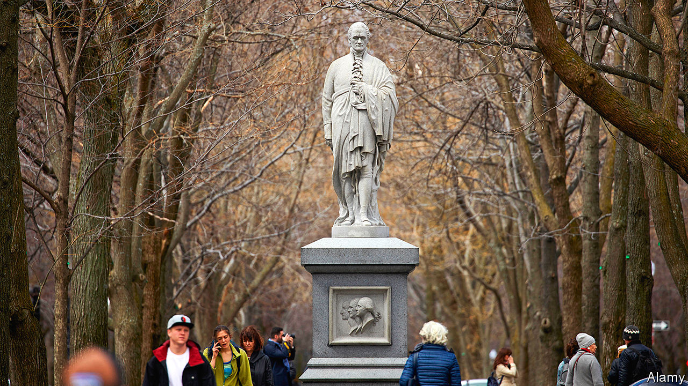

## Going rogue

# America’s Supreme Court considers the rights of “faithless” presidential electors

> The constitution is pretty clear that electors can do whatever they want. This is a problem for originalists

> May 9th 2020NEW YORK

MOST AMERICANS would like to abolish the electoral college, the idiosyncratic institution that picks presidents six weeks after election day. Twice this century, candidates who received more votes in the nationwide tally watched their rivals move into the White House the next January. But in 2016, when Hillary Clinton, the popular-vote winner, was vanquished by Donald Trump, another electoral-college flashpoint came to light.

The controversy over whether America’s 538 electors are free to deviate from their pledges comes to the quarantined Supreme Court live by telephone on May 13th. So-called “faithless” electors are rare, but nothing new. Ninety electors since 1796 have cast a ballot for someone other than their party’s elected nominee, including 63 who sought to replace candidates who had died after the general election. Some 27 electors have simply scrapped their pledged candidate in favour of another.

These switches have never turned an election. But like the emoluments clauses, the rights of electoral-college members were a constitutional obscurity until the Trump era. Activists seeking to subvert Mr Trump’s victory in 2016 spurred seven electors to break their pledges—short of the 37 needed, but more than in any previous presidential election. Some defectors ran into legal trouble. Peter Chiafalo from Washington was fined $1,000 when he selected Colin Powell rather than Mrs Clinton in an attempt to throw the election to Congress. Michael Baca of Colorado found himself replaced with a more obedient elector when he tried to change his vote from Mrs Clinton to John Kasich, the former governor of Ohio. Both men say the constitution protected their right to do so.

The plaintiffs have ample support from the founding era. Alex Keyssar of Harvard’s Kennedy School, the author of a forthcoming book on the electoral college, says there is no “serious doubt” that the framers “envisioned electors as free agents, actors who would deliberate and could decide whom to vote for.” Lawrence Lessig, a Harvard law professor arguing the electors’ case, notes that Samuel Johnson defined electors as people who have “a vote in the choice of any officer”—quite distinct from “agents” or “delegates” who merely “act on behalf of others”. In the words of Alexander Hamilton in the Federalist Papers No. 68, electors would be chosen for their “discernment” and would be “most capable of analysing the qualities” of a potential president.

Congress, which tallies the electoral-college vote, has never refused to count faithless electors’ ballots. And until 2016, no state tried to stand in their way. But Washington state argues that the anomalous voters’ arguments “crumble under examination” and “pose dangerous risks for our democracy.” A Supreme Court ruling that turns electors into free agents—and subjects them to outside pressure following a close general election—could have “bizarre and dangerous consequences,” the state warns. Presidential elections where electors enjoy “unfettered discretion” would become “hollow exercises” and “profoundly undermine public confidence in the value of participating in our democracy.” Forty-five states and the District of Columbia have filed a court brief asserting their power to hold electors accountable for their votes. An “unbridled electoral college”, they say, would sow chaos.

Both sides cite an article by Keith Whittington, a political scientist at Princeton, who acknowledges the founders’ discretionary view of electors but argues the vision has long been passé. If the justices liberate electors to exercise their own judgment, Mr Whittington fears, they will ignore the electoral college’s evolution into a pro-forma ratifier of the state’s popular vote and could “throw the American constitutional system into crisis”.

This tension between principle and practicality makes Chiafalo v Washington compelling. Laurence Tribe of Harvard Law School, wonders if conservative justices—who claim to hew to the constitution’s original meaning—will uphold the founders’ understanding of the electoral college, even if it means empowering electors “in whose judgment the voters this November 3rd will not in fact be placing any trust.”

The justices are wise to tackle this now, rather than in the midst of the November election. But Edward Foley of Ohio State University, who filed a brief arguing that the founders saw electors as autonomous, cautions that America could still face a crisis rivalling Bush v Gore in 2000. Electors may go rogue no matter how the court rules, and states could try to replace their votes. “Can Congress decide which electoral votes to accept,” Mr Foley wonders, “or is Congress bound by the court?” ■

Dig deeper: