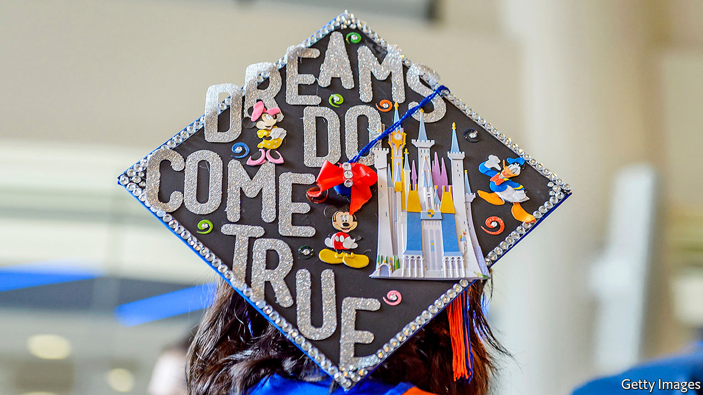

## Social experiments

# ASAP is more important than affirmative action

> Meet one of the least-known and most effective programmes to boost social mobility in America

> May 7th 2020CHICAGO AND NEW YORK

GROWING UP IN Morris Heights, a poor neighbourhood in the Bronx where violence was omnipresent, Joel Cabrera thought his future would be either “death or jail, because that’s what the outcomes are here”. Middle school was like “a juvenile-detention facility”. High school did not interest him enough to finish. Had he stopped there, he would have faced a life on the edge of penury. Among high-school dropouts nationwide, average earnings are only $600 a week. To avoid that, Mr Cabrera enrolled in courses offered at his local community college. There he came across a scheme called ASAP (“Accelerated Study in Associate Programmes”) that sought to push pupils like him—city residents without family wealth or familiarity with universities—to complete two-year degrees.

ASAP is designed to address a simply stated problem. Many low-income minority students enroll in college. But few finish. Only 34% of black men finish their bachelor’s degree within six years, compared with the average rate of 60%. Those individual decisions to drop out collectively amount to society-wide stratification. The racial gaps in earning college degrees have hardly budged since 1995.

Simple as the problem may be to describe, the approach taken by ASAP is complicated. Rather than target one thing that derails students, the programme tries to tackle many at once. Pupils are given financial help, including money for textbooks and free MetroCards to get around the city. They must meet academic and career advisers several times a month. They are tracked by a data operation that detects pupils in precarious positions before they quit. This worked for Mr Cabrera, who continued to a bachelor’s degree, a few internships and a series of good jobs after that.

He is not unusual. Students in the ASAP programme have a three-year graduation rate of 53%—more than double the 25% rate in the rest of the City University of New York (CUNY) system and close to triple the national average. In 2015, when external researchers tested these impressive outcomes by randomly assigning students—the gold standard for social science—they found effects of the same magnitude. The greatest gains went to black and Hispanic students, as well as those receiving Pell grants (most of which go to students with annual family incomes of $20,000 a year or less). Since then, the programme has grown and community-college systems across the country are trying to replicate it.

In New York the average cost of the additional supports amount to $3,500 per student. But such schemes benefit college finances too, by increasing their revenue. Georgia State University’s programme to provide micro-grants, which began in 2012, seemed to boost both graduation rates and university finances. “That’s actually a big driver of this completion movement [because] enrolments are not going up,” says Patrick Methvin of the Gates Foundation, which has funded research in the field. “The economics on this are going from nice to necessary.” Though not small, the cost also looks like a pittance compared with many ideas to alleviate intergenerational poverty. A child born poor who gets just a high-school degree has a 50% chance of remaining in poverty as an adult; with a college degree, the chances decline to 17%.

More evidence is accumulating to show that the approach works beyond New York. Starting in 2015, three community colleges in Ohio imported the ASAP model, with some modifications (such as offering money for petrol rather than for the subway). A randomised controlled trial by MDRC, a research outfit, found it nearly doubled the chances of completing degrees (35% compared with 19% in the control group). Two community colleges in West Virginia are set to try the system next. “We’re quite pleased to see that the model has been attempted in other places, and the numbers tend to look good too,” says Félix Matos Rodríguez, the chancellor of the CUNY system.

Perhaps the strongest corroboration that the ingredients are indeed right comes from Chicago, where a similar programme has improved the lot of students in the local community-college system. One Million Degrees (OMD), a project started in 2012, provides tutoring, professional development and cash grants to qualifying students: 80% of them black and Hispanic, 90% qualifying for Pell grants and 60% first-generation students. It is similar to the New York programme because, “if you really ask students what they need and observe what the challenges are”, you arrive in a similar place, says Paige Ponder, the organisation’s CEO. Initial results of a randomised controlled trial conducted by the University of Chicago Poverty Lab of 4,000 applicants found that participants were 35% likelier to persist through the first year of college. Talk to the students in the programme, and you find that no single element boosts their chances of finishing university as much as the whole cocktail.

This well-tested, cost-effective scheme has largely escaped national attention. To many, the whole question of equity in American universities can be reduced simply to the racial make-up of the Ivy League institutions. Besides ignoring the incomes of students at those colleges, who tend to be rich whatever their race and colour, this also assigns central importance to the controversial affirmative-action policies of highly selective universities. Although the share of black students attending Harvard is symbolically important, the situation of those happy few is divorced from the continued social immobility among successive cohorts of black students. Endless debate about affirmative action—which could soon wind up before the Supreme Court yet again—is a diversion from a less controversial method that works. ■

## URL

https://www.economist.com/united-states/2020/05/07/asap-is-more-important-than-affirmative-action
