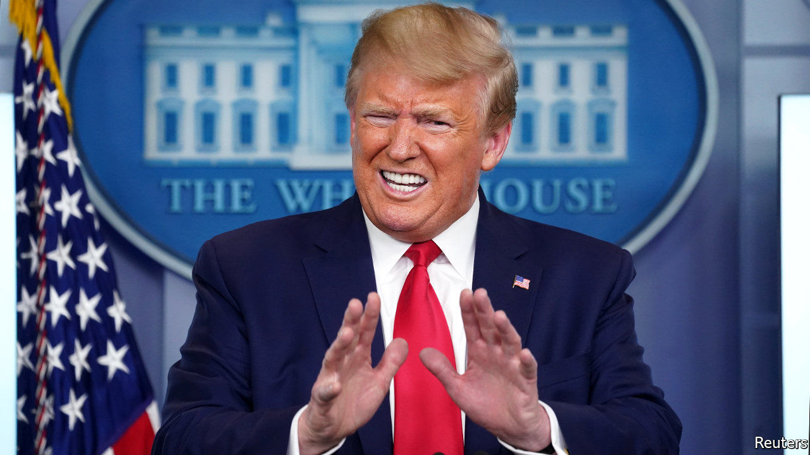

## Watchdogs in the doghouse

# Donald Trump’s war on inspectors general

> The president likes to rid himself of troublesome IGs

> May 7th 2020WASHINGTON, DC

BACK AT THE beginning of April, the Office of Inspector General for the Department of Health and Human Services (HHS) released a report, based on a survey of hospital administrators across America, showing that hospitals were struggling to obtain covid-19 tests, personal protective equipment (PPE) and routine supplies such as loo paper. This did not please the president. At a press conference the same day, he mused, “It’s wrong…Where did he come from—the inspector general (IG)? What’s his name?” Her name was Christi Grimm, and on the evening of May 1st Mr Trump nominated her replacement.

Ms Grimm is the latest in a string of IGs whom Mr Trump has pushed aside. On April 3rd he removed Michael Atkinson, the intelligence-community IG, who alerted Congress to the whistle-blower’s complaint that led to his impeachment. On April 7th, Mr Trump ousted Glenn Fine from both a new role as chairman of the Pandemic Response Accountability Committee, created to oversee $2.2trn in federal relief spending, and from his post as acting IG for the Department of Defence. According to the sprightly Project on Government Oversight (POGO), a watchdog, 14 statutory federal IG positions are now vacant. Six have been so for more than a year.

The Inspector General Act of 1978, passed in Watergate’s wake, established IGs in 12 federal agencies. The number has since grown to 74. Of those, 36—generally those for larger organisations, such as cabinet departments—require a presidential nomination and Senate consent. The rest, largely for more obscure agencies such as the Pension Benefit Guaranty Corporation, are nominated by the agency’s boss, which can be a person or board.

However appointed, an IG’s role remains the same. They audit and investigate to prevent waste, fraud and abuse; they review legislation that pertains to their agency and promote administrative “economy, efficiency and effectiveness”. Although IGs are supervised by their agencies’ heads, they enjoy substantial independence. The agency boss cannot assign or block investigations; IGs have subpoena power and hire their own staff.

Ronald Reagan, the first president to inherit IGs, asked them all to resign when he took office. After an outcry from Congress, he relented and invited most back. Since then, presidents have tended to accept their predecessors’ IGs, and many—such as Mr Fine and Ms Grimm—have served in multiple administrations and agencies.

Mr Trump’s reasons for removing these IGs look vindictive. Ms Grimm released a report with conclusions that displeased him. Mr Atkinson said he believed Mr Trump sacked him because he “faithfully discharged [his] legal obligations”. As the Defence Department’s IG he looked into allegations that the Pentagon steered a large contract away from Amazon, whose boss, Jeff Bezos, Mr Trump loathes. (His report found the Pentagon’s procedure was “consistent with applicable law”, but reached no conclusion on White House interference because “presidential communications privilege” discouraged testimony.)

Mr Trump’s attack on independent watchdogs sparked a rare moment of bipartisanship. After Mr Atkinson’s removal, senators from both parties demanded substantive reasons from the White House. It has so far provided none. As for Mr Trump, he seems to see only the political headaches that IGs cause, not those they solve. When a lot of federal money is spent quickly—for instance, $2.2trn in covid-19 relief—inevitably some goes where it should not. Fraud and misappropriation risk embarrassing the administration. Capable IGs can sometimes catch it before it happens. But only if they have not been fired first.■