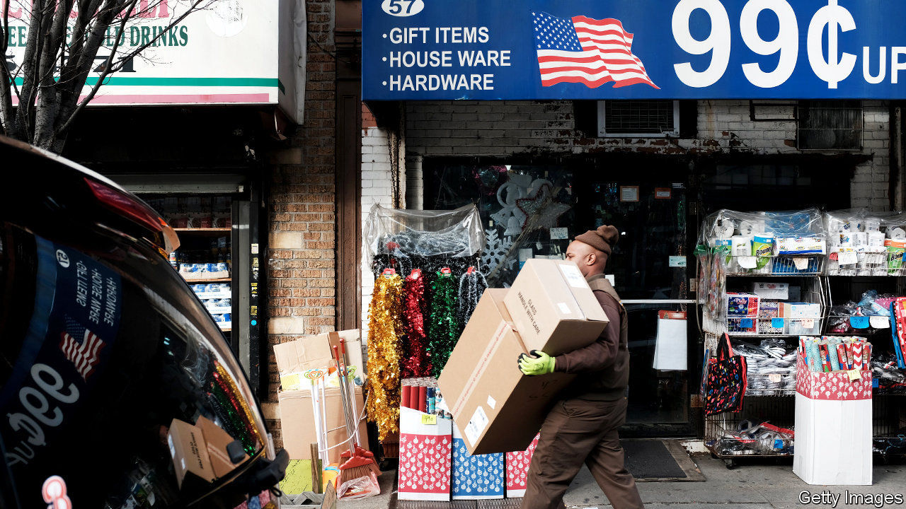
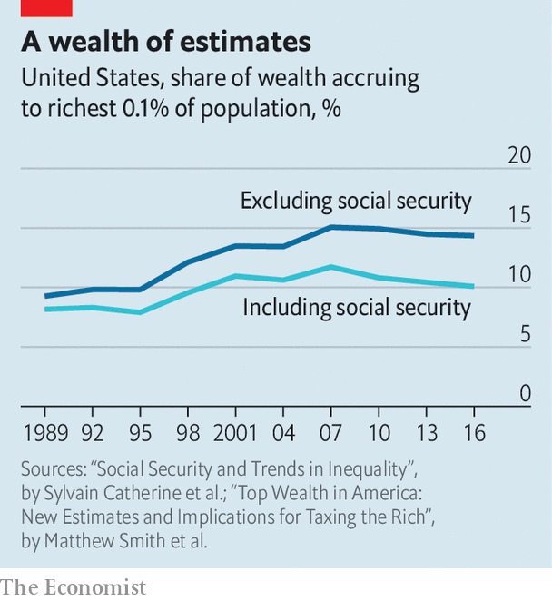

## Plutocracy

# Have the top 0.1% of Americans made out like bandits since 2000?

> Or have they merely stood still?

> May 7th 2020

IT IS A truth universally acknowledged that inequality in the rich world is high and rising. Or, at least, it used to be. A growing band of economists are challenging the received wisdom, pointing out that trends in the distribution of income and wealth may not be as bad as is often thought. Two recent studies focus on wealth inequality in America, providing further ammunition to the dissenters.

Measuring wealth is harder than it may seem. People are liable to under-report their asset holdings on official surveys, whereas it is hard to measure the true value of things like private companies and art works. Economists are using increasingly sophisticated methods to get a sense of who owns what. One popular method is to examine income earned on investments, such as interest payments from bonds, assume a rate of return, then multiply up to calculate the value of the investment.

In a newly updated working paper Matthew Smith of the Treasury department, Owen Zidar of Princeton University and Eric Zwick of the University of Chicago use this method to gauge American wealth inequality. Previous estimates have relied on the assumption that all people receive the same rates of return on a given type of investment. That may be misleading. The rich tend to plump for riskier investments, which command higher rates of return—implying, in turn, that the stock of wealth from which they derive that income is smaller than it would otherwise appear.

Allowing for different rates of return, the paper’s headline results suggest that America’s top 0.1% own roughly 15% of the country’s private wealth (see chart). Their share has risen since the 1980s, but by less than other economists believe (some papers find that it has jumped to 20% or more). And according to the new paper, that measure of wealth inequality has been stable since the middle of the 2000s.

But does it make sense to count only private wealth? In another new working paper Sylvain Catherine, Max Miller and Natasha Sarin of the University of Pennsylvania argue that accrued entitlements to Social Security should also be included. Someone with access to a public pension is surely better off than someone without. Crucially, too, an expansion of Social Security means that poorer folk have less need to save for retirement. That distorts measures of wealth inequality which count only private nest-eggs. (Sweden, surprisingly enough, has very high private-wealth inequality, in part because of its cradle-to-grave welfare system.)

In recent years the value of American Social Security wealth has jumped, in part because the population is ageing. It is also progressively distributed. Messrs Smith, Zidar and Zwick’s paper apportions this wealth between rich and poor. As the chart shows, measured inequality falls, while the wealth share of the very richest has remained remarkably flat over the past two decades. America is a highly unequal society—but it is not becoming ever more so.■