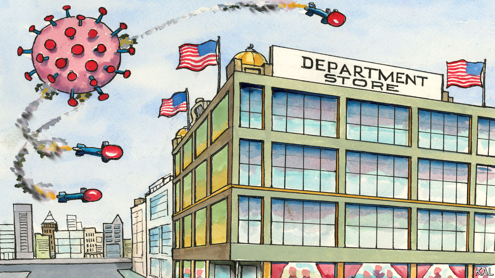

## Lexington

# Ode to the shopping mall

> How palatial shops, threatened by the virus, shaped America

> May 7th 2020

IN ALMOST all its modern crises, America has looked to its merchants for leadership. In 1914 John Wanamaker, the greatest retailer of the age, made headlines by dispatching 2,000 tons of food aid to Belgium—then suggesting America buy the little country to make the peace. In 1942 his New York rival, Macy’s, announced it was cancelling its annual Thanksgiving parade and donating 650 pounds of balloon rubber to the war effort: “We’ve enlisted!” Department stores, America’s temples of commerce, could always be relied upon to sell war bonds with panache. In a Younkers store in Des Moines, Iowa, a coffin for Adolf Hitler was lowered mechanically from the ceiling to the floor whenever a sale was made.

Masters of self-promotion, the great retailers did not suffer by being associated with patriotism. Yet rather than deplore their opportunism, Americans celebrated the consumption it was designed to promote. During the Great Depression, they rallied to the retailers’ “Buy Now” campaigns. Shopping was not merely the surest way to boost the economy; it was urbanites’ main community activity. As recently as September 2001, President George W. Bush hinted at that dual truth when urging Americans to shrug off terrorism and hit the stores. By contrast, the current crisis is the first in over a century in which retailers have provided no comfort.

Online ones are thriving but unloved. The biggest, Amazon, is battling damaging headlines over its patchy service and treatment of workers. Traditional retailers are meanwhile looking into the abyss. This week J.Crew filed for bankruptcy. JCPenney, whose low-cost innovations helped it survive the Depression and proved inspirational to one of its employees, Sam Walton, founder of Walmart, is also struggling under a heavy debt load. Macy’s, America’s biggest department store by sales, lost its place in the S&P 500 last month while all its 775 stores were closed. It reopened 68 this week but expects them to do around 15% of their regular trade: more a death rattle than a recovery. By one estimate, over 300 department stores could go under by the end of next year.

Losing your custom overnight will do that. Yet bricks-and-mortar retailers were struggling long before the virus struck, against e-commerce and other stresses, including Donald Trump’s tariffs, which many decried. The president was never going to turn to them as Herbert Hoover did to his friend J.C. Penney in 1929. Yet a weary sense of inevitability about legacy retail’s demise should not obscure how traumatic a development it is. Many of America’s shuttered cities were shaped by department stores: they would not have developed as they did, or at all, without them. Nor would the consumer economy; nor elements of American democracy.

The emergence of palatial, multi-line stores in New York, Chicago and other big cities in the mid-19th century was a first-world phenomenon, pioneered in Europe. Yet merchants such as Wanamaker, who opened his first department store in Philadelphia in 1876, added American characteristics. Their stores tended to be bigger than European ones and packed with extravaganzas; Wanamaker’s flagship store boasted 2m square feet and the world’s biggest organ. America’s retailers also poured their huge profits into advertising, which shored up the free press. And they were more egalitarian than Europeans, especially to women, as both customers and employees. By 1918 42% of Macy’s buyers were women.

Many promoted their enterprises as morally improving. Wanamaker, who also formed the world’s biggest Sunday school, described his stores as “beautiful fields of necessities”. With steepling cast-iron structures and acres of plate-glass, flooding them with light, they were America’s answer to Europe’s cathedrals.

Such stores’ impact on cities surpassed even their footprints. They feminised and commercialised them. They fostered civic identity as well as consumerism. To be from Philly was to know and shop at Wanamaker’s. Thereby the great downtown stores became synonymous with the forces that had fuelled their growth, industrialisation, urbanisation, democratisation. To this day famous names such as Macy’s, which retains its giant flagship store in Herald Square, Manhattan, retain an exalted place in the culture: over 3m turn out to watch its annual parade.

This is despite the fact that most Macy’s and other department stores are now in the suburban malls that began mushrooming after the second world war. They are less loved. Where Hollywood invariably depicts downtown stores as places of innocence and Santa Claus, it portrays malls as anonymous and prone to zombie attack. Those contrasting views are linked—the suburban expansion having devastated many cherished downtown areas. But the contrast is also unjust. Most Americans seem to associate malls with relaxation and family—a truth your columnist learned while staying on American bases in Afghanistan and Iraq. All the bigger ones had a rudimentary mall, selling fast food, sportswear, cheap carpets and Celtic swords, where the soldiers loved to saunter and unwind. Even conventional malls build social capital in a way it is hard to imagine e-commerce ever could.

Moreover, following a period of intense competition in the 1980s, America’s malls have increasingly come to resemble the extravagant old emporia. New Jersey’s $5bn American Dream mall, which opened last October, has an indoor ski slope, Legoland and Ferris wheel. The Grove shopping centre in Los Angeles takes its homage to early retail even further. It is a mock-up of a 20th-century town centre, including a tram-line and Art Deco cinema.

Such enterprises aim to retain a place in American life even as face-to-face retail recedes from it. The developers of the American Dream mall aimed to let only 45% of their area to retailers before the pandemic—and have since slashed the figure to 30%. That would seem realistic. Except, what if the virus persuades a generation of Americans to stay at home for their entertainment, as well as their shopping? And what kind of America would that be?■

## URL

https://www.economist.com/united-states/2020/05/07/ode-to-the-shopping-mall
