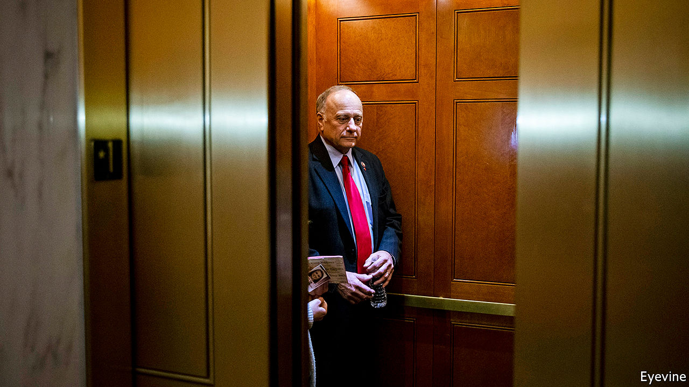

## The ninth innings

# Steve King, Iowa’s most noxious politician, looks vulnerable

> In each election cycle a few congressional races take on national importance. In 2020, Iowa’s fourth will be one

> May 9th 2020CHICAGO

GIVING OFFENCE is Steve King’s stock-in-trade. The congressman for Iowa’s fourth district has suggested heaven is off-limits to gay people, spoken up for white supremacy and posed with Marine Le Pen, Geert Wilders and other far-right populists. He has likened immigrants to animals. Many are smugglers, he once said, adding that migrant men have “calves the size of cantaloupes” from lugging bales of drugs. A decade before Donald Trump proposed walling up the border, Mr King was America’s leading xenophobe. He even posed in Congress with a model of a concrete barrier topped with electrified wires. Zap foreigners, he said, to keep ’em out.

Rural Iowans have swooned at that, and at how he has enraged urban, liberal folk. His admirers say that in person he is charm itself. After nine election victories, usually by huge margins, he has seemed entirely secure. In some counties he takes over 70% of the votes, thanks to a base of conservative Christians—Dutch Reform, evangelical, Catholic and Lutheran. They like his opposition to abortion, even in cases of incest or rape. He has also picked up protest votes. As family farms have died and home towns have dwindled, Mr King’s rage at the modern world seemed fitting.

And yet, after 17 years, he looks vulnerable. Republican leaders no longer coddle Mr King. Corporate donors are rejecting him. He has a paltry $43,000 on hand for re-election and faces a tough primary election on June 2nd. One poll suggests that Randy Feenstra, an equally conservative state politician with $416,000 in the bank, is just behind him in a field of five. The party (and Dutch Reform voters) back Mr Feenstra. This week the US Chamber of Commerce endorsed Mr Feenstra, as have other Iowan bigwigs.

On the face of it Mr King’s troubles date to January 2019, when he wondered aloud why “white supremacy” was an offensive term. Party leaders booted him off the congressional committees he sat on, which include agriculture (a perch that matters a lot to Iowans). Mr Feenstra says that marked Mr King as a failure. In fact, Mr King’s views on white supremacy are hardly new. His feeble showing three months earlier in the 2018 election was, however. “He is no longer a safe bet,” says Rachel Paine Caufield of Drake University, because he only scraped a narrow victory over J.D. Scholten, a first-time Democratic opponent.

Mr Scholten is a personable, lanky ex-professional baseball pitcher, who counts as a celebrity in Iowa’s fourth congressional district. A Republican strategist says there is a risk that the Democrat would win in a rematch; worse, she says, if Mr King lingers then voters in November may shun other Republicans, notably Joni Ernst, a senator in a tight re-election race. Mr Scholten reckons that plenty of Trump supporters back him. He also notes that last time he got 25,000 more votes than there were registered Democrats. That put him within 3% of winning. He also raised $2.3m, a mighty sum for a first-timer who supposedly had no chance. This time the money is gushing even faster.

The reason for this, he argues, is not just voter fatigue with Mr King, but mounting anger about the economic troubles that were evident long before coronavirus hit. Mr Trump’s trade war with China has suppressed prices for soyabeans and other agricultural commodities. Bail-outs have largely been grabbed by the biggest farmers. The ethanol industry is in the dumps. Workers in the meat industry and livestock farmers have been walloped by coronavirus. Mr Scholten thinks voters are warming to his call for antitrust measures to break the grip of a few giant firms over agriculture in the state.

Is Mr King doomed? No one knows how virtual campaigning and the use of postal ballots in the primary (and maybe in November) may skew things. He may do better in a presidential year than he did in the mid-terms. The incumbent likes a fight, and says “never-Trumpers” backed by “coastal elites” are conspiring to stop him. He could yet win the primary. Mr Scholten is eager that he does, to get that re-run from two years ago. After all, in baseball a team gets nine innings; Mr King has had his. ■

Dig deeper:

## URL

https://www.economist.com/united-states/2020/05/09/steve-king-iowas-most-noxious-politician-looks-vulnerable
