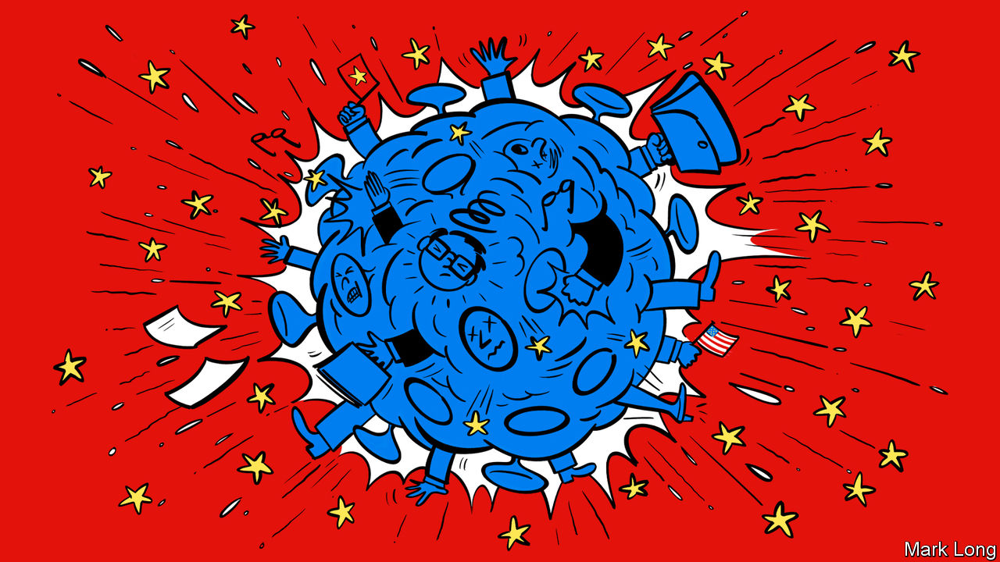

## Superpowered insults

# There is less trust between Washington and Beijing than at any point since 1979

> What does that mean in practice?

> May 9th 2020NEW YORK

Editor’s note: The Economist is making some of its most important coverage of the covid-19 pandemic freely available to readers of The Economist Today, our daily newsletter. To receive it, register [here](https://www.economist.com//newslettersignup). For our coronavirus tracker and more coverage, see our [hub](https://www.economist.com//coronavirus)

WHEN CONDUCTING war games between China and America, David Ochmanek of RAND Corporation, a think-tank, worries most about an invasion of Taiwan, the security of which is implicitly guaranteed by America. In one scenario the red team unleashes a “joint firepower strike” on Taiwan’s defence forces and on American forces, bases and command-and-control nodes in the Pacific, including on Okinawa and Guam. Many of the blue team’s planes are destroyed on the ground, and its runways disabled. China severs communication links as part of an effort to gain information superiority, part of a full-spectrum strategy called “system-destruction warfare”. Then comes the amphibious assault on the island. American submarines knock out some portion of the invasion force with torpedoes, but surface-level carriers and frigates are hammered by Chinese anti-ship missiles if they venture near the fight. “We always assume that the United States intervenes forcefully and early,” Mr Ochmanek says. But now, in contrast to years past, “I would not have confidence that we would succeed.”

The probability of such a world-changing military conflict between the two countries remains mercifully low. But it is becoming something to ponder beyond simulations, a reflection of how grim their relationship has become. Lesser conflicts may be reignited this year—over trade, technology, espionage and propaganda and disinformation—while the American death toll from covid-19 climbs. The world’s two largest economies, so long intertwined through trade and investment, are heading towards a partial decoupling. There is less trust between the two governments than at any time since the normalisation of relations in 1979. And as an election approaches in November, the chances of misunderstanding, miscalculation and provocation are escalating on both sides.

President Donald Trump had praised Chinese leaders in the early days of the pandemic, after signing a “phase one” trade deal. He has repeatedly expressed admiration for Xi Jinping, China’s president, even as recently as late March, tweeting after a telephone call, "We are working closely together. Much respect!" But in April, as Mr Trump faced intensifying criticism for the failure to contain the epidemic, he swung to attacking China, a strategy which Republican pollsters suggest may help him against Joe Biden, his Democratic challenger. (One attack ad paid for by Trump allies said that “To stop China, you have to stop Joe Biden”; another declared, “China is killing our jobs and now, killing our people”.) On May 3rd Mike Pompeo, the secretary of state and a proponent of the term “Wuhan virus”, tweeted that “China has a history of infecting the world”, implicitly blaming the covid-19 pandemic on “failures in a Chinese lab” in Wuhan. That theory is still in search of some evidence.

In China, too, the political calculus threatens to escalate tensions. In recent days state media have called Mr Pompeo “evil”, “insane” and a “common enemy of mankind”, stoking the fires of nationalism. In Beijing there are signs that leaders are getting nervous. On May 4th Reuters, a news service, reported that an elite think-tank under the Ministry of State Security had warned China’s leaders of an elevated risk of war with America, as the country endures a global backlash not seen since the massacre around Tiananmen Square. On May 4th a hawkish Chinese military strategist, apparently worried that some in China are eager to exploit a moment of weakness in America, warned against taking Taiwan by force, telling the South China Morning Post that it would be “too costly”.

State-sponsored hacking of American government and corporate targets carries fewer risks. The practice had subsided after a deal struck between Mr Xi and Barack Obama in 2015, but reportedly resumed after Mr Trump took office. It is expected to continue as tensions worsen; sensitive medical information, including work on covid-19 vaccines, could be a target. America in turn could decide to open its arsenal of hacking tools, potentially escalating cyber-hostilities to new levels.

Then there is what P.W. Singer, a specialist on 21st-century warfare, calls “like war”, the Kremlin-style use of social media to spread propaganda and disinformation. Mr Singer says China has learned from Russia. Its diplomats and state-media actors have spread the fiction that the American armed forces brought the virus to Wuhan. Xinhua, the official news agency, released an animated video using Lego characters to illustrate America’s efforts to blame China for its failure to contain the virus: “We are always correct, even though we contradict ourselves,” says the Statue of Liberty, while hooked up to an IV drip. “It’s like that scene in ‘Jurassic Park’ where the velociraptors figure out how to turn the doorknob,” Mr Singer says. “That’s what you just saw with China in information warfare.”

In some arenas the rhetoric may be little more than hot air. The “Justice for Victims of Coronavirus Act”, a bill sponsored by Josh Hawley, a Republican senator from Missouri, would allow citizens and states to sue China for damages related to covid-19. Mr Hawley published an op-ed in the New York Times arguing that the World Trade Organisation should be abolished because it has enfeebled America’s economy while enabling China’s rise. Mr Trump is considering action in a few areas—levying new tariffs, imposing sanctions, asking companies to move manufacturing out of China, and ordering federal pension funds not to invest there. News outlets reported the fanciful idea, floated by sources in the administration, that the White House was considering cancelling part of the country’s $1.1trn in debt obligations to China, to “punish” China for the pandemic.

The administration’s push to blame a lab in Wuhan for the pandemic may fall apart if it fails to produce evidence; officials in Britain and Australia have briefed newspapers that America has shared no convincing intelligence under their Five Eyes agreement. But in other ways the row is already taking a real toll. At the United Nations a resolution calling for ceasefires in regional conflicts around the globe has stalled over a squabble between the two countries about whether to name-check the World Health Organisation.

Taiwan is likely to be a flashpoint for increased tensions, if not armed conflict. America is backing the self-governing island’s bid for observer status at the World Health Assembly, the decision-making body of the WHO. A vote is expected later this month. The administration has also allowed a deputy secretary of health and human services to take part in a Zoom conference with a Taiwanese vice-premier about Taiwan’s successful response to covid-19. Mr Trump may consider sending a more senior official to Taipei, which would be taken as provocation by the Communist Party. In that sense the pandemic might provide a saving grace. If such a high-level summit were to be conducted over Zoom, to prevent the spread of the virus, the two governments might at least keep at a safe distance from each other. ■

Dig deeper:For our latest coverage of the covid-19 pandemic, register for The Economist Today, our daily [newsletter](https://www.economist.com//newslettersignup), or visit our [coronavirus tracker and story hub](https://www.economist.com//coronavirus)