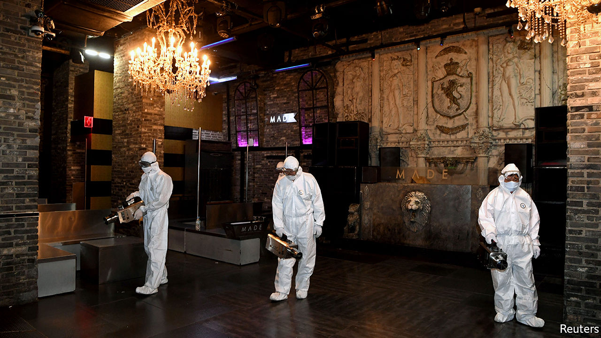

## A catchy beat

# Infections at nightclubs mar South Korea’s relaxation of restrictions

> But domestic flights and resorts remain packed

> May 16th 2020SEOUL

Editor’s note: The Economist is making some of its most important coverage of the covid-19 pandemic freely available to readers of The Economist Today, our daily newsletter. To receive it, register [here](https://www.economist.com//newslettersignup). For our coronavirus tracker and more coverage, see our [hub](https://www.economist.com//coronavirus)

APART FROM the temperature checks at the boarding gate and the face masks worn by passengers and crew, there was nothing unusual about the flight that left Seoul’s Gimpo airport for the southern island of Jeju on the morning of May 1st. There was not a single spare seat on the plane, nor on many of the 108 others that departed for the same destination that day.

Buoyed by much-relaxed social-distancing recommendations following weeks of very few new cases of covid-19, Seoulites emerged from their cramped apartments to spend the long holiday weekend by the sea. Closer to home, thousands of partygoers from both Seoul and the rest of the country flocked to the capital’s bars and clubs, which had reopened after a brief closure in April.

The return of domestic tourism and nightlife reflected public confidence in South Korea’s ability to keep the virus at bay. But in at least one instance, that confidence was misplaced. The tourists who frolicked by the sea suffered few adverse consequences beyond a spot of sunburn. Revellers in Seoul’s clubs, however, were not so lucky. Shortly after the long weekend, it emerged that customers had carried the virus into several busy nightspots. More than 100 new infections have been traced to clubs in Itaewon, a popular entertainment district. Since the affected areas saw thousands of visitors on the date in question, the number of infections is likely to continue to rise.

Tracking down potential patients, which has been South Korea’s main strength in suppressing the virus, has proved harder than during previous outbreaks. Contact-tracing initially focused on a handful of gay bars visited by a man who later tested positive. Homosexuality is often stigmatised in South Korea. Being outed as gay (the effective result of the man’s home town and workplace becoming public knowledge in the process of contact-tracing) can lead to people being fired from their jobs and ostracised by friends, family and neighbours. Many of the names and telephone numbers on the lists of customers that clubs have been obliged to keep since reopening turned out to be fake.

In response, authorities are adjusting their tracing methods. They are now offering free and anonymous testing for anybody who went near the affected areas in late April and early May. In a break with previous practice, they are seeking to reassure people that they will publish minimal information about their identity and routes. But delays associated with worries about privacy have probably already pushed up the number of infections associated with the incident.

The new outbreak has slowed the resumption of normal life. Clubs have been ordered to shut again until June 7th. The reopening of schools, originally planned for this week, has been pushed back by a week. Thousands of cram schools have also been told to close after a teacher and several students tested positive.

The outbreak has probably spread more widely than it might have given the recent uptick in domestic travel, with cases related to the Itaewon clubs being discovered as far afield as Busan and Jeju. The bounce-back in domestic tourism has been swift, as people have grown keener to get away from it all but have little scope to travel abroad. Flight capacity from Seoul to Jeju, the world’s busiest air route, is back to 95% of its usual average after dropping by half in March, when social-distancing recommendations were at their most stringent.

During the May holiday weekend, Jeju felt little changed from before the pandemic, bar a dearth of Chinese tour groups. Beaches, coffee shops and bike lanes were packed with visitors, many of whom appeared to have left their face masks at the airport. A guesthouse-owner on the island, who caters mainly to tourists in their 20s, says that occupancy has reached around 80% of the typical level: “Everything is starting to get back to normal.” Unfortunately, periodic surges in infections and consequent adjustments to the rules are also likely to become normal. ■

Dig deeper:For our latest coverage of the covid-19 pandemic, register for The Economist Today, our daily [newsletter](https://www.economist.com//newslettersignup), or visit our [coronavirus tracker and story hub](https://www.economist.com//coronavirus)

## URL

https://www.economist.com/asia/2020/05/16/infections-at-nightclubs-mar-south-koreas-relaxation-of-restrictions
