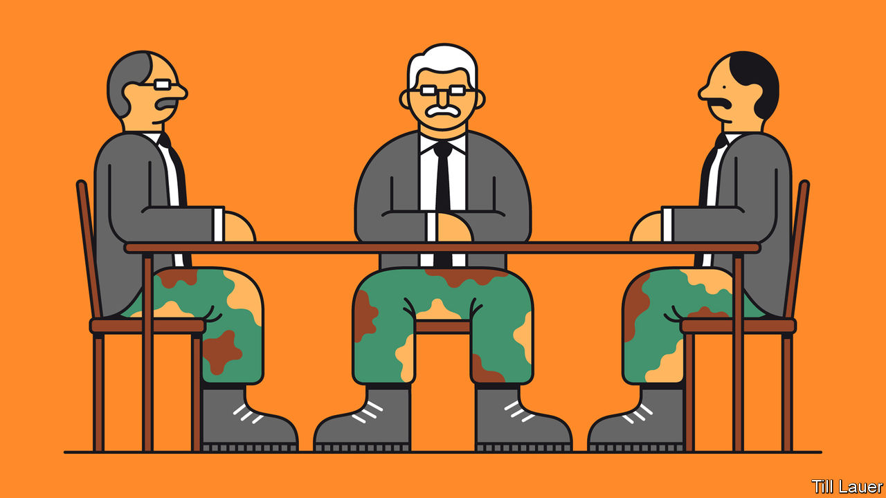

## Banyan

# Sri Lanka’s new president is putting soldiers in charge of everything

> Never mind the damage to national reconciliation after a long civil war

> May 14th 2020

BEFORE THE presidential election he won last November, Gotabaya Rajapaksa laid out for Banyan his vision for Sri Lanka. It was a sunlit upland of peaceful, inclusive “knowledge-based” development. All the political bickering of recent years, “Gota” promised, would be swept aside by his programme of brisk, technocratic proficiency. His years as an army officer would ensure that.

A military timbre to the former lieutenant-colonel’s rule was always on the cards. Mr Rajapaksa’s campaign dwelt on the need for a “disciplined society”. Viyathmaga, a social movement with political ambitions that backed him, counted many former officers among its leaders. The president’s personal network is rooted not just in his family (his elder brother, Mahinda, now prime minister, was himself president from 2005 to 2015). Gota commands the loyalty of past and present soldiers, a band of brothers from his time fighting a horrific, long-running civil war against Tamil insurgents, first as an officer and latterly as the powerful secretary of defence under Mahinda.

After the war, the army and intelligence played a big role in public life and, most Sri Lankans assumed, in the disappearance of critics of the government, until Mahinda was unexpectedly defeated in the presidential election of 2015. Yet few predicted the extent to which under Gota’s rule military types would move into senior positions in government, development and even health, fighting the covid-19 epidemic.

In a tally by the International Truth and Justice Project, a human-rights group, current or former officers include the president’s chief-of-staff and the heads of national intelligence, prisons and prisoner rehabilitation. Generals, past or present, are in charge of customs, the port authority, development, agriculture and poverty eradication. The army commander, General Shavendra Silva, runs the coronavirus task-force. Top brass are also expected to be named to plum ambassadorships.

The president’s backers bridle at any suggestion that this is an unhealthy trend. They point out that the top customs job is an irresistible temptation to civilian incumbents. Yet they do not explain how it would be any more resistible to military men. As for handling the coronavirus, given that the bureaucracy is hidebound and civilian capacities are weak, deploying the armed forces and their logistical abilities makes sense—besides, the armed forces are widely admired. Yet it is weird for them to police a dubious liquor ban imposed by the teetotal president. And their enforcement of quarantine areas with hazmat suits and assault rifles is surely overkill. Moreover, the commanders’ claims of covid-competence have been undermined by outbreaks on military bases. Of 900-odd reported cases in Sri Lanka, over 500 are members of the armed forces or their close contacts.

Nor is there much reason to believe that military men will do a better job of running ports, reducing poverty or increasing crop yields. For now, the main question is accountability. The positions filled by officers have little civilian oversight. It does not help that Mr Rajapaksa has dissolved the old parliament, while elections for a new one have been thwarted by the epidemic. The president and his aides govern by decree.

It reinforces what Kanishka Jayasuriya of Australia’s Murdoch University calls the “normalisation” of military influence in the civilian sphere, as informal networks become formal under Mr Rajapaksa. The normalisation extends to business, where—as has long been the case in, for example, Myanmar—military types prosper alongside a new, assertive bourgeoisie grown rich on the back of property and infrastructure deals, much of it lubricated by Chinese loans. Former officers advise on projects’ security, while the army gets involved in slum clearance to make way for development. Academics and journalists say they are afraid to investigate the business links.

Thus does Sri Lanka lurch further from liberal democracy. Gota has in the past railed at Banyan about the unfairness of external critics. He has no time for the UN’s call for an investigation into crimes that may have been committed in the closing days of the civil war. He defends General Silva, who was banned from America earlier this year over suspected involvement in extra-judicial killings. As he and his band of brothers have long seen it, having saved Sri Lanka from fracturing, they are entitled to an outsize role in its future. With military efficiency, they are taking it.