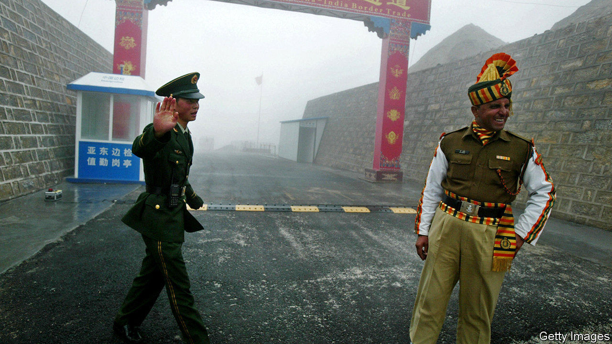
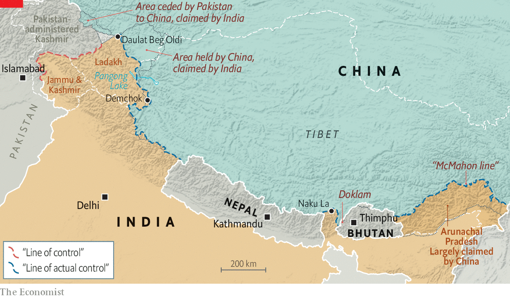

## High dudgeon

# The Chinese and Indian armies settle a clash by fisticuffs

> There may have been some rocks thrown, too

> May 16th 2020

THE LAST Indian soldiers to die on the country’s frontier with China, the longest disputed border in the world, were shot in 1975, when patrols from the two countries stumbled across one another in dense fog. The nuclear-armed neighbours have beefed up their border forces considerably since then, but have also worked to ensure that their disputes do not lead to bloodshed. That is why two clashes between Indian and Chinese soldiers in recent days have been limited to a relatively genteel form of combat: fisticuffs.

The most recent Sino-Indian confrontation occurred three years ago. In June 2017 China began building a road in a spot known as Doklam, where India, China and the tiny mountainous kingdom of Bhutan meet. That led to a tense 73-day standoff between Indian and Chinese forces before both sides agreed to fall back. An informal summit the following April between Narendra Modi, India’s prime minister, and Xi Jinping, China’s president (in, of all places, the Chinese city of Wuhan, soon to become the birthplace of covid-19), seemed to soothe relations between the rivals. But the “Wuhan spirit”, as boosters termed it, has clearly faded.

During April tensions appeared to build between Indian and Chinese troops in Ladakh, a high plateau at the western edge of Tibet. On May 5th these erupted into violence when Chinese troops reportedly took issue with an Indian patrol on the north bank of Pangong lake, where the two countries have overlapping claims. The resulting fist-fight and stone-pelting resulted in injuries on both sides, including to senior officers. Indian officials remain concerned about Chinese construction activity in Ladakh near Daulat Beg Oldi, a vital airfield, and Demchok, a strategically located village. Then on May 9th another skirmish broke out 1,000km to the east at Naku La, a mountain pass near Doklam. Shortly afterwards Nepal, another mountainous minnow wedged between the two giants, which Mr Xi visited in October, complained about India’s own road-building in yet another disputed border area.

Small dust-ups are common. Thanks in part to slapdash colonial cartography, the boundary between India and China is undefined. Whereas India and Pakistan agree where the “line of control” separating their forces runs in the disputed territory of Kashmir, India and China have different views about the exact location of the “line of actual control” they are patrolling. Encounters between units from the two sides are therefore inevitable. Agreements signed in 1996 and 2003 established protocols to deal with such incidents, including promises not to use weapons. The resulting gunless confrontations range from mere jostling to more serious melees, complete with rock-throwing and acrobatic flying kicks.

Such scuffles might become yet more frequent. Negotiations to define the border have made little progress, and troops are bumping into each other more often. Tanvi Madan of the Brookings Institution, a think-tank, points out that, after years in which China improved infrastructure and increased the military presence on its side of the border, India has recently been doing the same. At the Wuhan summit Messrs Modi and Xi both agreed to give “strategic guidance” to their respective armies to cool it. “The exact opposite is happening,” says Jabin Jacob of Shiv Nadar University. “Nationalist narratives in both countries are beginning to percolate down to the militaries in difficult-to-control ways.”■

Correction (May 15th 2020): The original version of this story mistakenly referred to Nepal as a kingdom. It ceased being one in 2008.