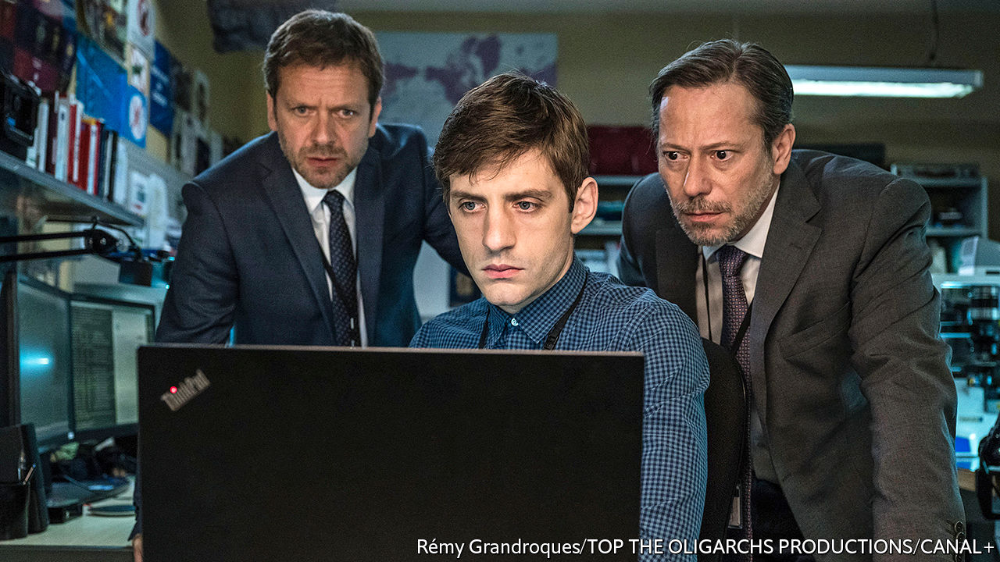

## Home Entertainment

# Catch up on the finest French television dramas during lockdown

> The fifth season of “Le Bureau des Légendes” (“The Bureau”) has been cult viewing

> May 16th 2020

Editor’s note: The Economist is making some of its most important coverage of the covid-19 pandemic freely available to readers of The Economist Today, our daily newsletter. To receive it, register [here](https://www.economist.com//newslettersignup). For our coronavirus tracker and more coverage, see our [hub](https://www.economist.com//coronavirus)

WHEN IT COMES to screen drama, the French have long considered cinema and the film d’auteur to be the nobler art, one that helps define national identity. Television drama was traditionally treated as its poor cousin: unsophisticated, formulaic and risk-averse. Yet in recent years this hierarchy has been upended. France now offers plenty of compelling viewing on the small screen.

A good place to start is “Dix Pour Cent” (“Call My Agent!”), which centres on a dysfunctional talent agency in Paris. The series follows half a dozen highly strung agents as they struggle to manage their roster of stars. The agents’ caprices and rivalries veer from the comic to the poignant, with occasional lapses into melodrama. All this is sustained by sharp dialogue, self-deprecating angst and warmth. In a twist, each episode also features a French film star—Isabelle Adjani, Juliette Binoche, Jean Dujardin—playing themselves. Produced for France 2, a public broadcaster, “Dix Pour Cent” attracted wider attention when Netflix bought the rights. A fourth and final season is currently in post-production in France.

For a moodier pace, and the intrigue of contemporary espionage, it is well worth catching up with “Le Bureau des Légendes” (“The Bureau”, pictured), a cult hit from Canal+. Starring Mathieu Kassovitz as Guillaume Debailly, an espion progressively trapped by his own lies, the fifth season launched during lockdown. The bureau in question runs undercover agents for the French intelligence service. But this smart, unhurried Gallic take on a spy thriller features no special effects and few stunts. Rather it relies on psychological complexity, intricate geopolitics and a form of slow-burn realism said to have met with approval even among French intelligence officers.

Equally unsentimental is “Baron Noir” (another Canal+ production), a political drama. Set in the gilded salons of the Elysée presidential palace, as well as the northern port of Dunkirk, it focuses on the compulsive and self-serving character of Philippe Rickwaert, superbly played by Kad Merad. A one-time Socialist mayor and member of parliament, he is out to play power politics at all costs, even to himself.

What most of these series share, along with others such as “Engrenages” (“Spiral”) or “Les Revenants” (“The Returned”), is the adoption of an American-style TV-writing structure: a pool of writers, overseen by a showrunner who enjoys overall creative control. Not all French directors have taken well to being treated as hired hands. But series creators, such as Éric Rochant of “Le Bureau des Légendes”, also a director himself, have now earned power and prestige.

The results speak for themselves. When she started out, Fanny Herrero, creator of “Dix Pour Cent”, analysed the best contemporary American television drama, realising that its French counterpart “had to modernise”. Now it has. Régalez-vous. ■

Dig deeper:For our latest coverage of the covid-19 pandemic, register for The Economist Today, our daily [newsletter](https://www.economist.com//newslettersignup), or visit our [coronavirus tracker and story hub](https://www.economist.com//coronavirus)

## URL

https://www.economist.com/books-and-arts/2020/05/16/catch-up-on-the-finest-french-television-dramas-during-lockdown
