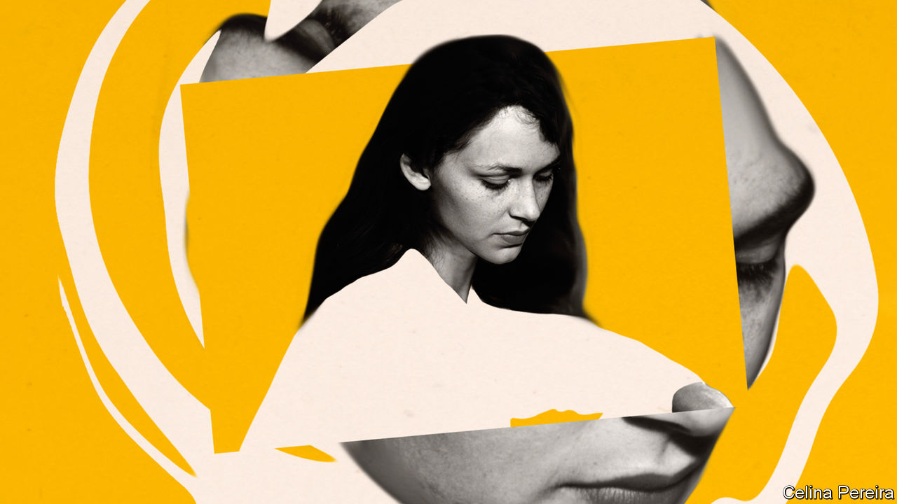

## Perspectives

# Even before lockdowns, confinement was part of human life

> And in some cases it was sought out

> May 16th 2020

Editor’s note: The Economist is making some of its most important coverage of the covid-19 pandemic freely available to readers of The Economist Today, our daily newsletter. To receive it, register [here](https://www.economist.com//newslettersignup). For our coronavirus tracker and more coverage, see our [hub](https://www.economist.com//coronavirus)

VERY GRADUALLY, now here, now there, the rules that have kept a large share of the world’s people immured in their homes are being relaxed. There can be no sudden burst from confinement, like young colts in spring. But already the parties are being planned, the long drives to see relations, the sheer revelling in independence and unfettered life. This peculiar imprisonment will end, and most people—physically, at least—will be free.

Yet, in myriad ways, confinement will continue as it always does. Alarms ring at the start of the day, and watches are strapped on, to submit to the limits of time. Bodies are roped with belts and ties, forced into unkind shoes and crammed into the narrow bounds of buses and tubes. Children, brushed and tidied, are packed off to school. And this, of course, is the daily round that many have been pining for.

It gets no looser as the day goes on. Office workers stay in one room, or one small cubicle, completing set tasks. From the window they may envy the gardeners and builders round about. But the outside labourer still works within the limits of his ground, to the limits of tools and strength, within the unpredictable imperatives of nature. And as workers and non-workers alike snuggle into the comfortable confines of their beds, sleep wraps them closely round a second time.

Confinement, of all kinds and degrees, is part of human life. The word does not normally denote imprisonment, still less isolation, but the setting of limits. Those limits are often self-imposed or set by generally benevolent forces: parents, society. Confinement to the home and thereabouts by state order is rare, but in emergency that too has been, by and large, accepted.

Physical restriction, after all, starts early, with the full-term fetus curled in a space it fills completely. This presumably seems cosy to some, intolerable to others; attitudes to confinement may well be laid down in utero. Newborn infants, when asleep, will sometimes fling out their arms as if to check that the limits are still there, and to seek reassurance. And for long centuries, persisting to the present in places, this reassurance was partly provided by swaddling the child in linen bands as tightly as could be.

The purpose of swaddling was also to make the limbs grow straight, as saplings are braced and tied; and here the moral purpose of confinement enters the picture. As the limbs were straightened by the bands, so the mind of the growing child was straightened by careful instruction in discipline and manners. Rote-learning of noun declensions and multiplication tables kept the brain focused in a tunnel of repeated sounds. Beatings for forgetting, and deferential behaviour to superiors, kept the body in check. Confinement in starched clothes in a church pew, or in mosque or synagogue, for long hours of the Sabbath ensured community cohesion. When young men and women subsequently went off the rails, as many did, they had plainly not been confined enough.

Much of that sort of restriction has disappeared from modern life. It is no longer bearable, though echoes of it have resurfaced in current public-information campaigns: the repeated mantras about hand-washing, the threat of tighter rules for disobedience. But attitudes to confinement are not merely a matter of prevalent social norms. They also lie in the mind and mood of the beholder.

For Hamlet in his half-madness, the world itself comprised “many confines, / wards, and dungeons, Denmark being one o’ the worst.” It was an “unweeded garden” (gardens being hedged and walled, as even Eden had been enclosed), possessed by “rank and gross” things. The Romantic poets tended to agree. Percy Bysshe Shelley thought himself confined by the entire institutional structure of his age, especially the interdiction of free love; “heart-withering custom’s cold control” was a dead hand that he could not escape. Both Samuel Taylor Coleridge and John Keats felt “pent” in London, though Samuel Johnson had equated the city with life itself, and they had its whole width to wander in. Like the caged birds that were bought to swing at tenement windows, poets too could not sing among shops and chimney stacks.

Down the ages, fear of confinement was often inculcated through stories. A large number of fairy tales featured maidens confined indoors: the Sleeping Beauty in a palace-room behind thick thorns, Rapunzel in a high tower. Princes rescued them, but there was usually no obvious sign that their confinement had ended. It was perhaps just the fate of women to be shut up, as in the Song of Solomon (“A garden enclosed is my sister, my spouse”) or in medieval nunneries, or in the harems of the East; after all their inexplicable or forward behaviour, the ancients thought, was caused by the womb drifting in an unchecked way. The agony that may be hidden in such closed rooms is perhaps summed up by the old use of “confinement” as a euphemism for childbirth, when a pregnant woman disappeared into a female world full of secret rituals, desperation, pain and shame.

Yet even strict confinement was not necessarily fearful. It might offer, paradoxically, a means of escape. In Greek myth, some characters—Myrrha, who had slept with her father, or the Heliades, who had offended the sun god—were turned into trees as punishment. For others, however—the nymph Daphne, turned into a laurel tree as Apollo pursued her, or Syrinx, turned into a reed to frustrate Pan—that gradual spread over their soft skin of gnarled bark or hard outer layer, that stiffening of their limbs, was deliverance. Restriction could mark the beginning of a different and, in some ways, freer life.

Many encountered this paradox. Within a few lines, world-hating Hamlet also averred that “I could be bounded in a nutshell, and count myself a king of infinite space.” While the body was held, the mind leaped outwards. Julian of Norwich, in confinement and in vision, saw a “little thing”, only the size of a hazelnut, in God’s hand, and was told it was “all that is made”. She was one of hundreds of anchorites in pre-Reformation England, most of them women, who had entered a confinement so permanent that the Office of the Dead was recited over them, and the door of their tiny cell was sealed. They were not isolated; people consulted them, and through a window food would be passed in, the chamber pot passed out. But they were bounded, as in that nutshell. In this locked place, salvation could be found and God encountered. Jesus himself had told his followers not to pray in public, but to “enter into thy closet, and…shut the door…and thy Father...shall reward thee openly.” For each monk, nun or hermit their cell was, and is, their spiritual touchstone. As Abba Moses, a Desert Father, said, “Sit in your cell, and your cell will teach you everything.”

Another self-imposed confinement, for those of a platonic cast of mind, was that of the soul within the body. When souls lost their feathers, as Socrates explained in “Phaedrus”, they fell from the heavenly realms and, on reaching solid ground, took on the covering of mortality. In this double casing of Earth and body, they could experience beauty; on recognising it, they would feel their feathers growing again and recall their heavenly beginnings. Romantic poets treasured this notion of confinement awakening the soul; of seeing, through the smallest earthly forms, “into the life of things”. For Wordsworth, in his “Ode on Intimations of Immortality”, the soul’s visions could be unlocked even by the sight of a wild pansy in the grass.

They could be set free, too, when he lay on his couch in the small, dark rooms of Dove Cottage, where the views from the tiny windows were only of banks and close stone walls. Writers and thinkers in all disciplines have long found confinement useful, even essential. It can be technical: strict adherence to harmony and counterpoint, or to metre and rhyme. As Wordsworth himself explained, just as nuns were content with their narrow rooms, and hermits with their cells, he too for a while enjoyed “the sonnet’s scanty plot of ground”. More often, however, confinement is simply physical. Its purpose is focus, away from distraction. Virginia Woolf believed that women could never flourish as writers unless they had not only “money enough to travel and to idle”, but also independence of mind and spirit, in a room of their own.

The rooms, or cells, or sheds, need not be austere or viewless. Dylan Thomas’s writing shed at Laugharne had a prospect so beautiful, looking over “full-tilt river and switchback sea/Where the cormorants scud”, that it could not help appearing sometimes in his poems. Yet the lands he travelled were interior. Rainer Maria Rilke felt that his retreat at Muzot, a small square tower in the Alpine foothills, held the secrets of his poems; for it was there that he could mine his inner life, immersing himself in “inwardness”.

Physical feats of exploration, too, often rely on confinement. To stumble on the wonders of limestone formations underground, potholers must squeeze through tunnels and bores that can barely admit them. In the deep ocean, where a diver can no longer swim freely because of the weight of water above, two scientists and a pilot cram into a cabin six feet across in a tiny sphere of titanium, the deep-diving submersible DSV Alvin, as it drops two miles or so into the dark.

A dive on Alvin could last no longer than nine hours. But Al Worden, an astronaut on Apollo 15, spent 67 hours in lunar orbit in a command-module cabin with 6.17 cubic metres of space, while his two colleagues walked on the Moon. Other things confined him too: his clumsy space suit, and the minute-by-minute schedule imposed by mission control. In the simple poems he wrote afterwards (for he felt that the official debriefing only scratched the surface), the narrowness of his circumstances never rated a mention. He noticed only how unconfined he was, among the pirouetting stars, gazing at the “cloudy frail earth”, on which all the colours of the universe seemed to be focused:

Dig deeper:For our latest coverage of the covid-19 pandemic, register for The Economist Today, our daily [newsletter](https://www.economist.com//newslettersignup), or visit our [coronavirus tracker and story hub](https://www.economist.com//coronavirus)