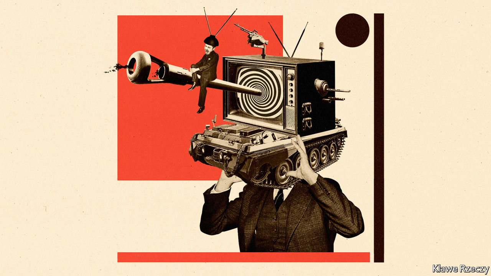

## Disinformation and democracy

# The weapons of political warfare

> Four new books explore how the struggle between Russia and the West has evolved

> May 16th 2020

Active Measures. By Thomas Rid.Farrar, Straus and Giroux; 528 pages; $30. Macmillan; £25.

Russians Among Us. By Gordon Corera.William Morrow; 448 pages; $32.50. William Collins; £20.

From Russia with Blood. By Heidi Blake.Mulholland; 336 pages; $30. William Collins; £20.

The Folly and the Glory. By Tim Weiner.To be published by Henry Holt in October; $29.99.

IN HIS ANNUAL lecture in December, General Sir Nick Carter, Britain’s chief of defence staff, warned that “the idea of political warfare has returned”. Tanks and jets still mattered, he assured a bemedalled audience, but authoritarian rivals were unpicking the seams of society and politics in the West using disinformation, espionage, assassinations, cyber-attacks and proxies. General Carter had struck on the same problem identified by George Kennan, a renowned American diplomat, at the outset of the cold war. Americans, Kennan said, viewed war “as a sort of sporting contest outside of all political context”. Russians grasped “the perpetual rhythm of struggle, in and out of war”.

Four new books reveal different facets of how that murky struggle between Russia and the West has played out and evolved. In “Active Measures”, Thomas Rid, a professor at Johns Hopkins University, surveys the history of disinformation, with an emphasis on the KGB’s prodigious output. “The Folly and the Glory” by Tim Weiner, a veteran journalist, examines America’s campaign of propaganda against communist rivals. Gordon Corera, a security correspondent for the BBC, looks at Russia’s “illegals” programme of deep-cover sleeper agents in “Russians Among Us”. And in “From Russia with Blood”, Heidi Blake, a journalist for BuzzFeed News, investigates Russia’s killing spree in Britain.

The notion that invisible weapons—“facts, fakes and ideally a disorienting mix of both”, as Mr Rid puts it—can yield famous victories is widely accepted today. That is in no small measure thanks to Russia’s intervention in America’s presidential election of 2016 using inflammatory social-media posts and the publication of hacked emails. But the practice was pioneered in the 1920s and refined in the cold war.

At first the CIA was “even more prolific and brazen” than the KGB, explains Mr Rid. A CIA-funded printing house in Berlin churned out more than 855,000 media items in 1957 alone, including pamphlets, forged and real, as well as a magazine devoted to jazz. Personalised horoscopes were sent to unnerve Stasi officials. In 1951 one front organisation was sending 15,000 propaganda-packed balloons east every month and maintained three ballooning bases until 1960.

But the KGB’S efforts would come to dwarf that. By the middle of the 1960s it was co-ordinating 300-400 “active measures” annually—everything from fuelling the European peace movement to, in later decades, spreading allegations that America had created AIDS as a weapon. A large bureaucracy was devoted to the task. One campaign, directed against America’s plans to build neutron bombs, cost $200m (over $700m in today’s money). In 1985 the annual budget for active measures was conservatively put at $3bn-4bn (more than $7bn today).

Mr Rid pulls important insights out of this tangled history. Three stand out. One is that disinformation is not the same as fabrication. In fact, it can be most effective when “larger truths” are “flanked by little lies”. The KGB circulated genuine accounts of racial violence in America in the 1960s through fake black activist groups, just as real emails were spread through phoney cut-outs in 2016. But precisely because active measures exploit pre-existing divisions, it can be hard, if not impossible, to measure whether they are effective or not.

A second lesson is that disinformation is not only corrosive to open societies, which depend on collective trust in facts, but also takes a subtler toll on the perpetrator. “When vast, secretive bureaucracies engage in systemic deception, at large scale and over a long time,” warns Mr Rid, “they will...undermine the legitimacy of public administration at home”. Soviet propagandists often deceived themselves, he notes. “It is impossible to excel at disinformation and at democracy at the same time.”

That did not stop America from trying, argues Mr Weiner. Though Kennan believed that “the disrespect of Russians for objective truth” led them “to view all stated facts as instruments for furtherance of one ulterior purpose or another”, the CIA itself would come to own or underwrite 50 news outlets around the world. America’s most illustrious newspapers all employed “at least one journalist working or moonlighting for the CIA”, claims Mr Weiner. Radio Free Europe, a CIA-funded station, was at best a source of vital news in Soviet-occupied Europe; at worst it was “a poison factory”, one former employee says, devoted to “creating chaos”.

Both countries used information as a crowbar to widen social or political divisions in the other, but Mr Rid denies any moral equivalence. The CIA, he says, “retreated from the disinformation battlefield almost completely”. When it did wage information war, it was often of a different character: distributing translated copies of “1984” into Ukraine or smuggling newsprint into Poland. America’s worst excesses in political warfare were typically curbed, eventually, by checks and balances that did not trouble Soviet agencies. “What they do to us we cannot do to them,” as Estonia’s president noted after a landmark cyber-assault in 2007.

That becomes clearer when turning to the other arrows in Russia’s quiver. Mr Corera’s account of Russian spies who burrowed into American suburbs in the 1990s, having stolen the identities of dead infants, is gripping. Many raised their unwitting children as bona fide Americans and retired there. That reflects the stamina of Russian intelligence, but also an asymmetric advantage. No young CIA or MI6 officer would want to “spend two decades working in Volgograd pretending to be a Ukrainian”, points out Mr Corera.

Ms Blake’s book explores another one-sided battle. She describes how associates of Boris Berezovsky, an oligarch who fell out with Vladimir Putin, died one after the other in London, at a rate which “defied natural explanation”. American spies repeatedly told their British counterparts that Mr Putin’s agents were probably responsible, but pusillanimous British leaders, mindful of the roubles flooding into London’s property market, swept these concerns aside. Ms Blake’s argument rests on eyebrow-raising claims that Russian spies have developed undetectable poisons that can cause fast-acting cancers and “mood-altering substances” to induce depression and suicide.

The evidence for that lurid suggestion is slender. But it relates to the third of Mr Rid’s arguments: that technology has transformed the arena of political warfare. This is evident from Mr Corera’s account of the revolution in Russia’s illegals programme. The age of biometric border controls and social-media backstories made it significantly harder to create aliases that would stand up to scrutiny. A new and more prosaic generation of illegals travelled between Russia and the West under their real names, hidden in a flood of émigrés, says Mr Corera. But as technology closed one door, it opened another.

Soviet disinformation had to be laundered into the West, typically through the media. “If they did not have press freedom, we would have to invent it for them,” the KGB’s disinformation chief quipped in 1964. The internet changed the nature of that conduit. Information could be stolen in vast quantities and spread anonymously, quickly and cheaply, often through credulous activists and amplified by harried journalists untroubled by its provenance. “A significant and large proportion of the disinformation value-creation chain was outsourced to the victim society,” concludes Mr Rid. More perversely, the Western panic around false news stories often overstated the effectiveness of those campaigns—and thus compounded their disorienting effects.

Like Kennan in 1948, Western intelligence officers and soldiers are now relearning how to wage political warfare. Last year General Carter launched a new division of the British army devoted to “information manoeuvre and unconventional warfare”. It “routinely conduct[s] operations below the threshold of armed conflict in the virtual and physical dimensions”, boasts Britain’s defence ministry, somewhat cryptically. One of its units, the 77th Brigade, has been active in countering disinformation around covid-19. Whether it also sends customised horoscopes to Russian spies is not disclosed.■

## URL

https://www.economist.com/books-and-arts/2020/05/16/the-weapons-of-political-warfare
