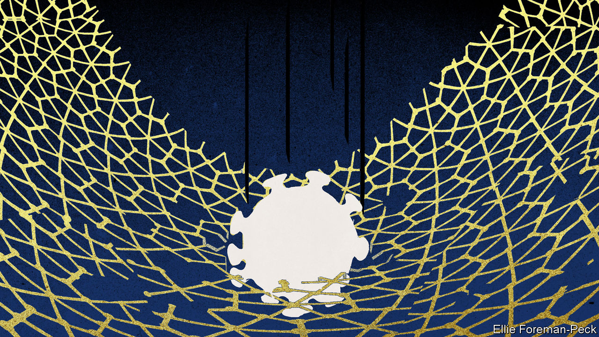
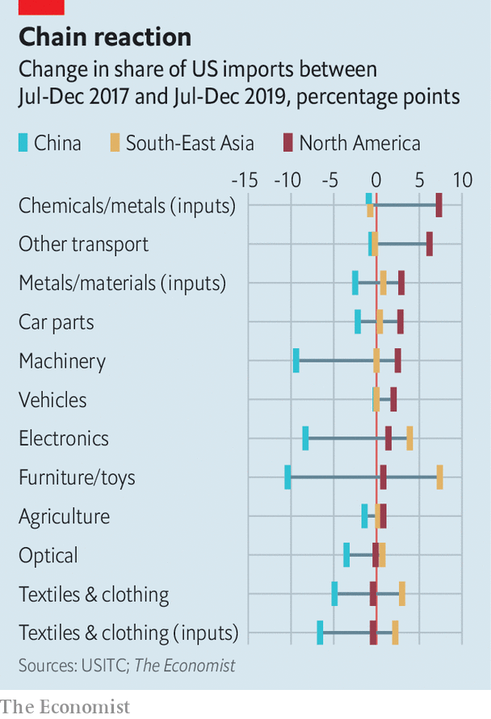

## No safety net

# Covid-19’s blow to world trade is a heavy one

> And pre-existing conditions seem to worsen the prognosis

> May 14th 2020WASHINGTON, DC

Editor’s note: The Economist is making some of its most important coverage of the covid-19 pandemic freely available to readers of The Economist Today, our daily newsletter. To receive it, register [here](https://www.economist.com//newslettersignup). For our coronavirus tracker and more coverage, see our [hub](https://www.economist.com//coronavirus)

THE 2010S WERE not a happy decade for proponents of global trade. Though fears of an increase in protectionism following the financial crisis of 2007-09 did not materialise, nor did the growth of the 1990s and 2000s re-establish itself. Finance was tamer; China was richer and developing its internal market; transport was no longer getting cheaper. As a share of global GDP, neither global trade, foreign direct investment, nor stocks of cross-border bank lending returned to their 2000s peak.

And then, belatedly, fears about protectionism came good with the election of President Donald Trump. In 2018 he launched a trade war against China; he applied tariffs in the name of national security; his administration hog-tied the World Trade Organisation’s appellate court.

Optimists might have seen the 2020s getting off to a slightly better start. The “Phase One” deal between America and China, signed on January 15th, left tariffs six times higher than they had been before Mr Trump launched his trade war. But at least it seemed a step in the right direction.

The covid-19 pandemic has since, by curtailing trade across the Pacific, made it very hard to see how China can increase its imports from America in line with the Phase One deal’s requirements. But that is the least of the trading world’s worries. The United Nations Conference on Trade and Development is predicting that covid-19 will reduce flows of foreign direct investment by 30-40%; the World Bank expects remittances to fall by 20%; the WTO reckons trade could fall by as much as a third. Much of this carnage is because of crashing demand, not new barriers to trade. But the crisis has not made international commerce any easier.

Travel bans, quarantines and a widespread desire to stay at home even among those not ordered to do so means that the movement of individuals from place to place, the one aspect of globalisation that had continued from strength to strength, came to a juddering halt.

Fewer passengers means fewer planes means less room for air freight. In a forecast of covid-related costs made this April, the WTO took into account higher air-cargo prices, extra time spent in transit for goods having to go through more stringent border checks, and travel restrictions making trade in services and the delivery of equipment that needs bespoke installation more difficult. Overall, the WTO thinks the rise in costs could be equivalent to a 3.4% global tariff. For comparison, in 2018 the global average tariff was around 8%.

As firms have foundered, fears have mounted that foreign state-supported companies will swoop in and snap them up. The European Commission has urged member states to be “particularly vigilant” in making sure businesses are not sold off. The German, Italian and Spanish governments have all tightened their processes for screening foreign investment. The Australian government is requiring that all foreign investments be approved by the Foreign Investment Review Board. India has enacted new restrictions, too; China calls them “discriminatory”.

Around the world, governments responsive to their people are concerned with little more than keeping them something close to safe and solvent. Meeting the needs of the public is taken to mean being able to provide for them independently. Kevin O’Rourke of NYU Abu Dhabi sees a parallel with the period which came immediately after the second world war. Policy was neither being driven by corporate interests seeking protection from foreign competitors, nor by a calamitous attempt to impose capital controls, but rather voters’ desire for safety. It is a powerful justification for protective measures.

Take medical supplies. In 2018 China alone supplied about 42% of the world’s exports of personal protective equipment. Almost three-quarters of Italy’s imported blood thinners come from China; so do 60% of the ingredients for antibiotics imported by Japan. Such dependence on any country seems unwise. Such dependence on China, which has been known to abuse its market dominance, seems idiotic. Smaller, poorer countries have little choice but to build stockpiles. But the bigger, richer countries and blocs are thinking of ways to shake up the status quo.

On April 27th Bernd Lange, head of the European Parliament’s Committee on International Trade, suggested that requirements could be imposed on companies to source certain intermediate products from several countries, or to develop strategic agreements with companies for their assembly lines to change quickly in a crisis. Alternatively, the EU could create a list of strategic goods for which European production would be required.

Mr Trump’s trade adviser, Peter Navarro, is clearly itching to set procurement rules which would force health-care providers to buy American-made products. Mr Trump’s administration is reportedly also trying to remedy what it sees as a strategic vulnerability by convincing Intel and Taiwan Semiconductor Manufacturing Company, two companies on the frontiers of chipmaking, to build new factories in America. A survey of members of the Global Business Alliance, a group of companies with investments in America, published on May 11th, revealed that 77% expected the country to become more protectionist in terms of cross-border mergers and acquisitions, government procurement and trade because of the pandemic.

Those businesses, and their peers, are currently in crisis-management mode. When the dust gets to settling, they have some reconfiguring to do. Adjusting their supply chains will probably accelerate the trend towards regionalisation, particularly in complex cases where assemblies cross borders repeatedly. This will have the knock-on effect, desired by some, of reducing the centrality of China.

Take regionalisation first. In the automotive supply chain, which stretches from the leather for seats to the chips for dashboard displays, 59% of trade is already intraregional. Such integration is self-reinforcing; it becomes increasingly easy, and enticing, to replace suppliers farther afield with ones nearer to hand. Comparing the second half of 2019 with the second half of 2017, China’s share of car parts imported by the United States fell by 2.2 percentage points. The share coming from elsewhere in North America increased by 2.8 percentage points (see chart).

What works for cars, though, does not work for everything. Near-shoring imports of furniture, toys and clothes may not be worth the fuss. As China’s (sizeable) share in America’s imports of clothing, toys and furniture fell between 2017 and 2019, North America’s barely budged. Drops in electronics imports from China were offset not by suppliers closer to home, but mostly by other Asian countries.

That demonstrates the other strategy companies are developing: globalisation with fewer Chinese characteristics. Last October a survey of American multinationals found that around 40% were either considering or in the process of relocating manufacturing or sourcing outside of China. A more recent survey suggested that 24% were planning to adjust their sourcing outside of China as a result of covid-19.

For some companies, this is not a straightforward retrenchment, but an embrace of what is known as “China+1”. The strategy is still to use Chinese suppliers, not least so as to go on serving the very attractive Chinese market, but also to encourage suppliers elsewhere in case something goes wrong. Witness Google’s reported investment in Vietnam to produce its Pixel smartphone or Microsoft’s to produce its Surface tablet. The strategy’s purported benefits, though, are not bought cheaply, argues Jake Parker of the US-China Business Council, a lobby group. It will take five years for any such reconfigured supply chain to achieve costs as low as what they would have been if based in China. In the meantime prices will have to rise.

In the longer run, and once companies have more cash to spare, it is possible that they will attempt to set up new clusters of production. Mike Jette of GEP, a supply chain consultancy, reports hearing from some electronics manufacturers that they want to get 30-40% of their supply chain within the same region as the customer, leaving around half in China.

If the customer is in Asia, that will be fairly easy. If the customer is elsewhere, it will be harder. Their historical and geographic ties give the nexus of Asian electronics suppliers a huge advantage over comparatively isolated firms elsewhere, even if customers are actively trying to encourage the challengers. The Asian advantage will be hard to dislodge.

To the extent that companies do go looking for new secure sources of supply, they will keep in mind how countries have responded to covid-19. Kristin Dziczek of the Centre for Automotive Research says that the Mexican government’s haphazard approach to the pandemic generated huge uncertainty for car companies, and raised questions about their reliance on the country as a supplier.

Such concerns will be weighed against countries’ other advantages, such as trade deals, existing sophisticated manufacturing capacity, and competitive labour costs. In Mexico’s case, an incoming trade deal with America and Canada will increase the incentives to source car parts from within the region. Pierre Sauvé of the World Bank reckons that deals with America and/or the European Union mean that the likes of Colombia, Costa Rica, Morocco and Tunisia could also gain from shifting supply chains, as could Malaysia and Vietnam, which enjoy broad, well-established trade ties with Japan and Korea.

Such countries need not limit themselves to whittling away at China’s manufacturing role. Trying to supply digital services could be a better long-run strategy—one that the pandemic may be making easier. White-collar workers have just been jolted into a mostly digital existence. If managers get used to supervising staff remotely, why should they not get used to managing more overseas? Employers will be keen on cost savings after the shutdown, notes Richard Baldwin, who works at the Graduate Institute in Geneva.

That said, trade is not the only way to realise savings. Bernard Hoekman of the European University Institute warns that companies may choose to automate services rather than to offshore them. The same warning applies, in reverse, to people hoping that reshoring production brings back jobs. It may do if you are an engineer. It will not if you wait tables.

As defenders of the status quo try to explain that strength lies in openness, and critics crow about globalisation going too far, the reality is that both will probably get their way. The medical and pharmaceutical sectors should expect pressure to localise more of their production in those countries that have enough clout to apply it. Those Chinese companies hoping to take advantage of the global market in ideas will find it harder to access. Foreign acquisitions will be treated with suspicion. American scrutiny of their suppliers will make international commerce harder.

But once companies can start investing again many will continue to set up their supply chains in such a way as to chase the next source of growth—mindful, of course, of governments prone to placing obstacles between them and their favoured suppliers. It is something global business knows how to do pretty well (see [article](https://www.economist.com//briefing/2020/05/16/businesses-are-proving-quite-resilient-to-the-pandemic)). “If I were advising Davos man, I would advise him to keep quiet and take it on the chin,” says Mr O’Rourke, adding that his study of history has taught him the benefits of moderation in all things.

That return to the norm could be impeded if political leaders see the public desire for security as requiring an all-out assault on what went before. “It was clear that this kind of globalisation was ending its cycle,” Emmanuel Macron, the president of France, recently told the Financial Times in a disquisition on the lessons of the covid-19 pandemic and the retrenchment it might bring. If so, better for the world to start a new, rebalanced cycle, less centred on a single dominant exporter, than to give up on the process altogether.■

Dig deeper:For our latest coverage of the covid-19 pandemic, register for The Economist Today, our daily [newsletter](https://www.economist.com//newslettersignup), or visit our [coronavirus tracker and story hub](https://www.economist.com//coronavirus)

## URL

https://www.economist.com/briefing/2020/05/14/covid-19s-blow-to-world-trade-is-a-heavy-one
