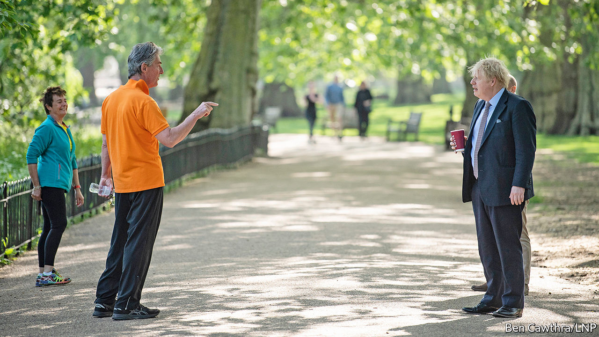
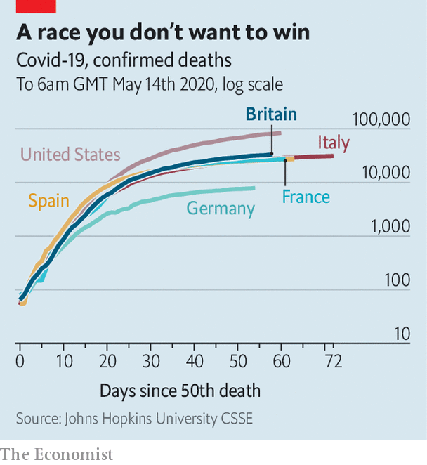

## Reputation

# How coronavirus Britain looks from abroad

> Britain’s handling of covid-19 is drawing unfavourable comparisons

> May 16th 2020

Editor’s note: The Economist is making some of its most important coverage of the covid-19 pandemic freely available to readers of The Economist Today, our daily newsletter. To receive it, register [here](https://www.economist.com//newslettersignup). For our coronavirus tracker and more coverage, see our [hub](https://www.economist.com//coronavirus)

A SLIDE TRACKING Britain’s coronavirus death toll against other countries’ had been a fixture of the daily government press conference. When it was first produced, on March 30th, it showed the United Kingdom trailing Spain, Italy, France and America in a grisly league table. On May 9th, the last time it was displayed, Britain was the highest in Europe. It has now disappeared from the briefings.

As The Economist went to press, the confirmed British death toll stood at 33,186, the second highest reported figure in the world behind America (see chart). Britain is fourth for fatalities as a share of population. On May 13th, Boris Johnson told the House of Commons that although the death count was “deeply, deeply horrifying”, it would be premature to make international comparisons until the figures of excess deaths were released, which would capture cases where covid-19 was not recorded as a cause of death. The Economist’s calculations of excess deaths per 100,000 people in Britain, Belgium, France, the Netherlands, Spain and Sweden puts Britain at the top; data for America and Italy are not available.

Britain is not alone in experiencing shortages of protective equipment, a deficient testing regime and uncontrolled outbreaks of the virus in care homes. It is too soon to say how far the death toll is attributable to government missteps, demography or geography. Yet to many foreign observers, Britain’s death toll serves as confirmation of deeper-rooted problems: a political culture of hubris and exceptionalism; atrophied public services; inequality and poor health.

At home, the crisis has become a political risk for Mr Johnson. His announcement on May 10th of tentative steps to unwind the lockdown did not go well. Only a third of voters said they understood what the new “Stay alert, control the virus” slogan asked of them. Teachers’ unions criticised plans to start to reopen schools on June 1st as unsafe. In London the Tube and some buses were busy, despite Mr Johnson’s plea for returning workers to avoid public transport. Mr Johnson’s poll ratings remain high, but have fallen back in recent weeks, and a poll by YouGov on May 12th showed Sir Keir Starmer, the Labour Party’s new leader, more popular than him.

Voters still approve of the government’s handling of the crisis, by a net 12 points according to a survey released on May 9th by Opinium, a pollster. But the figure is down from 21 points two weeks earlier, and respondents increasingly think foreign governments have handled things better. In a poll published on April 25th they judged Britain’s government to have performed worse than those of China, Germany, France, South Korea, Japan and Australia. By May 5th, Italy and Spain had joined that list. Only America gets lower marks of ten countries polled. Voters who supported Brexit tend to take a rosier view of Britain’s performance than Remainers, but both are becoming increasingly negative.

Attitudes at home are reflected abroad. Chinese parents panicked on social media about children studying in a plague-ridden basket-case. But the Europeans are most vociferous. Coronavirus has reinforced unfavourable views formed during the Brexit saga. The British government’s early dismissal of lockdowns was seen as reminiscent of Mr Johnson’s disregard for the risks of leaving the bloc. The German press has been particularly scathing. Süddeutsche Zeitung concluded that unequal and unhealthy Britain made “a good breeding ground for the pandemic”. Poland’s government, which locked down early, cited Britain as a case study of what not to do. Scott Morrison, the Australian prime minister, described the “herd immunity” strategy that Britain had initially favoured as a “death sentence”.

Mr Johnson’s election victory last year went some way towards restoring an image of stability and competence after Theresa May’s chaotic attempt to negotiate Britain’s departure from the EU. Covid-19 risks derailing that, and foreign policy hands worry about its impact on Britain’s reputation for good governance. Expertise in public administration and fields such as global health has long been one of Britain’s calling cards in international forums. New Zealand’s standing has been enhanced by its rapid elimination of the outbreak. Mr Johnson’s decision to shun an EU scheme to procure medical kit collectively sent a blunt message about its appetite for co-operation after Brexit, according to Fabian Zuleeg, of the European Policy Centre, a think-tank in Brussels.

Reputation is soft power, and big cheeses in the foreign-policy world worry about the impact on Britain’s ability to sway opinion. “During the Brexit process I was very struck by the decline in Britain’s authority,” says a former foreign secretary, noting particular dismay in Japan. “We weren’t treated as grown-ups.” Esteem for Britain is probably recoverable, says Michael Jay, a former head of the foreign office, but securing top international posts may be tricky for a while.

Declinism is a national pastime in Britain, and some aspects of the country’s response have been impressive. The National Health Service has held up remarkably well, thanks to swift reorganisation. Mr Johnson is driving an international effort to produce a vaccine, and has pledged generous sums in support of it. Britain’s vast jobs rescue package, announced by Rishi Sunak, the chancellor, originally announced in March and extended until October on May 12th, compares favourably with schemes deployed elsewhere. Oxford University’s vaccine research programme is one of the world’s most advanced; success there, or in one of a series of British trials for antiviral therapies, would be a fillip for a battered government.

But the recent knocks to Britain’s reputation will have consequences. “I would not want to be going around, as we all used to do, saying whatever its defects the British government system is one of the best in the world and other countries should borrow it,” says Lord Jay.■

Dig deeper:For our latest coverage of the covid-19 pandemic, register for The Economist Today, our daily [newsletter](https://www.economist.com//newslettersignup), or visit our [coronavirus tracker and story hub](https://www.economist.com//coronavirus)

## URL

https://www.economist.com/britain/2020/05/16/how-coronavirus-britain-looks-from-abroad
