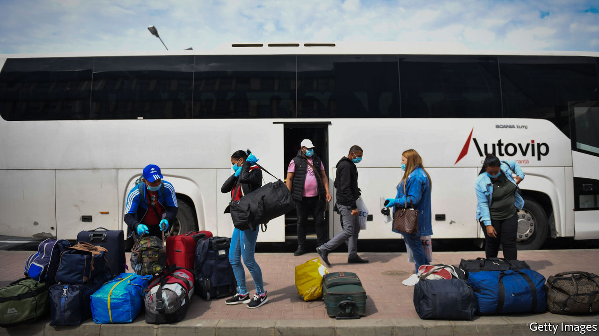
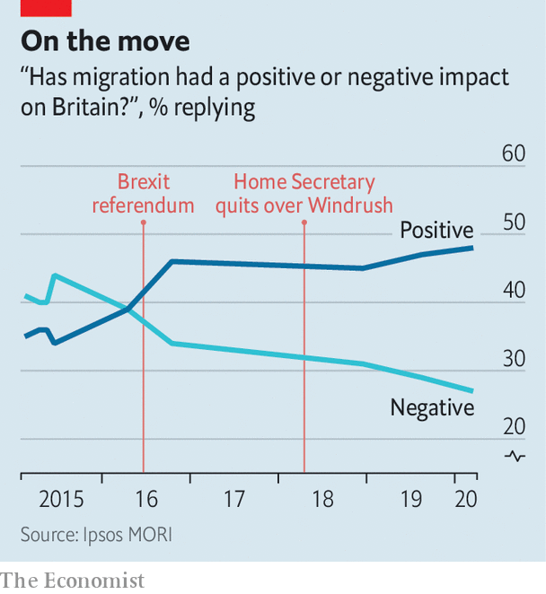

## Labour market

# How post-Brexit immigration rules will exclude key workers

> Many of the people whom Britain celebrates as “heroes” would fall foul of tighter regulations

> May 16th 2020

Editor’s note: The Economist is making some of its most important coverage of the covid-19 pandemic freely available to readers of The Economist Today, our daily newsletter. To receive it, register [here](https://www.economist.com//newslettersignup). For our coronavirus tracker and more coverage, see our [hub](https://www.economist.com//coronavirus)

“CARE WORK isn’t just bum wiping,” insists Karolina Gerlich. In the 12 years since she swapped her native Poland for Britain, aged 18, she has learnt that it involves being a “PA, a nurse, a therapist, an occupational therapist, a dietician and a friend”. She now runs a charity supporting other carers, while working as one herself. Yet under post-Brexit immigration rules due to take effect in January, a similar applicant would be turned down for a visa, since the job is classed as low-skilled. “I feel disrespected, offended and like my contribution to the economy and to the country has not been recognised at all.”

The timing of the covid-19 pandemic puts Priti Patel, the hardline home secretary, in an awkward spot. Recognising that Britain’s vote to leave the EU in 2016 was in part down to a desire to curb immigration, she plans to end freedom of movement from the bloc and apply the same salary threshold (£25,600, or $31,200, for most) and skills requirement to prospective migrants wherever they come from. Yet many of the incomers such a policy would rule out—including care-home workers—are those classified by the government as the pandemic’s “key workers”.

A paper by researchers at Oxford University, in the Oxford Review of Economic Policy, published on May 14th, finds that nearly one in five of those working in essential care-related occupations are immigrants. In all, a little more than half of EU migrants now classed as key workers would not have qualified for a work visa under the new dispensation. Using a different definition of key worker (the category is blurry), the Institute for Public Policy Research, a think-tank, finds that 71% of such migrants would have been excluded.

In one sense, the pandemic takes the pressure off. A deep recession should limit the need to import low-paid workers, since there will be a large pool of unemployed domestic labour. Yet farms are flying in workers from Romania, suggesting that Britons on their uppers might hesitate before taking back-breaking or low-paid jobs.

The political argument for a restrictive regime is weakening. Voters were warming to immigration even before they voted to leave the EU and thereby restrict it (see chart). The scandal in 2018 over the government’s shoddy treatment of the Windrush generation of Caribbean migrants illustrated that, if the public senses injustice, crackdowns can prove as politically perilous as liberal approaches. A survey in March by Ipsos MORI, a pollster, found that the overwhelming majority of voters want the number of migrants coming to Britain to work in care homes to stay the same or rise. Since the pandemic and its associated recession will significantly reduce overall immigration anyway, Ms Patel can afford to be a little more generous. ■

Dig deeper:For our latest coverage of the covid-19 pandemic, register for The Economist Today, our daily [newsletter](https://www.economist.com//newslettersignup), or visit our [coronavirus tracker and story hub](https://www.economist.com//coronavirus)