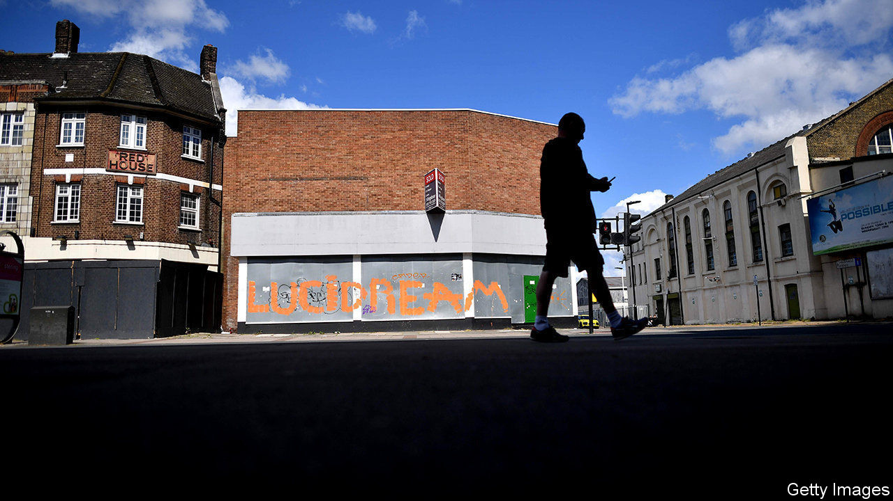
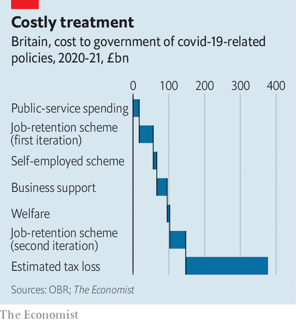

## Acute to chronic

# The cost of the pandemic to Britain’s economy is becoming clear

> It will linger long after the threat to public health subsides

> May 16th 2020

Editor’s note: The Economist is making some of its most important coverage of the covid-19 pandemic freely available to readers of The Economist Today, our daily newsletter. To receive it, register [here](https://www.economist.com//newslettersignup). For our coronavirus tracker and more coverage, see our [hub](https://www.economist.com//coronavirus)

THE LAST time Britain’s GDP fell by 2% quarter-on-quarter, the investment bank Lehman Brothers had just gone bust, bringing the global financial system to its knees. Then, in 2008, Britain was at the beginning of a steady rise in unemployment that would continue for years, and real wages had started a decline that would take more than a decade to undo. So it is alarming that, on May 13th, statisticians reported a similar fall in GDP in January to March 2020. The country was in lockdown for only a week of that period. The second-quarter figures, released in August, will make for astonishingly grim reading.

With many companies shut down, whether temporarily or permanently, Britons are flocking to the government for support. Universal credit, the primary welfare programme before the pandemic, has been swamped with applications, although it seems to be coping better than welfare systems in some other countries (see [article](https://www.economist.com//united-states/2020/05/16/inefficiencies-bedevil-americas-response-to-soaring-joblessness)). The government’s scheme for preserving jobs during the pandemic, under which the state pays up to 80% of a furloughed employee’s wages, has seen many more applications than was expected, according to Treasury insiders. More than one in five workers is now on it.

The mounting costs of providing this support in part explain the government’s shifting rhetoric over lockdown measures. Britons in many sectors have been told to return to their office, factory or site if teleworking is not possible (although some such employees were never told by the government to stop work). Some parliamentarians have been pushing Rishi Sunak, the chancellor, to wind down the job-protection scheme. Fearful of mass unemployment, however, on May 12th Mr Sunak extended it to the end of October—though he has sensibly tweaked it to allow bosses to bring back workers part-time from August. He also says that employers will soon have to foot more of the bill.

The extension of the scheme adds further costs to an already swollen fiscal bill (see chart). Even in the absence of any decline in output, and with no fall in tax revenues, this support would push up Britain’s budget deficit from 2% of GDP, before the pandemic, to 8%—its highest level since the global financial crisis of 2007-09. In reality, nominal GDP may fall by 12% or more this year, and tax revenues are collapsing. An annual deficit on a wartime scale looks inevitable, leading to substantially higher public debt.

A leaked government memo published on May 13th in the Daily Telegraph suggested that the deficit could hit around 15% of pre-pandemic GDP. Measures under consideration for balancing the books included raising income tax and freezing pensions spending. A brouhaha followed. In truth the Treasury has been looking for some time at how to raise revenue to pay the costs of an ageing population, regardless of the pandemic. For now, with government-borrowing costs near record lows Mr Sunak seems more focused on supporting the economy than on balancing the budget. But the memo is a sobering reminder: though the threat to public health should eventually pass, the economic costs of the pandemic will linger.■

Dig deeper:For our latest coverage of the covid-19 pandemic, register for The Economist Today, our daily [newsletter](https://www.economist.com//newslettersignup), or visit our [coronavirus tracker and story hub](https://www.economist.com//coronavirus)

## URL

https://www.economist.com/britain/2020/05/16/the-cost-of-the-pandemic-to-britains-economy-is-becoming-clear
