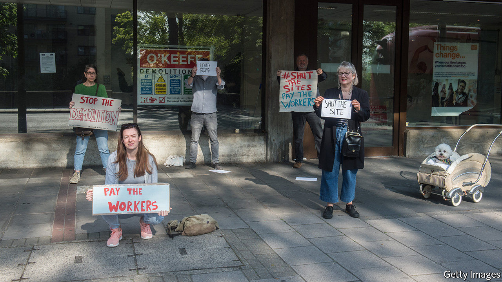

## Politics and labour

# Trade unions are back

> The crisis is winning trade unions influence, attention and members

> May 16th 2020

Editor’s note: The Economist is making some of its most important coverage of the covid-19 pandemic freely available to readers of The Economist Today, our daily newsletter. To receive it, register [here](https://www.economist.com//newslettersignup). For our coronavirus tracker and more coverage, see our [hub](https://www.economist.com//coronavirus)

IF BRITONS NEEDED reminding of the new dangers present in the workplace, a story that emerged this week reminded them: Belly Mujinga, a railway ticket-office worker who contracted covid-19 after being spat at by a passenger who said he was infected, died. The incident lent weight to the concerns which union leaders have expressed about Boris Johnson’s get-back-to-work plan. Manuel Cortes, general secretary of the TSSA, Ms Mujinga’s union, has said that it turns transport workers into “cannon fodder.” Frances O’Grady, general secretary of the Trade Union Congress (TUC), says that “it felt incredibly cavalier...The prime minister...threatened to unleash a stampede for public transport at a time when we just weren’t ready.” Four of the biggest unions, Unite, Unison, GMB and USDAW, say they will not recommend their members return to work until the correct policies and practices are in place.

The issue of health and safety at work, of marginal interest to most people most of the time, is suddenly at the front of everybody’s minds. That’s one reason why trade unions suddenly have new relevance and influence. Another is the government’s need for a united front in the war against covid-19. The unions were recruited to help put together the Jobs Retention Scheme (JRS), which guarantees workers 80% of their pay. The movement has not been so close to power since union leaders sat in smoke-filled rooms with ministers in the 1970s. “Unions are back,” says Ms O’Grady.

Thanks to swift and satisfactory negotiations over the JRS, Rishi Sunak, unusually for a Tory chancellor, wins plaudits from the union movement. “He’s very intelligent, he’s switched on, he’s not ideologically driven,” says Steve Turner, an assistant general secretary at Unite. Ms O’Grady is more circumspect. “The jury’s still out for me—I’ve been around the block a few times.” But she contrasts his policies favourably with Mr Johnson’s. “The reality is that it’s the chancellor who sets a much more sensible transition in the furlough scheme extension.”

Beyond getting a say on the furlough scheme, unions have won many battles during the crisis. The bakers’ union’s success in persuading Tim Martin, boss of the pub chain Wetherspoons, to reverse his decision not to pay his workers during the crisis, was widely noticed. Others have been smaller or less spectacular. Wetherspoons denies that it made a decision not to pay staff; the firm paid its employees until March 23rd, and staff currently on furlough are being paid under the government scheme. The TUC got long-term agency workers the same pay as colleagues directly employed by firms. Unite won casual workers at the Marriott Hotel the right to be furloughed.

The big question is whether the unions’ new clout will last. Workplace safety is likely to remain a big issue for a long time, and there is plenty of public support for some aspects of unions’ agenda—a recent Survation poll showed 76% supporting a rise in the minimum wage and 67% in favour of eliminating zero-hour contracts—but the principal measure of union strength is membership. “It’s an incredibly high stakes moment for the unions,” says Gavin Kelly, chair of the Resolution Foundation, a think tank. “In the recent past, winning arguments has often not meant gaining members. This time it must.”

It may be happening. Since the beginning of March, Unison has recruited 40,000 new members, nearly half as many again as in normal times. Unions are using their new visibility to push their agendas. The TUC wants the government to establish a National Council for Reconstruction and Recovery, which would allow unions’ voice to be heard loudly. Ms O’Grady is determined that their new influence should not dissipate. “Like puppies, we don’t just want to be for Christmas.”■

This article was updated on June 10th to reflect the position of JD Wetherspoon on the matter of payments to staff during the crisis.

Dig deeper:For our latest coverage of the covid-19 pandemic, register for The Economist Today, our daily [newsletter](https://www.economist.com//newslettersignup), or visit our [coronavirus tracker and story hub](https://www.economist.com//coronavirus)

## URL

https://www.economist.com/britain/2020/05/16/trade-unions-are-back
