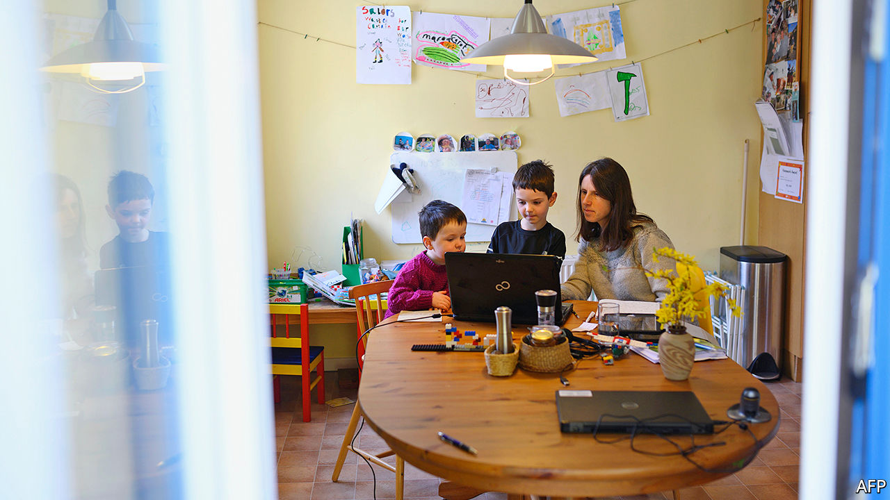
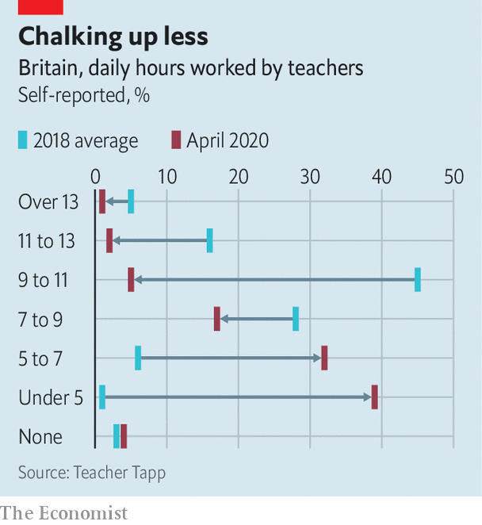

## Schools

# Why teachers are doing so little teaching

> Teaching remotely is hard. Many British schools are barely trying

> May 16th 2020PETERBOROUGH

Editor’s note: The Economist is making some of its most important coverage of the covid-19 pandemic freely available to readers of The Economist Today, our daily newsletter. To receive it, register [here](https://www.economist.com//newslettersignup). For our coronavirus tracker and more coverage, see our [hub](https://www.economist.com//coronavirus)

LUCIAN STIOPU watches his son cycle round Central Park in Peterborough. Before the government imposed a lockdown, he says, the boy would spend about nine hours a day at primary school, allowing him to go to work in a prison. And now? Mr Stiopu’s son reports that his teachers are setting a bit of work online. It is “easy” and he dashes it off in less than two hours.

He might be showing off, but probably not much. Two months after schools closed, it is becoming clear that most children of all ages are doing rather little schoolwork, and even less that is difficult or stimulating. An entire cohort appears to be treading water.

Schools have had a rough time. On March 23rd they were given two working days’ notice to close, while remaining open to vulnerable pupils and children of key workers. On May 11th the government asked English schools to restart some classes in June, but the teachers’ unions are against that, and it seems likely that few children will return before September. Schools have had little guidance about what and how to teach the 98% supposed to be studying at home.

In France teachers and pupils were directed to a single online portal. Britain, by contrast, has seen a free-for-all. One maths teacher might use Microsoft Teams to assign problems that she devised herself; another will use email to assign lessons created by an online service such as White Rose Maths. Some send homework through the post. Few attempt anything resembling a lesson. Teacher Tapp, a polling company, finds that on a given day only 6% of state secondary-school teachers and 3% of state primary-school teachers have hosted an online streamed lesson that allows pupils to speak, via Zoom for example.

John Gilligan, the head of Hampton College in Peterborough, says he was warned against trying to deliver live lessons by his professional association and the teachers’ unions. Portals like Zoom may not be secure, he says; they also allow participants to peer into each others’ bedrooms, putting children at risk. He also concluded it would be unwise to push on with the curriculum. Because children who struggle to work from home would be unable to absorb new concepts, “disadvantaged students would become more disadvantaged”. Better to concentrate on reinforcing what they have already been taught.

Many heads have made similar decisions. As a result, schoolchildren are largely idle. A poll of parents last month by the Sutton Trust, an education charity, found that 50% of secondary-school pupils and 64% of primary-school pupils were working three hours a day or less. Teachers, who normally put in long days, have stopped doing so (see chart). That is probably because little is expected of them, not because they are struggling with domestic obligations. Those without children are working as little as those with.

This is probably harming pupils. Studies show that young children—especially poor ones—backslide during the summer holidays, with the poor faring especially badly. Children with learning difficulties may be worst off. On a Peterborough housing estate, Anna Adams says that her autistic son, who loves maths, has been unable to get any work done at all. Worse, he has become so terrified of the virus that she is not sure he will ever return to school.

There are some exceptions. At the Michaela Community School in Wembley, teachers are recording lessons and ringing every child once a week. The school reckons that one in ten children is doing little or no work—but, given that many of the pupils are from poor families, that is not a bad ratio. With amazing speed, another group of teachers has created Oak National Academy, which provides online video lessons in various subjects. More than 6m have been viewed so far.

But the most striking difference is between state schools and private schools. The latter have leapt onto Zoom and similar services: 74% of private secondary-school teachers and 58% of private primary-school teachers use them on a given day, according to Teacher Tapp. Andrew Gordon-Brown, the head of the private Truro School in Cornwall, says that he advised teachers not to push on with the curriculum—but only for the first week of lockdown. Then they charged ahead. His staff claim to be working harder than ever.

It isn’t just the private schools. Those who charge for lessons, from music teachers to karate instructors, have often found ways of carrying on more-or-less as normal. Anouska Leckie, a Kumon tutor in Cardiff, switched from in-person group classes to live video lessons a week after the lockdown. She lost several clients at first: many of the children she instructs are from working-class immigrant families, who ran short of money. But some are returning, saying that their children are not being taught nearly enough by their schools. ■

Dig deeper:For our latest coverage of the covid-19 pandemic, register for The Economist Today, our daily [newsletter](https://www.economist.com//newslettersignup), or visit our [coronavirus tracker and story hub](https://www.economist.com//coronavirus)

## URL

https://www.economist.com/britain/2020/05/16/why-teachers-are-doing-so-little-teaching
