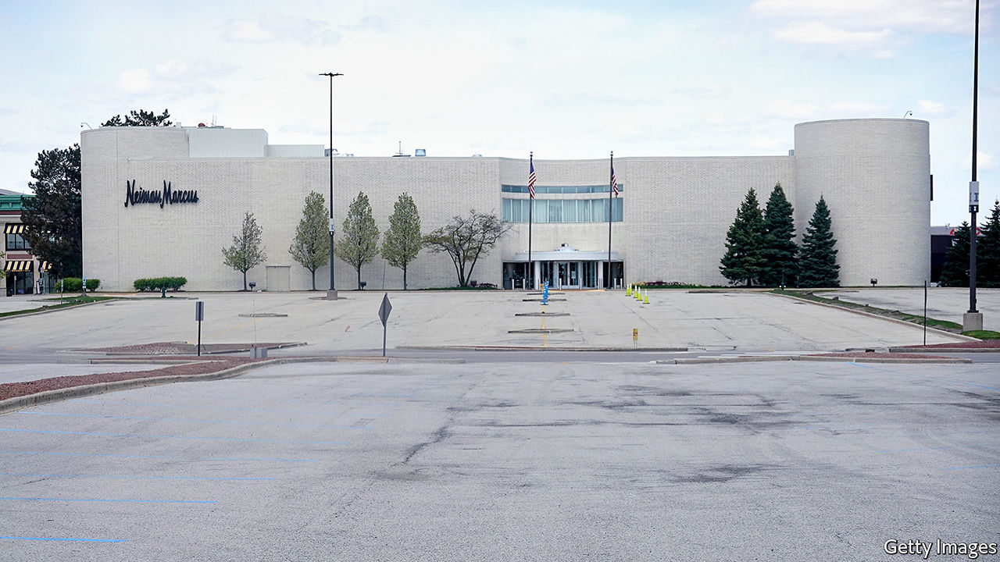
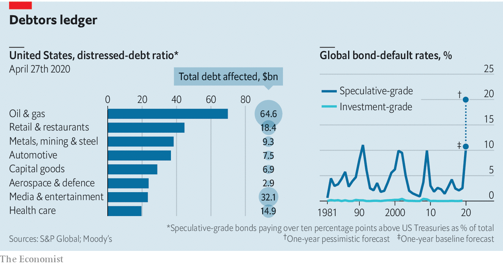

## Eye of the hurricane

# America Inc faces a wave of bankruptcies

> But some firms will be able to restructure rather than go broke

> May 16th 2020NEW YORK

Editor’s note: The Economist is making some of its most important coverage of the covid-19 pandemic freely available to readers of The Economist Today, our daily newsletter. To receive it, register [here](https://www.economist.com//newslettersignup). For our coronavirus tracker and more coverage, see our [hub](https://www.economist.com//coronavirus)

“YOU WILL get business failures on a grand scale.” So declared James Bullard, president of the Federal Reserve Bank of St Louis, on May 12th. Peter Orszag, a former official in Barack Obama’s White House and now with Lazard, an investment bank, warned that the American economy could face “a significant risk of cascading bankruptcies”. How bad will things really get for America Inc?

The country has already seen a surge of corporate bankruptcies among big firms that puts 2020 on track to be the worst year since 2009, at the height of the global financial crisis. In recent weeks well-known firms ranging from Neiman Marcus, a department-store chain, and J Crew, a clothing retailer, to Gold’s Gym, a glitzy workout group, have gone bust. Hertz, a giant car-hire firm, and Chesapeake Energy, a pioneer of America’s shale industry, are both on the brink of bankruptcy.

As the American economy sinks further in the coming months, many more firms are sure to get into trouble. This raises three questions. What early-warning signs might reveal the scale of the coming wave of bankruptcies? How does the looming disaster compare to the pain endured during the financial crisis? And are there meaningful alternatives to outright bankruptcy?

First, to harbingers of doom. One is the upheaval in the market for “speculative grade” (or junk) bonds. In America, two-thirds of non-financial corporate bonds are rated junk or BBB, the level just above junk. In April, Goldman Sachs, another investment bank, predicted that over $550bn of investment-grade bonds will fall to junk status by October (adding roughly 40% by current value to the junk-bond market).

Edward Altman of NYU Stern Business School reckons that about 8% of all firms whose debt is rated speculative grade (about 1,900 in all) will default in the next 12 months. This figure could reach 20% over two years. He expects at least 165 large firms, those with more than $100m in liabilities, to go bankrupt by the end of 2020.

A measure known as the “distress ratio” also highlights the problem. Distressed credits are junk bonds with spreads of more than ten percentage points relative to US Treasuries. S&P Global, a credit-rating agency, reckons that distressed credits as a share of total junk bonds in America had grown to 30% by April 10th, up from 25% on March 16th. Of the 32 worldwide junk-bond defaults in April, a level not seen since the financial crisis, 21 took place in America. S&P Global estimates that the 12-month trailing default rate for junk bonds in America increased to 3.9% in April, from 3.5% in March. In Europe it rose to 2.7% from 2.4%.

A wave of defaults might unfold with varying severity across different industries. Thanks to the collapse of the oil price as well as other troubles in the shale patch, almost 70% of the speculative-grade debt in the oil-and-gas industry is at distressed levels. Five other sectors have ratios of 35% or higher: retail and restaurants, mining, transport, cars and utilities (see chart).

The upshot is that a second, bigger wave of bankruptcies is on the cards. How would that compare to past troubles? At the peak of the financial crisis, the global default rate for junk bonds was 10%. Moody’s, a credit-rating agency, predicts that if the current crisis is more severe than the financial crisis, as now seems likely, the default rate could rise to 20.8% (see chart). The coming bankruptcy wave could be worse than during the financial crisis because it will be more widespread, reckons Debra Dandeneau, a bankruptcy specialist at Baker McKenzie, a law firm. But she thinks it will take some months to arrive: “We’re in the eye of the hurricane now.”

Another big difference to the financial crisis arises from uncertainty. The nature of this pandemic makes it impossible to know when the economy might return to normal. As William Derrough, a restructuring specialist at Moelis & Company, points out, “It’s very hard to value a company that doesn’t have clear cashflow and visibility on its future markets.” Jared Ellias at the University of California at Hastings argues that “lenders don’t know whether to restructure out of court, grant forbearance or insist on Chapter 11 bankruptcy when you have no idea when a firm will make money again.” Worried about the coming deluge of cases, he organised a group of experts that last week petitioned Congress to appoint more bankruptcy judges and increase budgets for law clerks and other staff.

“It will be very difficult for courts to keep up with the onslaught,” says Judith Fitzgerald, a former bankruptcy judge now at Tucker Arensberg, a law firm in Pittsburgh. Amy Quackenboss of the American Bankruptcy Institute, an industry body, reports that members are busy, which will translate into more filings later on. Larry Perkins of Sierra Constellation Partners, a restructuring firm, thinks a legal bottleneck is “absolutely” possible unless courtrooms “evolve to digest it”. Vince Buccola of Wharton business school thinks part of the solution lies in embracing faster “pre-packaged” bankruptcy deals and debt exchanges (lenders agreeing to swap less onerous new debt for old unserviceable debt) done out of court.

A looming wave of bankruptcy cases points to the third question: how viable are the alternatives? There is good and bad news. The financial crisis saw a massive liquidity crunch and financial-sector implosion. But as Bruce Mendelsohn of Perella Weinberg Partners, an investment bank, observes, “this crisis is the opposite. Capital markets are strong and open with many firms able to access capital from government or from markets, but…the fundamental operations of businesses are disrupted.”

There is a flurry of activity among investors pouring money into so-called rescue funds. According to Preqin, a data firm, distressed-debt funds are looking to raise nearly $35bn. General Atlantic, a private-equity firm, is in the midst of raising nearly $5bn to invest in otherwise-healthy businesses squeezed temporarily by shutdowns. Bill Ford, General Atlantic’s boss, thinks that outside the retail sector, where many business models will prove unviable, “most firms will try to avoid bankruptcy and seek rescue capital instead.”

All restructuring firms are hiring, notes Michael Eisenband of FTI Consulting. He observes that there are more types of creditor today than during the financial crisis, so there is “more opportunity to get liquidity into firms in different ways.” He reckons few want to force liquidation because “if you can kick the can down the road, maybe a vaccine comes and…there is a better chance of getting a recovery for creditors.” Many hedge funds and non-traditional lenders (though not stodgy banks) are opting for debt-for-equity exchanges. That is so they “get the upside when the economy recovers”, says Thomas Salerno of Stinson, a bankruptcy lawyer.

So the good news is that many squeezed firms staring at bankruptcy might be saved through restructuring. Mr Derrough, a veteran of financial crises, explains that this involves five steps: stopping the bleeding; evaluating the injuries; performing the necessary surgery; rehabilitating the victim; and returning it to health. The bad news is that America Inc is at the start of phase one. As he puts it, “Most of what we are doing is blood transfusions. We haven’t even gotten to stopping the bleeding.”■

Dig deeper:For our latest coverage of the covid-19 pandemic, register for The Economist Today, our daily [newsletter](https://www.economist.com//newslettersignup), or visit our [coronavirus tracker and story hub](https://www.economist.com//coronavirus)