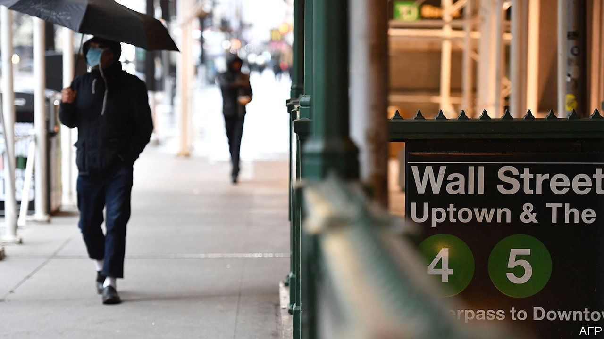
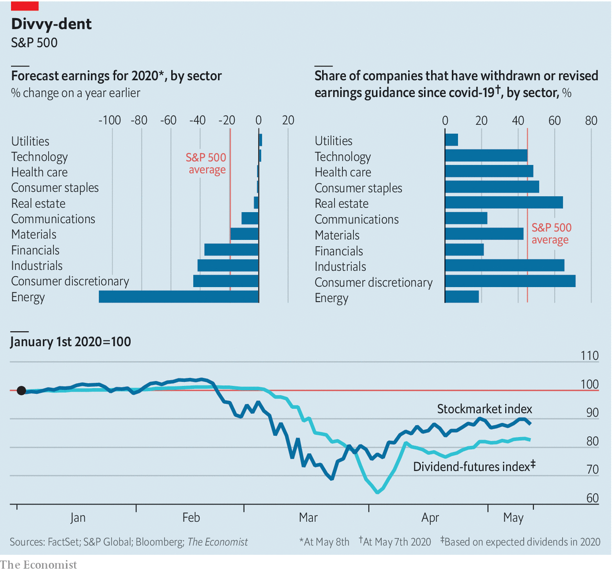

## American corporate profits

# An earnings season to forget

> America’s businesses give a hint of the carnage to come

> May 14th 2020

ON UNVEILING Amazon’s strong first-quarter sales, Jeff Bezos issued a warning: next quarter’s operating profits would fall as the firm covid-proofs its e-empire. No bonanza for shareholders, then. Ditto for much of the s&p 500. Nearly all its firms have now reported their quarterly results. Because America Inc locked down in mid-March, these do not reflect the pandemic’s toll. Few ceos have been as blunt as Mr Bezos about what comes next; 45% have suspended or revised guidance. Analysts expect profits to fall by 20% this year. The futures market is pricing in large cuts to s&p 500 dividends in 2020 and 2021. The bouncy stockmarket—not so much.■

## URL

https://www.economist.com/business/2020/05/14/an-earnings-season-to-forget
