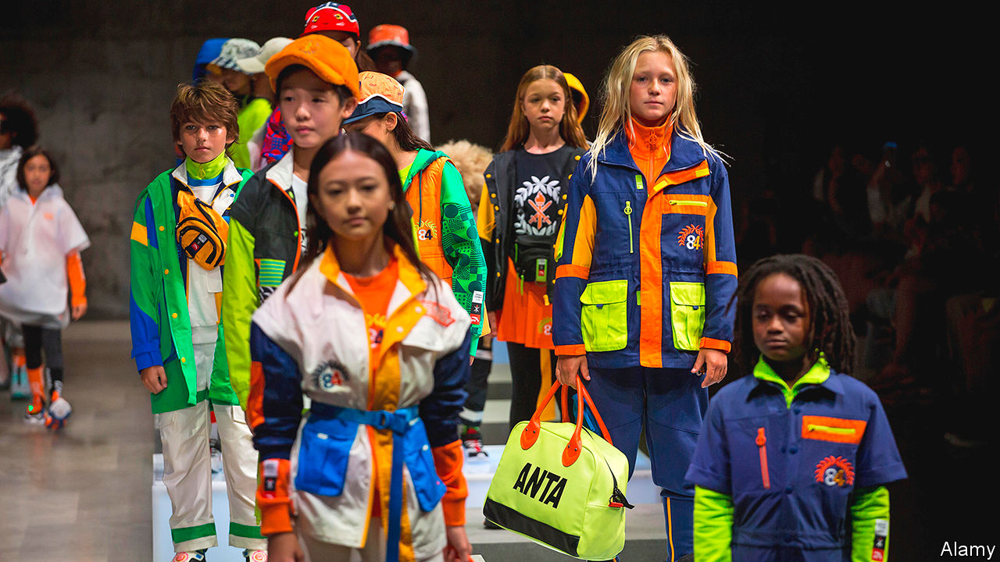

## Upping the Anta

# Anta, an ambitious Chinese sportswear firm, does some fancy footwork

> It does some fancy footwork

> May 14th 2020

DING SHIZHONG, the founder and boss of Anta, the world’s third-biggest sportswear firm by market capitalisation, refused to let the covid-19 pandemic interfere with sales. In early February, as the virus forced shops to close, Mr Ding gave each of his 30,000 employees a new assignment: hawk Anta’s apparel and shoes to personal contacts on WeChat, a messaging platform. Such resolve to protect revenues is admirable. Yet it reflects insecurity.

Anta, established in 1991, has long been runner-up on its home turf to Nike and Adidas. The Western sportswear powerhouses together accounted for over two-fifths of China’s market in 2019, according to Euromonitor, a market-research firm. Anta has a sixth of the market but it is moving fast. Revenues grew by over 40% in each of the past two years, double the rate of the industry. Operating profit hit 8.7bn yuan ($1.2bn) in 2019. But that is still only half the sum made in China by Nike.

 Anta’s aim is to become “a Chinese brand that stands out in the world”. It is perhaps best known in the West as the shoe sponsor for Klay Thompson, a star player with the Golden State Warriors basketball team, and Manny Pacquiao, a Filipino boxer. But the brand generates few foreign sales. Even in China, many urban youngsters think Anta “lacks the cool factor”, says Lu Ge of the Beijing Institute of Fashion Technology—despite being the official kit supplier for China’s Olympic athletes.

 That perception stems in part from Anta’s customer base. Its shops are concentrated in medium-sized cities, to cater to consumers that are less well off than those in Beijing or Shanghai, the preferred haunts of Nike and Adidas. A pair of Anta shoes typically costs a third less than a similar pair of Nikes, observes Dallas Cai of Oriental Patron, a broker. Pricier and associated with more global superstars, Nike and Adidas have far more brand appeal.

 Mr Ding’s all-hands-on-deck strategy and Anta’s clientele may have insulated the firm from the worst of covid-19’s ravages. Ms Cai observes that, as China began to re-open in late February, residents of cities where Anta is strong may have been less fastidious about social distancing than counterparts in richer locales. Revenues at Anta fell by 20-25% in the first quarter year-on-year, according to the firm’s latest financial update. That looks rosy compared with Adidas. It saw sales in China drop by 58% in the same period.

Relying on rivals’ bad luck is not a long-term plan. Mr Ding recently wrote that Anta aspires to make the leap from an “affordable brand” to a “desirable” one. He has some more upmarket trademarks at his disposal. In 2009 Anta acquired the Chinese operation of Fila, a sportswear firm with Italian roots. Last year, in a $5.2bn deal, the firm bought a majority stake in Amer Sports, a Finnish outfit with assets including Wilson tennis rackets and Salomon skis. But that may not be enough to take on and beat Nike and Adidas. Shifting perceptions will be hard.■