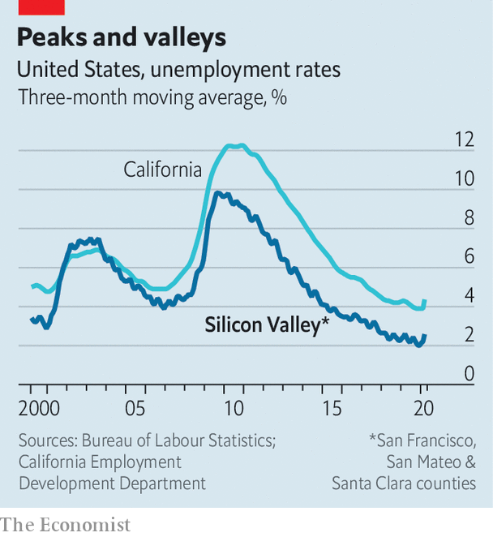

## The next garage

# Silicon Valley in the pandemic

> The crisis has hit tech’s spiritual home hard, but it is already planning ahead

> May 16th 2020SAN FRANCISCO

Editor’s note: The Economist is making some of its most important coverage of the covid-19 pandemic freely available to readers of The Economist Today, our daily newsletter. To receive it, register [here](https://www.economist.com//newslettersignup). For our coronavirus tracker and more coverage, see our [hub](https://www.economist.com//coronavirus)

FIRING SOMEBODY is hard under any circumstances. But doing it over a video call is brutal. “It’s not the best environment for this, with people at home and kids in the background,” observes Marwan Forzley, the boss of Veem, a startup based in San Francisco which allows firms to transfer money cheaply. He recently had to let go 30 of its employees.

Mr Forzley speaks for many in Silicon Valley. The largest American tech firms may be the winners from a global pandemic. Demand for their online services has exploded among people and businesses in lockdown. But many startups in tech’s heartland are hurting. Hardly a day goes by without news of more lay-offs and firms going out of business. Yet amid the doom and gloom, venture-capital (VC) firms and entrepreneurs are already doing the thing they believe they do best: divining the future in their crystal balls.

Californian tech firms and their financiers were among the first in America to take the threat of coronavirus seriously. Some venture capitalists began refusing to shake hands at the beginning of February (and were ridiculed for it). The moneymen also moved quickly to “triage” companies in their portfolio, classifying them according to how likely they were to survive and what they should do. Mostly this involved letting people go. “The shocking thing is how fast everything has moved,” says Marco Zappacosta, who runs Thumbtack, a marketplace for local professionals from plumbers to dog trainers, which laid off 250 of its 900 employees.

Definitive figures are hard to come by. When big firms cut back it makes the news. Airbnb and Uber recently announced they would let go 1,900 and 3,700 workers respectively. Layoffs.fyi, a website that tracks dismissals in the tech industry by adding up numbers from press reports, has counted about 17,600 jobs lost since mid-March. But this misses many sackings at smaller startups. Although still well below the national average and the peak during the financial crisis of 2007-09, unemployment in the region is edging up (see chart). Some VCs expect workforces to shrink by 15% on average, adding up to total job losses in excess of 125,000.

Yet Silicon Valley’s denizens are not ones to dwell on bad numbers. VCs are scouting for promising firms whose valuations have dropped and which need fresh capital. Investments in America are only down by 25% compared to before the pandemic, according to PitchBook, a data provider. For startups with cash in the coffers, it is an opportunity to scoop up weaker rivals. On May 12th it emerged that Uber, a shrinking ride-hailing service with a growing meal-delivery arm and $9bn in the bank, is seeking to acquire GrubHub, which also delivers food. A few days earlier Uber led a $170m funding round in Lime, an ailing startup that rents out electric scooters and bicycles. Expect more such deals—and more criticism that the likes of Uber are trying to use the pandemic to monopolise markets.

Silicon Valley’s leading VC firms are also trying to seize new opportunities. More than one sees the tech industry’s sweet spots moving from services that cater to consumers and involve the physical world, such as electric scooters and online ticketing, to offerings for business that are delivered virtually, including specialised web-based software and digital infrastructure.

Much of the venture capital flowing in recent weeks has been aimed at deeply technical targets, such as Confluent, which manages corporate data. The firm raised $250m in April. Startups in telemedicine and online education are also doing well. And business is improving for some firms that had looked less resilient to the virus, such as Veem and Thumbtack. Firms want to move money cheaply and people stuck at home are planning to give their nests a makeover, driving demand for local services.

Looking further forward, the debate now revolves around how the pandemic will change Silicon Valley—and with it much of the tech industry. The crisis will accelerate existing trends. The Valley will continue to spread out, reckons Randy Komisar of Kleiner Perkins, another VC firm. Even before the virus hit, an exodus of sorts was under way. Exorbitant property prices, near-permanent traffic jams and the jarring number of homeless people have pushed growing numbers to leave.

Startups have been moving away or have become “fully distributed”, with only their most important employees living in San Francisco and the rest spread across the world. Such dispersion is likely to speed up if a consequence of covid-19 is that working remotely becomes the norm. It looks likely. Big Silicon Valley companies, including Facebook and Google, are letting employees work from home until the end of the year. Twitter says they can do so indefinitely.

Another question is whether venture capital, Silicon Valley’s lifeblood, will go virtual and distributed as well. Some hope that the crisis will disrupt what Pete Flint of Nfx calls the “archaic world of venture capital”. In April, his firm launched an online service where startups can input the information that investors want, from founders’ biographies to business plans, and then get a decision on funding within nine days.

Silicon Valley may no longer be the only place that matters as startups hunker down in cheaper locations with fewer distractions. Frontier is one such firm. It has decamped to Vancouver to build a marketplace for remote workers. It was founded a few months before the virus struck and got its first funding a few weeks ago. Elliot O’Connor and his co-founders are holed up in an Airbnb, using DoorDash and other delivery services to feed themselves. It feels like working in the proverbial garage, he says—not in the Valley, but of the Valley.■

Dig deeper:For our latest coverage of the covid-19 pandemic, register for The Economist Today, our daily [newsletter](https://www.economist.com//newslettersignup), or visit our [coronavirus tracker and story hub](https://www.economist.com//coronavirus)