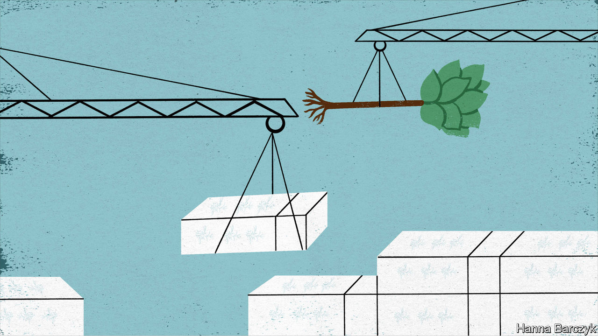

## Chaguan

# A small town in China makes half of Japan’s coffins

> Such hyper-local production may prove resilient against decoupling

> May 14th 2020

SINCE ANCIENT times, Chinese poets have revered the purple-flowering paotong as something rare: a tree in which a phoenix will land. Musicians cherish lutes made from its wood. The fast-growing plant, often used in sandy areas prone to soil erosion, even has a place in the Communist Party’s iconography. It is the subject of a rare poem by President Xi Jinping, who wrote of watering a paotong with his tears, shed in memory of a Mao-era official who battled cancer to supervise mass-planting of the tree.

Chaguan, a flintier-hearted sort, would like to propose the paotong (Paulownia elongata to botanists) as a metaphor for something less romantic: a distinctive Chinese business model that rarely makes international headlines, but which has helped to power the country’s rise. Governments everywhere are debating the future of globalisation in general, and dependence on China in particular. Politicians and CEOs fret about supply chains that cross oceans in search of value, but that now look vulnerable to trade barriers thrown up by pandemics or ideological disputes.

In Washington, China hawks talk of “decoupling”, unveiling plans that would see medicines, microchips and other sensitive products made in America again. In Japan the government has earmarked $2bn to help firms move high-value production back home from China. Meanwhile, Chinese officials seem bent on trampling their own country’s reputation for reliability. Chinese diplomats, playing the role of nationalist “wolf warriors”, have ordered foreign governments to offer vocal thanks if they wish to buy Chinese medical equipment. Chinese ambassadors have threatened trade boycotts against countries that displease the party’s leaders in Beijing. On May 12th a Chinese spokesman announced a ban on many beef imports from Australia. The official cited food-safety reasons, but almost in the same breath condemned Australia’s “erroneous words and deeds” in calling for an international probe into the origins of covid-19.

In this turbulent moment, the paotong tree is a timely reminder that globalisation, China-style, does not always involve globe-spanning supply chains of the sort now causing so much political angst. Since the country embraced capitalism more than 30 years ago, its astonishing growth has also been driven by an intensely localised variety of globalisation, in which a specific export sector is dominated by a single Chinese city or county.

The coffin-makers of Zhuangzhai, a leafy township of 100,000 people in the eastern province of Shandong, are a case in point. Between them, Zhuangzhai’s three main manufacturers export 740,000 coffins annually, almost all of them to Japan. With just under 1.4m deaths in Japan last year, that gives one Chinese township something around half the Japanese coffin market.

But when Japanese television journalists visited Zhuangzhai in 2017, they treated its share of the market as cause for larky curiosity rather than alarm. Their calm reflected the obvious synergies between Japan and this corner of Shandong. The largest local firm is Yunlong Woodcarving, which ships 20,000 coffins to Japan each month. Its 56-year-old founder, Li Ruqi, has coffin-making in the blood. His grandfather and father made caskets as well as furniture for locals, defying the superstitious horror that many rural Chinese feel for anything linked to death. In 1995 his firm began supplying a Japanese coffin-maker with panels decorated with phoenixes and lotus flowers. Most were carved from the wood of the paotong, which grows all around Zhuangzhai. Historically, Chinese preferred coffins of heavy cypress or cedar. They thought of paotong wood, which is creamy in colour and light in weight, as fit only for burying the poor. In modern Japan, where cremation in pale-coloured coffins is the norm, paotong is ideal.

Yunlong began making complete coffins for export in 2000, as labour costs in an ageing Japan soared to ten or 20 times those found in Zhuangzhai. Back then Mr Li’s Chinese workers were in their 20s, freshly graduated from local schools. In contrast, when Mr Li visited his Japanese customers, their workshops “didn’t have a lot of young people”. Now China is catching up. With about one in nine citizens over 65, China is at the point on the ageing curve that Japan hit in 1987. Today Mr Li’s 600 workers are mostly in their late 30s and 40s. Youngsters prefer service-sector jobs, he sighs.

Cold commercial logic sent Japanese coffin-makers to Zhuangzhai. Shandong offered skilled artisans, easy access to the right trees and a good climate for woodwork—neither dry nor too humid. Japanese clients came with “very high requirements”, Mr Li recalls without resentment. Over the years his firm and its customers have innovated, using hollow panels so that a single tree now provides the wood for 20 coffins or more, rather than two or three as was once the case. In one corner, workers are checking a new line of flat-pack coffins. With their pegs and holes and drop-in end panels, they eerily resemble caskets that IKEA might make. Mr Li demonstrates the way that two small doors in each coffin lid would open to reveal the face of the deceased. Their hinges must be perfectly silent or risk causing tremendous offence, he explains.

Mr Li is unfazed by talk of the rich world decoupling from China. Some Japanese clients did try sourcing coffins in Vietnam and Indonesia, he concedes. But they found that workers in South-East Asia lacked “discipline”, so returned to Shandong. His corner of China has paotong trees, skilled labour and trusted suppliers. “Price-wise, talent-wise, this place is pretty far ahead,” he says.

Demography is a bigger worry. It is not just Zhuangzhai’s workers who are ageing. With more than one in four Japanese over 65, coffin sales are brisk. But clients from Japan remind Mr Li that Japan’s population is shrinking fast. “They told me I’ve got about 30 years in this line of business,” he says. China’s hyper-local version of globalisation may prove surprisingly resilient in the face of decoupling. But some storms will overcome the deepest roots. ■