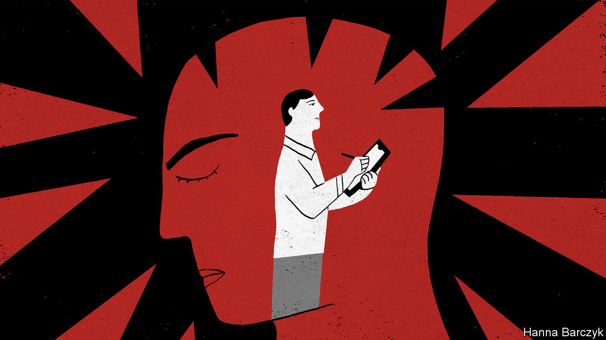

## Picking up the pieces

# In China, covid-19 has focused attention on mental health

> In Mao’s day, sufferers were accused of lacking revolutionary zeal

> May 16th 2020BEIJING

LATE IN JANUARY Shen Yinjing, a therapist in Shanghai, volunteered to help distressed people in the coronavirus-stricken city of Wuhan by offering counselling over the phone or by text. Before long she was running an online support group for people being treated in one of Wuhan’s makeshift hospitals for covid-19 patients. Now Ms Shen wonders how she should assist those bereaved by the disease. She worries that many people will not think to ask for help, even though the loss of a loved one can cause lasting mental trauma.

Ms Shen is among a small army of mental-health professionals who have provided support during the coronavirus outbreak, which reached a peak in China in January and February. Hundreds of universities and charities have set up “psychological hotlines” for people suffering from ailments such as anxiety and depression. Their efforts have enjoyed strong backing from the government, which has issued dozens of directives to guide the mental-health response to the epidemic.

Such attention reflects a profound change in official and public attitudes. Under Mao Zedong, modern approaches to psychology and psychiatry were suppressed. Mental ailments were treated as a deficiency of revolutionary zeal—nothing that earnest study of the chairman’s works couldn’t cure. In the post-Mao era political taboos surrounding mental health were lifted. But cultural ones persisted. Among citizens, psychological problems remained shrouded in shame. The government still paid little attention to developing expertise in the science. It tended to regard those with psychiatric disorders as potential troublemakers rather than as people in need of sympathetic care.

In recent years, however, the government has begun to stress the importance of mental health in the country’s long-term development goals. A mental-health law, passed in 2012, advised against the previously common practice of confining people in psychiatric wards against their will. The government’s “Healthy China 2030” plan, issued in 2016, called for a stronger “mental-health service system”.

These days many Chinese recognise that mental-health problems are common. Zhiying Ma of the University of Chicago says that young Chinese, in particular, have grown comfortable using terms such as depression and anxiety when talking about their difficulties. A Chinese government-funded survey published in 2019 found that such disorders were becoming more common in China. The study’s authors suggested that “rapid social change” was intensifying “psychological pressure and stress”.

At the same time, mental-health counselling has become more widely available, particularly for those willing to pay for private treatment. Between 2002 and 2018 more than 1m people completed brief government-certified courses in counselling skills. A devastating earthquake that struck the south-western province of Sichuan in 2008, killing more than 60,000 people, helped to promote interest in work involving psychology. In its wake, more Chinese took up careers as therapists.

Mental-health workers who have responded to the covid-19 outbreak appear better-organised and better-trained than the volunteers who flocked to care for victims of the earthquake, says Huang Hsuan-Ying of the Chinese University of Hong Kong. During the covid crisis, counsellors have formed online networks to co-ordinate their efforts to help the afflicted. Yu Zhihong, a professor of social work at Wuhan University, set up one such group. Its members provide psychological support for nearly 30 people who lost loved ones to the virus. Ms Yu says some of them are suffering from feelings of guilt, believing they were the source of a fatal infection, or worrying that they did not do enough to help a person who died.

But Ms Yu says that some people are reluctant to seek help from her network. She says this may be because grief is a private family matter in Chinese culture, and stigma still surrounds those who seek help from mental-health professionals.

There remain far too few such specialists to cope with China’s needs. The country has about two registered psychiatrists per 100,000 citizens, only about a sixth of the number in rich countries. Few Chinese have access to top-notch primary health care, so mild mental problems can go undetected until they are severe. Hospitals do not offer good care, either. Doctors often prescribe drugs, even when more subtle treatment, such as psychotherapy, might suffice. That is in part because they lack expertise and in part because it is more profitable to dispense pills.

The mental-health system that the government says it is building would make it easier for ordinary Chinese to receive counselling in local clinics or schools. The rich southern city of Shenzhen is one of about 30 places that were instructed in 2019 to pilot such reforms. By the end of this year it plans to have a staffed “psychological counselling room” in all of its larger local clinics. By the end of 2021 it aims to make counselling available in 85% of primary and secondary schools.

The reforms may help. But officials often refer to them not as a way of boosting public health, but as a means of improving “social governance”—in other words, strengthening control. It is possible that the counselling rooms will provide some assistance to people who are suffering, but also make it easier for the government to keep tabs on unhappy people.

Stories from Wuhan provide reasons to be sceptical. Grieving relatives report that they have been obliged to take government officials with them when they bury ashes, perhaps to ensure that funerals are kept brief and low key. Members of one family were ordered by police to delete an online group they had created in order to help bereaved people connect with each other. The government wants Chinese to talk more about their emotions, but not if they say the wrong things. ■