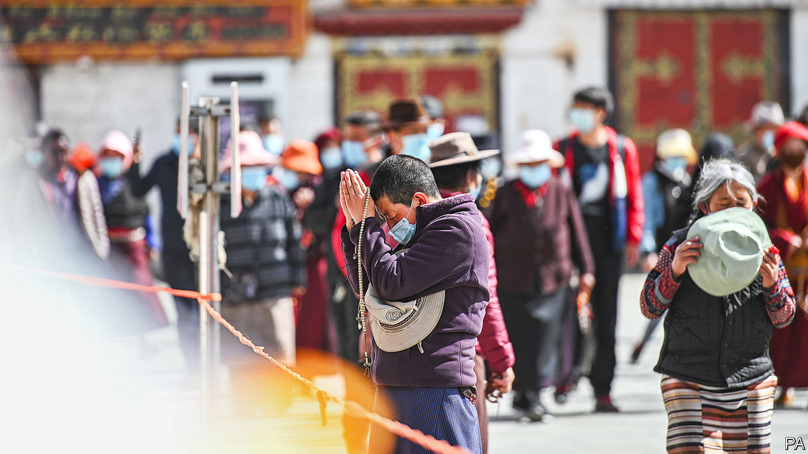

## The lost boy

# Why there are two Panchen Lamas, and one is missing

> China’s atheist ruling party wants to pick Tibetan Buddhist leaders

> May 14th 2020

TO THE GREAT WALL of mutual suspicion and recrimination that divides China and the United States, the American Senate is adding another brick. It will soon consider the Tibet Policy and Support Act, a piece of bipartisan legislation that was passed by the House of Representatives in January. When, as seems likely, it becomes law, China will be furious. It regards its conduct in Tibet as above criticism by meddling foreigners.

Among other measures, the law would make it American policy that only Tibetan Buddhists can choose their religious leaders, including an eventual successor to the most senior of them all, the Dalai Lama, who is 84 and lives in exile in India. The law would demand that sanctions be imposed on any Chinese official who attempts to control the process of finding the Dalai’s Lama’s reincarnation. Odd as it seems, China’s avowedly atheist government is indeed intent on fixing the outcome. In 2007 it issued “management measures for the reincarnation of living Buddhas”.

An anniversary this month recalls how seriously China takes Tibetan religious succession. On May 17th, 25 years ago, Gedhun Choekyi Nyima, a six-year-old boy, was taken along with his parents from their home in Tibet. Three days earlier, in a ceremony in northern India, the Dalai Lama had proclaimed him as the 11th Panchen Lama, the second-most senior monk in the hierarchy, the tenth of whom had died in 1989. In Tibetan tradition, the Dalai and Panchen Lamas have important roles in identifying each other’s reincarnations.

The boy, whom activists would call “the world’s youngest political prisoner”, has not been seen in public since. Occasionally, China has tersely declared that he is living life as “normal”. In 1995 it named its own candidate as the 11th Panchen, Gyaltsen Norbu, who appears in public occasionally, but lacks credibility among Tibetans.

Exiled activists see the anniversary as a chance to remind the world of China’s brutality in Tibet and the hollowness of its promises of “autonomy” there. But in Tibet itself, the day will pass without notice. The region has emerged from its covid-19 lockdown into the political lockdown that passes for normal life there. The official media are indulging in a propaganda blitz around a new law, passed by the regional assembly in January, that came into effect on May 1st: “Regulations on the Establishment of a Model Area for Ethnic Unity and Progress in the Tibet Autonomous Region”.

Matthew Akester, a Tibet researcher based in India, says the regulations, under which government and private organisations must “strengthen ethnic unity” and combat separatism, contain nothing new. Rather, they formalise a trend in China’s policy towards its ethnic minorities. This stresses “unity” rather than diversity, let alone autonomy. Tibetan exiles fear that, by promoting intermarriage between Tibetans and Han Chinese, Han migration into Tibet and the urbanisation of Tibet, China aims to eradicate Tibetan identity.

No American law is going to deter China from trying. But neither will Tibet’s new regulations change an enduring fact: the strongest symbol of Tibet’s identity remains the Dalai Lama himself and the hold he has on Tibetan loyalties, despite 61 years in exile. As China should have learnt from the history of the Panchen Lamas, the Communist Party will never be accepted by Tibetans as the arbiter of their faith. ■

Editor's note: This article was updated after publication to remove a reference to a meeting of the Senate Foreign Relations Committee on May 14th, which was in fact postponed.