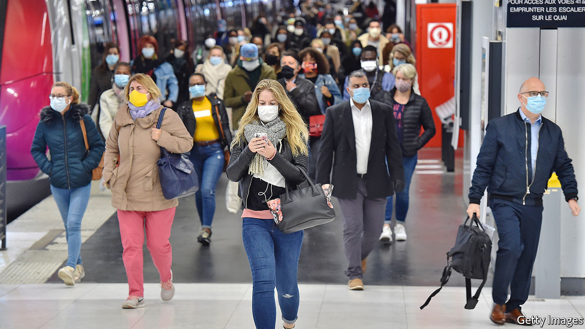
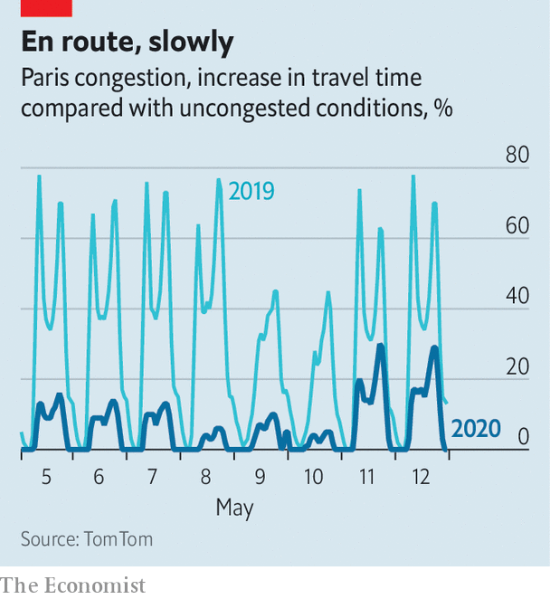

## Free at last

# France is leaving lockdown. Now the trouble begins

> The process is hampered by adversarial labour relations and distrust of government

> May 14th 2020PARIS

Editor’s note: The Economist is making some of its most important coverage of the covid-19 pandemic freely available to readers of The Economist Today, our daily newsletter. To receive it, register [here](https://www.economist.com//newslettersignup). For our coronavirus tracker and more coverage, see our [hub](https://www.economist.com//coronavirus)

ON THE ESTUARY of the river Seine in Normandy, the Renault factory at Sandouville lies silent and empty. Usually, the 1,900 workers at this plant turn out 132,000 vehicles a year, mostly delivery vans. But on May 7th a court in Le Havre ordered Renault not to reopen fully as planned on May 11th, when France began its déconfinement, or emergence from lockdown. It upheld a complaint brought by the Confédération Générale du Travail, a union with historical links to the Communist Party, that the firm had not followed procedure for consulting employees about reopening. Pending an appeal, the factory remains shut.

After eight weeks of confinement, France was supposed to resume work this week. Forms for permission to pop to the shops have been binned. Public transport was running at 75% of normal in Paris, with masks compulsory. Hairdressers, clothes shops, bookstores and all other commerce—except restaurants and cafés—were allowed to reopen. Some primary-school pupils returned to class. It was “essential” for the economy to get going again, said Bruno Le Maire, the finance minister.

Much of the complexity of organising this is not unique to France. The sourcing of masks, the spacing of seats on public transport or in classrooms, the distribution of hand gel in shops and offices: these problems are shared by all countries exiting lockdown. Yet, as the court decision against Renault shows, France also faces some quite specific difficulties.

One is the adversarial nature of labour relations, combined with the French state’s enduring appetite for bureaucracy. Unions enjoy an entrenched role through mandatory works councils. President Emmanuel Macron simplified these, and merged even more tangled former structures into a single comité social et économique. But firms with over ten employees still have to hold monthly or bi-monthly meetings, partly to discuss issues concerning employee well-being. Talks are often long, and testy.

In preparing déconfinement, bosses report vastly more such consultations. The director of a services firm in the Paris region says that he has spent a full day each week on discussions to prepare for the return of just ten employees (out of 95) to the office. The government has produced a 20-page “national déconfinement protocol”, with guidelines on how, for instance, to calculate the new minimum workspace per employee (four square metres). “It’s really complicated,” says Jérôme, who runs a hairdressing salon. He has had to take out five of the 12 seats in his salon and says each haircut—much in demand after eight weeks—is taking an extra 15 minutes because of the time it takes to disinfect things. The price of not applying the rules can be high. The court ruled against Renault partly because the firm had organised a works-council meeting by email rather than, as the rules state, by post.

Furthermore, both company bosses and elected officials are criminally liable while in their jobs. Just five months ago a court sentenced France Telecom’s former boss to a year in prison (with eight months suspended) in a criminal case brought after the suicide of several employees over a decade ago. In normal times, this breeds caution. Under covid-19, as managers scrub offices and install plexiglass partitions, even more so. After much lobbying, the liability has been limited a bit for employers and mayors, but only during the crisis.

Already, an astonishing 63 legal complaints have been filed against ministers, including Edouard Philippe, the prime minister, and Olivier Véran, the health minister. Many of the complaints are bound to be dismissed. But ministers could yet be hauled before a special court. In 1999 a contaminated-blood case was brought against Laurent Fabius, a former prime minister. He was charged with manslaughter, but acquitted in court. That he faced such grave charges in the first place scares decision-makers today.

Still, many people are itching to go back to work. “I’m really relieved to be back, I couldn’t bear confinement,” says Joseph cheerfully on his first day back at a men’s outfitter in Paris. While shops were shut he was on chômage partiel, a furlough scheme under which the government paid 84% of his wages. Now he is back on full salary. Elsewhere in France, Renault has partially reopened car factories without difficulty. Many office staff continue le télétravail, or work from home, easing pressure on trains and buses. Despite the anxiety, 1.5m primary-school pupils, or roughly one in five, have filed back to the classroom.

Yet there is an underlying fearfulness, which Yann Algan, an economist at Sciences Po university, links to a “particular lack of trust in French society” towards institutions, employers and government. During confinement “distrust” was the single most-cited feeling by the French in a poll for Sciences Po, while for Germans and Brits it was “calm”. This, says Mr Algan, “is the key to understanding why the return to work will be slower and more complicated in France than in Germany”. In May, despite déconfinement, François Villeroy de Galhau, the governor of the Bank of France, expects the economy to operate at only 83% capacity, after 73% in April.

The balance between safety and prosperity is perilous. As Eric Chaney of the Institut Montaigne, a think-tank, points out, chômage partiel (which covers 12.4m workers) has been the right policy to avoid lay-offs, “but creates the wrong incentives about returning to work”. The government now talks about gradually shifting the cost of the scheme to employers from June. Having played so well to French angoisse to impose confinement, the government may find it peculiarly hard to secure the trust needed to assuage those fears, and get the country fully back to work. ■

Dig deeper:For our latest coverage of the covid-19 pandemic, register for The Economist Today, our daily [newsletter](https://www.economist.com//newslettersignup), or visit our [coronavirus tracker and story hub](https://www.economist.com//coronavirus)

## URL

https://www.economist.com/europe/2020/05/14/france-is-leaving-lockdown-now-the-trouble-begins
