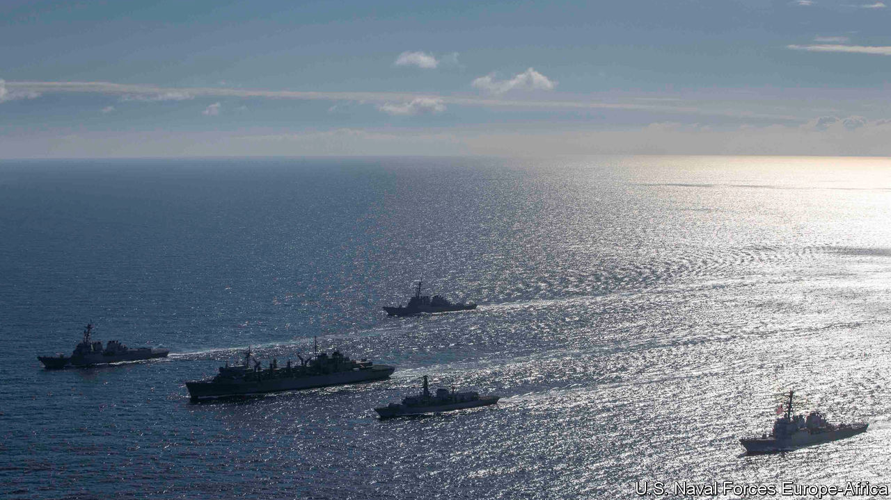
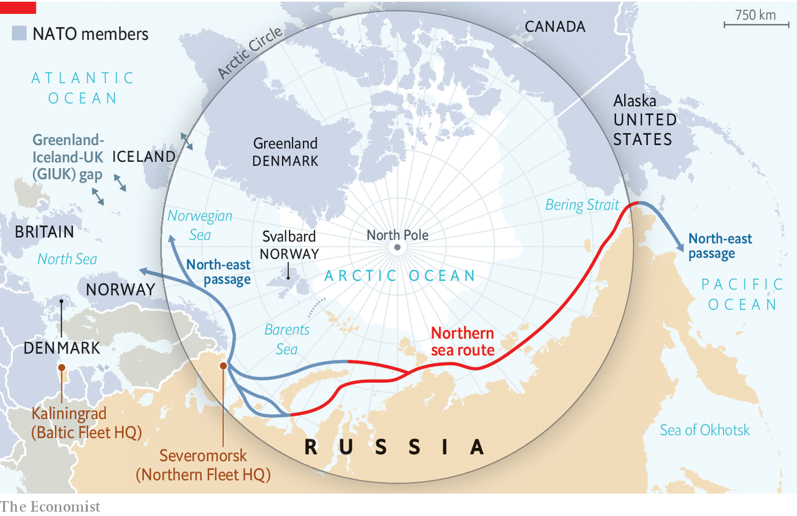

## Northern fights

# NATO is facing up to Russia in the Arctic Circle

> An exercise in the Barents Sea signals that big-power rivalry covers every ocean

> May 14th 2020

THE BARENTS SEA is not a hospitable place for visitors. “Frequent snow storms…blotted out the land for hours on end,” wrote an unlucky British submariner sent there to snoop around during the cold war. “We faced the beastliness of spray which turned to ice even before it struck our faces.” American and British warships have not exercised there since the 1980s—until they returned last week.

On May 1st a flotilla of two American destroyers, a nuclear submarine, a support ship and a long-range maritime-patrol aircraft, plus a British frigate, practised their sub-hunting skills in the Norwegian Sea. That is not out of the ordinary; NATO has been rediscovering its cold-war interest in the Arctic in recent years. In 2018, for instance, an American aircraft-carrier sallied into the Arctic Circle for the first time in 30 years, during a huge exercise in Norway.

But on May 4th some of those ships broke off and sailed farther north into the Barents Sea, along with a third destroyer, remaining there until VE Day on May 8th. Russia’s navy, whose powerful Northern Fleet is based at Severomorsk around the corner, was told in advance, but still greeted its visitors with live torpedo exercises.

The decision to dispatch destroyers was a bold one. One aim was to show that covid-19 has not blunted swords, despite the virus knocking out an American and a French carrier. Another was to assert freedom of navigation in the face of Russia’s imposition of rules on the Northern Sea Route (NSR), a passage between the Barents Sea and the Pacific Ocean that is increasingly navigable as ice melts. Although last week’s exercise did not enter the NSR, it hints at a willingness to do so in the future.

More broadly, the Arctic is a growing factor in NATO defence plans. Russia has beefed up its Northern Fleet in recent years. The fleet’s submarine activity is at its highest level since the cold war, and the country’s new boats are quiet and well-armed. As a result, the alliance’s “acoustic edge”—its ability to detect subs at longer ranges than Russia can—“has narrowed dramatically”, reckons the International Institute for Strategic Studies, a think-tank.

The main task of Russian subs is defensive: to protect a “bastion”, the area in the Barents Sea and Sea of Okhotsk where its own nuclear-armed ballistic-missile submarines patrol. But NATO admirals worry that, in a conflict, some might pose a wider threat to the alliance. A separate Russian naval force known as the Main Directorate of Deep-Sea Research (GUGI, in its Russian acronym) could also target the thicket of undersea cables that cross the Atlantic.

The challenge is a familiar one. For much of the cold war, NATO allies sought to bottle up the Soviet fleet in the Arctic by establishing a picket across the so-called GIUK gap, a transit route between Greenland, Iceland and Britain that was strung with underwater listening posts. The gap is now back in fashion and NATO is reinvesting in anti-submarine capabilities after decades of neglect.

But defence in depth may not suffice. A new generation of Russian ship-based missiles, capable of striking NATO ships or territory from far north of the GIUK gap, represents “a dramatically new and challenging threat”, concludes the IISS. Similar concerns led the Reagan administration to adopt a more offensive naval posture, sending forces into the Soviet Union’s maritime bastion—“bearding the bear in its lair”, as a British MP once put it. “I’m struck by similarities with the 1980s,” says Niklas Granholm of the Swedish Defence Research Agency. “A forward maritime strategy to get up close and personal with the Russian Northern Fleet, rather than meet them farther south.” ■

## URL

https://www.economist.com/europe/2020/05/14/nato-is-facing-up-to-russia-in-the-arctic-circle
