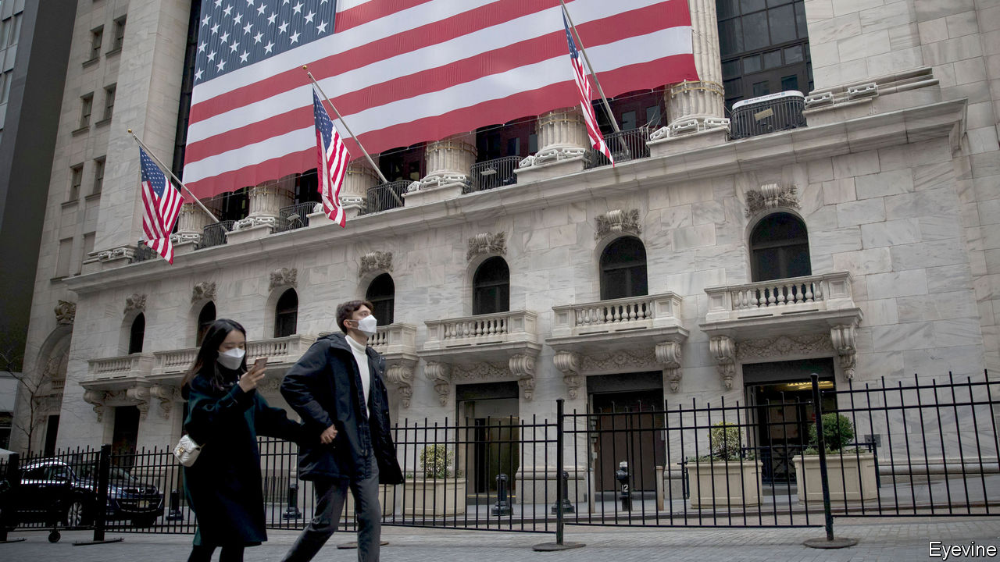
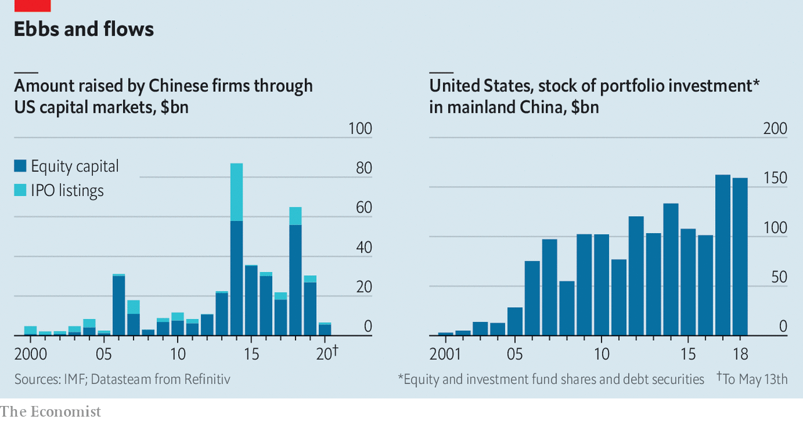

## Feuding over funds

# America files a new financial salvo at Beijing

> The White House seeks to stop a government pension fund investing in China

> May 14th 2020

Editor’s note: The Economist is making some of its most important coverage of the covid-19 pandemic freely available to readers of The Economist Today, our daily newsletter. To receive it, register [here](https://www.economist.com//newslettersignup). For our coronavirus tracker and more coverage, see our [hub](https://www.economist.com//coronavirus)

LAST SEPTEMBER a leak suggested that Donald Trump’s administration was mulling steps to rid American exchanges of Chinese firms and force investors to dump stocks listed in mainland China. The share prices of Alibaba, an e-commerce giant, and Baidu, a search engine, slid. So did the yuan. Within a day, however, the government denied having such plans, calling them “fake news”. Insiders say “old-school” Republicans on Capitol Hill, who favour free markets, prevailed over the president’s jingoistic entourage. Markets sighed in relief.

This week, though, the rhetoric was amplified. On May 11th administration officials urged the independent board overseeing the Thrift Savings Plan (TSP), the government’s main pension fund, worth $600bn, to freeze plans to invest in Chinese firms. Investors’ money, they argued, would be at risk if the firms were to be later whacked with American sanctions punishing China for its alleged culpability in allowing the coronavirus to spread. Defence hawks argue that the pension fund risks investing in firms that supply China’s military and surveillance services. Beijing reacted furiously, saying that restrictions would only hurt America’s interests.

The amounts immediately at stake are small. TSP’s guardians had planned to start investing part of the money it earmarks for foreign investment—some $40bn—into funds that track an index that includes some China-based stocks in the second half of this year. Markets mostly shrugged off the news.

The measure is, however, belligerent. It is America’s first serious attempt to limit investment in Chinese firms. Intent on “financial decoupling”, Washington seems ready to explore “all avenues”, says Eswar Prasad of Cornell University. Tariffs already make it less palatable for American companies to invest directly in China, since repatriating goods made there is costlier.

Discouraging investors from holding Chinese stocks would put portfolio flows at risk. And there is a lot of money at stake. Chinese firms have raised over $336bn on American venues since 2000, and another $81bn through initial public offerings (see chart). Their total market capitalisation in New York is close to $1.1trn, about the same as China’s holdings of Treasuries. American portfolio holdings in China amount to $150bn. Before the latest announcement, that seemed likely to pick up: the weight of Chinese stocks listed on the mainland and abroad in the MSCI Emerging Markets index, a popular benchmark, has risen from 30.5% two years ago to nearly 40% today.

Tensions are already affecting sentiment, says Ivy Wong of Baker McKenzie, a law firm. Chinese firms wanting to list in New York are more tentative in their preparations. Some listed in America, such as Alibaba and JD.com, are already turning to Hong Kong to issue new shares. But it is unclear whether the White House can legally ban investors from buying Chinese stocks. It could force Chinese firms to delist from America, but that, says a lawyer, would “traumatise” markets. It could make life so difficult for firms that they volunteer to relist elsewhere—but the dire economic situation makes this risky too.

Another difficulty is that most Chinese firms listed in America are not actually Chinese, but are legally domiciled in offshore centres and use “variable-interest entities” (VIEs). These have contractual rights over part of the revenue or profit generated by mainland firms, which own the assets and intellectual property. An American ban on Chinese companies might fail to reach VIEs; but a broader legal net could risk ensnaring the Chinese arms of American multinationals.

A forceful attack would also have unintended effects. It would prevent American investors from earning good returns on fast-growing Chinese stocks. Delisting firms in haste could mean savers lose, if share prices tumble. Discouraging Chinese companies from listing in America would have costs too. Wall Street banks would lose the fat fees they make helping Chinese companies list, says Hao Zhou of Commerzbank, a German lender.

There are good reasons to demand more scrutiny of Chinese firms listed in New York: some are exempted from the same level of reporting as American peers. (This week Luckin Coffee, a Chinese firm listed in New York through a VIE, sacked its bosses amid an accounting scandal). But the best way to uncover, if not deter, fraud may be to keep firms in the system, rather than driving them away, says Matthew Doull of Wedbush Securities, an investment firm.

Washington has made its first move but it may be unwilling to do much more. The Securities and Exchange Commission, America’s markets watchdog, wants better disclosure but may be less keen on outright financial warfare. Jay Clayton, its boss and a former capital-markets lawyer, advised Alibaba on its VIE when it listed in New York in 2014. ■

## URL

https://www.economist.com/finance-and-economics/2020/05/14/america-files-a-new-financial-salvo-at-beijing
