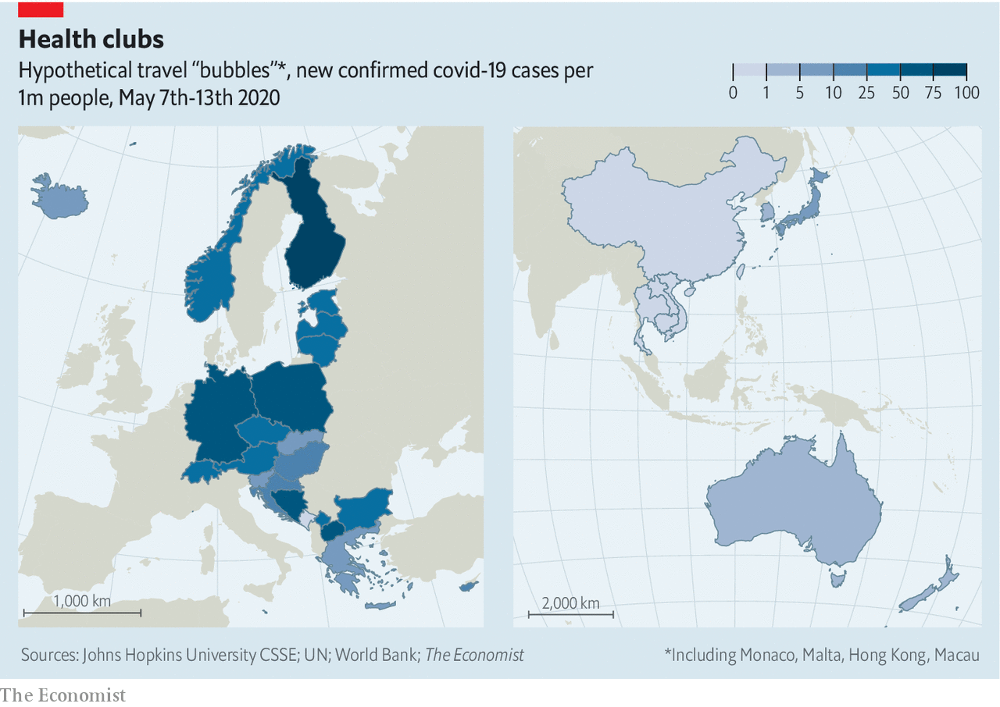

## A good kind of bubble

# Could travel bubbles offer a route to economic recovery?

> The economic gains would be large, but the health requirements could be vexing

> May 14th 2020SHANGHAI

Editor’s note: The Economist is making some of its most important coverage of the covid-19 pandemic freely available to readers of The Economist Today, our daily newsletter. To receive it, register [here](https://www.economist.com//newslettersignup). For our coronavirus tracker and more coverage, see our [hub](https://www.economist.com//coronavirus)

IT MAY BE a painful fact to contemplate during these locked-down days, but last year the world was more mobile than ever, with people taking 4.6bn flights. In April this year, though, planes carried just 47m passengers; that level of mobility, annualised, would set the clocks back to 1978. The virtual halt to travel has exacerbated the global economy’s woes, complicating trade ties, upending business and devastating the tourism industry. Little wonder that governments want to restore links. An idea gaining favour is the creation of travel “bubbles”, binding together countries that have fared well against the coronavirus.

A closer look yields some grounds for optimism. The Economist has identified potential bubbles that account for around 35% of global GDP, 39% of all trade in goods and services and 42% of the world’s spending on tourism. But the challenge of connecting them also underscores how hard restarting the global economy will be.

Simply returning borders to pre-virus days is, for now, inconceivable. Many health experts, first critical of travel restrictions, have come to view strict controls as useful, especially for places that have contained local infections. “Every inbound case is a potential seed that can grow into an outbreak,” says Ben Cowling, an epidemiologist at Hong Kong University.

The first bubble is due to come to life on May 15th between Estonia, Latvia and Lithuania, among Europe’s best performers in taming the virus. Their citizens will be free to travel inside the zone without quarantine. The next might be a trans-Tasman bubble, tying New Zealand to Australia’s state of Tasmania, both of which have kept new cases down. China and South Korea have launched a “fast track” entry channel for business people. “My expectation is that there will be a large number of small travel bubbles,” Mr Cowling says.

But in the same way that regional trade deals are more efficient than bilateral pacts, the economic benefits from making the bubbles bigger would be greater. Based on an analysis of infection data, The Economist sees two large zones that could emerge as bubbles, subsuming the smaller ones that are now being formed.

The first is in the Asia-Pacific region, where countries from Japan to New Zealand have recorded fewer than ten new infections per 1m residents over the past week. The second is in Europe: using a laxer threshold—fewer than 100 new cases on the same basis—the bubble could reach from the Baltic to the Adriatic, and take in Germany (see map). Our Asia-Pacific bubble would, thanks to China and Japan, account for 27% of global GDP. Our European one would make up 8%.

One measure of the potential value of the bubbles is their degree of trade integration, showing whether the economies are complementary. For the countries in our Asia-Pacific bubble, an average of 51% of their overall trade is with each other. In our Baltic-to-Adriatic bubble, it is 41%. Small countries would gain the most by reconnecting with larger neighbours.

Free movement would be especially helpful for countries such as Thailand and Greece that rely on tourism. Factory Asia and Factory Europe also rely on workers shuttling back and forth. Before the pandemic, on a normal day up to 3.5m people would cross an internal border in the European Union, and 700,000 would go between Hong Kong and mainland China.

The bubbles would have spillovers beyond their boundaries, positive and negative. Much trade these days is in services, not goods, requiring less of a physical presence. Britain would be outside the Baltic-to-Adriatic bubble, but London’s financiers would still hope for business, even if they could not visit their clients. Or if, for instance, Vietnam enters the Asia-Pacific bubble and Indonesia does not, investment that might have flowed to the latter could be diverted to the former.

In any case, the public-health requirements for creating the travel bubbles will be vexing. In trade terms, they resemble an extreme version of non-tariff negotiations: countries will need to harmonise their approaches to managing the pandemic. That is a tall order when America and Europe cannot even agree on whether it is safe to wash chickens with chlorine.

Consider the question of whether countries that have high but similar infection rates might form travel bubbles. This in effect describes Britain and France for now: recording hundreds of deaths a day but not quarantining each other’s citizens. This could, however, pose two problems. First, given that both countries still call for social distancing, they do not actually want to see people crowd onto the Eurostar. Second, if one starts to vanquish the virus, it might opt to close its borders to the other. “Contaminated” travel bubbles are thus likely to be less productive and less stable.

The ideal is “clean” bubbles. For these to work, countries first have to control infections domestically, says Teo Yik Ying, dean of the Saw Swee Hock School of Public Health at the National University of Singapore. Then they have to be open with their partners: sharing data about infection levels and testing, and disclosing how they trace and isolate those who might have the virus. “This will all be underpinned by trust between governments,” Mr Teo says.

The need for trust immediately puts the Asia-Pacific bubble into doubt, as underlined by the region’s latest spat: China suspended some beef imports from Australia after it called for an inquiry into the origins of covid-19. Poorer nations might also be excluded. Laos and Cambodia have reported few infections, but wealthier countries have little faith in them.

More robust testing could help overcome the trust deficit. Take the fast track between South Korea and China. So long as business travellers test negative for the virus before departure, they are quarantined for just one or two days and are tested once more before being allowed out. But that is cumbersome, which helps explain why China admitted only 210 South Koreans in the first ten days of the agreement.

The upshot is that there are no real shortcuts. Michael Baker, an epidemiologist at the University of Otago in Wellington, sees developed countries splitting into two blocs: those like New Zealand and South Korea that aim to eliminate the coronavirus and those like America and Britain that merely want to suppress it. These blocs could, in time, resolve into two travel zones, he says. Goods and money would still flow between them. But people would find their horizons dictated by whether they were on the clean or contaminated side of the divide. ■

Dig deeper:For our latest coverage of the covid-19 pandemic, register for The Economist Today, our daily [newsletter](https://www.economist.com//newslettersignup), or visit our [coronavirus tracker and story hub](https://www.economist.com//coronavirus)